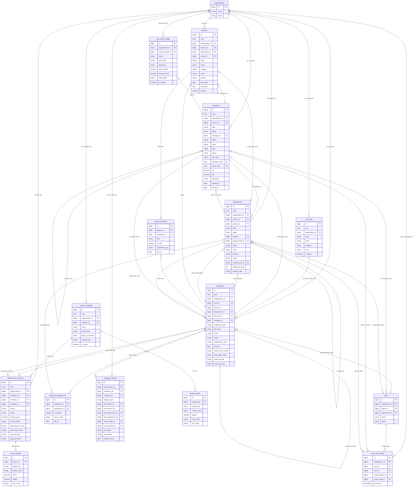

# ERD — Cơ cấu tổ chức & Nhân sự

> Phiên bản: 2.2 · Cập nhật: 2026-06-02
> Phạm vi: Các module MỚI xây xung quanh `organizations` (đã có sẵn)
> Nguyên tắc: Multi-tenant · Không dùng JSON column · Organization là trung tâm
> Stack: Laravel 11 + MySQL 8

### Thay đổi v2.1 → v2.2 (chỉ tinh chỉnh trong các bảng hiện có, không thêm bảng mới)

| # | Thay đổi | Bảng | Lý do |
|---|----------|------|-------|
| 1 | Thêm `path` + `depth` (materialized path) | `branches`, `departments` | Query cây nhanh không cần đệ quy, scale khi nhiều cấp/nhiều chi nhánh |
| 2 | Thêm `is_system` / `is_locked` | `job_titles`, `review_templates` | Phân biệt bản ghi seed hệ thống vs do org tạo; chặn xóa nhầm |
| 3 | Đẩy ràng buộc "1 primary dept" và "1 default config" xuống DB | `employee_departments`, `org_chart_configs` | Generated column + partial-style unique, giảm phụ thuộc app layer |
| 4 | Thêm cột vận hành thực tế 2026 | `branches`, `employees` | Mã số thuế chi nhánh (hóa đơn điện tử), eKYC, locale |
| 5 | Chuẩn hóa charset & engine | Toàn bộ | `utf8mb4` + InnoDB, tiền tệ `DECIMAL`, chuẩn MySQL 8 |
| 6 | Thêm `created_by` / `updated_by` cho entity nghiệp vụ chính | `branches`, `departments`, `employees`, `projects` | Audit "ai tạo / ai sửa", phổ biến cho SME nhiều người dùng |

---

## 1. Phạm vi tài liệu

Tài liệu này chỉ đặc tả **các bảng mới** cần tạo. Các module đã có (Organization, Auth/Users, Assessment, Lead/CRM, Approval, Workflow, RBAC Spatie, Billing, Geographic) **không được nhắc lại**.

### Modules mới

| # | Module | Bảng mới | Mô tả |
|---|--------|----------|-------|
| 1 | Chi nhánh | `branches` | Văn phòng / cửa hàng / kho của org |
| 2 | Phòng ban | `departments` | Bộ phận / nhóm trong org |
| 3 | Chức danh | `job_titles` | Danh mục chức danh toàn org |
| 4 | Nhân sự | `employees`, `employee_departments`, `employee_history` | Hồ sơ nhân viên & lịch sử |
| 5 | Phân quyền theo phạm vi | `user_role_scopes` | Scoping RBAC xuống branch/dept |
| 6 | Đánh giá hiệu suất | `review_templates`, `review_criteria`, `performance_reviews`, `review_scores` | HR review nội bộ |
| 7 | Dự án | `projects`, `project_members` | Dự án cross-functional |
| 8 | Sơ đồ tổ chức | `org_chart_configs` | Config view sơ đồ |

**Tổng: 14 bảng mới** + ALTER `users` (thêm 2 FK)

### Bảng hiện có được tham chiếu (không thay đổi)

| Bảng | Dùng bởi |
|------|---------|
| `organizations` | FK gốc của mọi bảng mới |
| `users` | `employees.user_id`, `user_role_scopes.user_id` |
| `roles` | `user_role_scopes.role_id` (Spatie) |
| `provinces` | `branches.province_code` |
| `wards` | `branches.ward_code` |

---

## 2. Kiến trúc tổng thể

```
                    ┌─────────────────────────┐
                    │      organizations       │  ← existing (center)
                    └────────────┬────────────┘
                                 │ organization_id (mọi bảng mới đều có)
          ┌──────────────────────┼──────────────────────┐
          ▼                      ▼                      ▼
    ┌──────────┐          ┌──────────────┐       ┌──────────────┐
    │ branches │          │  departments │       │  job_titles  │
    │ (cây 3   │◄─────────│  (branch_id  │       │  (chức danh) │
    │  cấp)    │          │   nullable)  │       └──────┬───────┘
    └────┬─────┘          └──────┬───────┘              │
         │                      │                       │
         └──────────┬───────────┘                       │
                    ▼                                    │
             ┌─────────────┐ ◄─────────────────────────┘
             │  employees  │  (branch + dept + job_title)
             │  (hồ sơ HR) │
             └──────┬──────┘
                    │
       ┌────────────┼─────────────────┐
       ▼            ▼                 ▼
  employee_    employee_         employee_
  departments  history           (manager_id
  (kiêm nhiệm) (audit trail)      self-ref)
       │
       ├──────► performance_reviews
       │              │
       │        review_scores
       │
       └──────► project_members ◄── projects
```

### Quy tắc Multi-tenant

1. **Mọi bảng mới** đều có `organization_id BIGINT UNSIGNED NOT NULL`.
2. **Không dùng JSON column** — mọi data đều là cột scalar hoặc bảng riêng.
3. **Index đầu tiên** của mọi bảng luôn là `(organization_id, ...)`.
4. **FK ON DELETE**: `RESTRICT` cho dữ liệu nghiệp vụ · `CASCADE` cho bảng junction/child · `SET NULL` cho optional reference.
5. `deleted_at` (SoftDeletes) cho entity có quan hệ phức tạp. `status` column cho entity có vòng đời nghiệp vụ rõ.

### Quy tắc kỹ thuật (MySQL 8)

6. **Engine & charset**: mọi bảng dùng `ENGINE=InnoDB DEFAULT CHARSET=utf8mb4 COLLATE=utf8mb4_unicode_ci`. Đảm bảo lưu được tiếng Việt có dấu, emoji, tên đa ngôn ngữ.
7. **Tiền tệ**: luôn `DECIMAL`, không dùng `FLOAT/DOUBLE` (tránh sai số). Mã tiền tệ `CHAR(3)` theo ISO 4217.
8. **Cây phân cấp (`branches`, `departments`)**: dùng **materialized path** (`path` + `depth`) song song với `parent_id`.
   - `parent_id` giữ quan hệ trực tiếp (cha-con).
   - `path` lưu chuỗi id tổ tiên dạng `/1/5/12/` để query toàn bộ nhánh con bằng `WHERE path LIKE '/1/5/%'` — không cần truy vấn đệ quy, scale tốt khi tổ chức nhiều cấp.
   - `depth` (0 = gốc) để giới hạn độ sâu và render nhanh.
   - Cập nhật `path`/`depth` khi tạo hoặc đổi `parent_id` (Observer ở Laravel).
9. **Audit cơ bản**: entity nghiệp vụ chính có `created_by` / `updated_by` (FK → `users`, nullable, `ON DELETE SET NULL`).
10. **Generated columns**: dùng cho ràng buộc unique có điều kiện (MySQL 8 không có partial index như PostgreSQL) — xem chi tiết ở từng bảng.

---

## 3. Lớp 1 — Cơ cấu tổ chức

### 3.1 `branches`

Chi nhánh / văn phòng / cửa hàng / kho. Cấu trúc cây tối đa 3 cấp (headquarters → regional → local).

| Cột | Kiểu | Nullable | Mặc định | Mô tả |
|-----|------|----------|----------|-------|
| `id` | BIGINT UNSIGNED PK | NO | auto | |
| `uuid` | CHAR(36) UNIQUE | NO | | Public identifier cho URL/API |
| `organization_id` | BIGINT UNSIGNED FK → organizations | NO | | |
| `parent_id` | BIGINT UNSIGNED FK → branches | YES | NULL | Chi nhánh cha (tối đa 3 cấp) |
| `path` | VARCHAR(255) | NO | `/` | Materialized path: `/1/5/` (id tổ tiên). Query nhánh con bằng `LIKE` |
| `depth` | TINYINT UNSIGNED | NO | 0 | Độ sâu trong cây (0 = gốc) |
| `manager_id` | BIGINT UNSIGNED FK → employees | YES | NULL | Trưởng chi nhánh |
| `order_column` | INT UNSIGNED | NO | 0 | Thứ tự hiển thị (Spatie Sortable) |
| `name` | VARCHAR(255) | NO | | Tên chi nhánh |
| `code` | VARCHAR(50) | NO | | Mã chi nhánh (HN01, HCM02) |
| `type` | VARCHAR(30) | NO | `branch` | Loại chi nhánh — xem Enum §7 |
| `status` | VARCHAR(20) | NO | `active` | Trạng thái — xem Enum §7 |
| `tax_code` | VARCHAR(20) | YES | NULL | Mã số thuế chi nhánh (hóa đơn điện tử — NĐ 2026) |
| `phone` | VARCHAR(20) | YES | NULL | |
| `email` | VARCHAR(255) | YES | NULL | |
| `fax` | VARCHAR(20) | YES | NULL | |
| `province_code` | CHAR(2) FK → provinces | YES | NULL | |
| `ward_code` | CHAR(5) FK → wards | YES | NULL | |
| `address` | VARCHAR(500) | YES | NULL | |
| `lat` | DECIMAL(10,7) | YES | NULL | Vĩ độ (map view) |
| `lng` | DECIMAL(10,7) | YES | NULL | Kinh độ (map view) |
| `timezone` | VARCHAR(50) | YES | NULL | NULL = kế thừa từ organization |
| `currency` | CHAR(3) | YES | NULL | NULL = kế thừa từ organization |
| `opened_at` | DATE | YES | NULL | Ngày khai trương |
| `closed_at` | DATE | YES | NULL | Ngày đóng cửa |
| `created_by` | BIGINT UNSIGNED FK → users | YES | NULL | Người tạo (audit) |
| `updated_by` | BIGINT UNSIGNED FK → users | YES | NULL | Người sửa gần nhất (audit) |
| `created_at` | TIMESTAMP | NO | | |
| `updated_at` | TIMESTAMP | NO | | |
| `deleted_at` | TIMESTAMP | YES | NULL | SoftDelete |

**Constraints:**
```sql
UNIQUE KEY uq_branch_code (organization_id, code)
CHECK (type IN ('headquarters','regional_office','branch','store','warehouse'))
CHECK (status IN ('active','inactive','closed'))
CHECK (id != parent_id)   -- chặn self-reference
CHECK (depth >= 0 AND depth <= 2)  -- tối đa 3 cấp (0,1,2)
```

**Business rules:**
- Mỗi org phải có ít nhất 1 branch type `headquarters`.
- `status = closed` → set `closed_at = TODAY`, cascade `departments.status = inactive`.
- Không thể `closed` khi còn `employees.status = 'active'` (kiểm tra ở app layer).
- Circular reference (`parent_id` tạo vòng) chặn ở app layer khi update.
- `path` và `depth` tự động tính lại khi tạo mới hoặc đổi `parent_id` (BranchObserver). Khi đổi cha, cập nhật `path` cho cả nhánh con (`WHERE path LIKE '/old_path/%'`).
- `tax_code`: chi nhánh hạch toán độc lập cần mã số thuế riêng để phát hành hóa đơn điện tử.

**FK:**
```
organization_id → organizations.id  ON DELETE RESTRICT
parent_id       → branches.id       ON DELETE RESTRICT
manager_id      → employees.id      ON DELETE SET NULL
province_code   → provinces.province_code
ward_code       → wards.ward_code
created_by      → users.id          ON DELETE SET NULL
updated_by      → users.id          ON DELETE SET NULL
```

**Indexes:**
```sql
INDEX (organization_id, status)
INDEX (organization_id, type)
INDEX (organization_id, path)          -- query cây con theo tenant
INDEX (parent_id)
INDEX (manager_id)
INDEX (province_code)
```

---

### 3.2 `departments`

Phòng ban / bộ phận trong tổ chức. `branch_id` nullable vì có phòng ban cấp tổ chức (Kế toán, Pháp chế...) không gắn với chi nhánh cụ thể.

| Cột | Kiểu | Nullable | Mặc định | Mô tả |
|-----|------|----------|----------|-------|
| `id` | BIGINT UNSIGNED PK | NO | auto | |
| `uuid` | CHAR(36) UNIQUE | NO | | |
| `organization_id` | BIGINT UNSIGNED FK → organizations | NO | | Denormalized để query nhanh |
| `branch_id` | BIGINT UNSIGNED FK → branches | YES | NULL | NULL = phòng ban cấp tổ chức |
| `parent_id` | BIGINT UNSIGNED FK → departments | YES | NULL | Phòng ban cha (tối đa 3 cấp) |
| `path` | VARCHAR(255) | NO | `/` | Materialized path id tổ tiên |
| `depth` | TINYINT UNSIGNED | NO | 0 | Độ sâu trong cây (0 = gốc) |
| `head_id` | BIGINT UNSIGNED FK → employees | YES | NULL | Trưởng phòng |
| `deputy_head_id` | BIGINT UNSIGNED FK → employees | YES | NULL | Phó trưởng phòng |
| `order_column` | INT UNSIGNED | NO | 0 | |
| `name` | VARCHAR(255) | NO | | |
| `code` | VARCHAR(50) | NO | | Mã phòng ban (HR01, IT02) |
| `function` | VARCHAR(50) | YES | NULL | Chức năng — xem Enum §7 |
| `status` | VARCHAR(20) | NO | `active` | `active`, `inactive`, `merged` |
| `merged_into_id` | BIGINT UNSIGNED FK → departments | YES | NULL | Bắt buộc khi `status = merged` |
| `budget_code` | VARCHAR(50) | YES | NULL | Mã trung tâm chi phí |
| `headcount_limit` | SMALLINT UNSIGNED | YES | NULL | Biên chế tối đa (cảnh báo, không chặn cứng) |
| `description` | TEXT | YES | NULL | Chức năng nhiệm vụ |
| `internal_phone` | VARCHAR(20) | YES | NULL | |
| `internal_email` | VARCHAR(255) | YES | NULL | |
| `effective_from` | DATE | YES | NULL | Ngày thành lập / có hiệu lực |
| `effective_to` | DATE | YES | NULL | Ngày giải thể |
| `created_by` | BIGINT UNSIGNED FK → users | YES | NULL | Người tạo (audit) |
| `updated_by` | BIGINT UNSIGNED FK → users | YES | NULL | Người sửa gần nhất (audit) |
| `created_at` | TIMESTAMP | NO | | |
| `updated_at` | TIMESTAMP | NO | | |
| `deleted_at` | TIMESTAMP | YES | NULL | |

**Constraints:**
```sql
UNIQUE KEY uq_dept_code (organization_id, code)
CHECK (status IN ('active','inactive','merged'))
CHECK (id != parent_id)
CHECK (merged_into_id IS NOT NULL OR status != 'merged')
CHECK (depth >= 0 AND depth <= 2)  -- tối đa 3 cấp
```

**Business rules:**
- Không xóa khi còn `employees.status = 'active'` trong phòng này.
- Khi `merged`: set `merged_into_id`, ghi `employee_history` cho từng nhân viên.
- `headcount_limit`: chỉ hiển thị warning badge ở UI.
- Nếu `branch_id` và `parent_id` cùng có giá trị: dept con phải cùng `branch_id` với cha (hoặc NULL). Kiểm tra ở app layer.
- `path`/`depth` cập nhật cùng quy tắc với `branches` (DepartmentObserver).

**FK:**
```
organization_id  → organizations.id  ON DELETE RESTRICT
branch_id        → branches.id       ON DELETE RESTRICT
parent_id        → departments.id    ON DELETE RESTRICT
head_id          → employees.id      ON DELETE SET NULL
deputy_head_id   → employees.id      ON DELETE SET NULL
merged_into_id   → departments.id    ON DELETE RESTRICT
created_by       → users.id          ON DELETE SET NULL
updated_by       → users.id          ON DELETE SET NULL
```

**Indexes:**
```sql
INDEX (organization_id, status)
INDEX (branch_id, status)
INDEX (organization_id, path)   -- query cây con theo tenant
INDEX (parent_id)
INDEX (head_id)
INDEX (merged_into_id)
```

---

### 3.3 `job_titles`

Danh mục chức danh dùng chung toàn tổ chức. Không ràng buộc vào phòng ban hay chi nhánh cụ thể.

| Cột | Kiểu | Nullable | Mặc định | Mô tả |
|-----|------|----------|----------|-------|
| `id` | BIGINT UNSIGNED PK | NO | auto | |
| `uuid` | CHAR(36) UNIQUE | NO | | |
| `organization_id` | BIGINT UNSIGNED FK → organizations | NO | | |
| `code` | VARCHAR(50) | NO | | Mã chức danh (MGR, DIR, STAFF) |
| `name` | VARCHAR(255) | NO | | Tên đầy đủ (VD: Trưởng phòng Kinh doanh) |
| `category` | VARCHAR(30) | NO | `staff` | Nhóm chức danh — xem Enum §7 |
| `level` | TINYINT UNSIGNED | NO | 1 | Cấp bậc 1–20 (cao hơn = cấp cao hơn). Reviewer phải có level ≥ reviewee |
| `description` | TEXT | YES | NULL | Mô tả vai trò, trách nhiệm |
| `is_system` | TINYINT(1) | NO | 0 | Chức danh do hệ thống seed (mọi org đều có) |
| `is_locked` | TINYINT(1) | NO | 0 | Khóa chỉnh sửa/xóa (bảo vệ chức danh chuẩn) |
| `is_active` | TINYINT(1) | NO | 1 | |
| `created_at` | TIMESTAMP | NO | | |
| `updated_at` | TIMESTAMP | NO | | |

**Constraints:**
```sql
UNIQUE KEY uq_job_title_code (organization_id, code)
CHECK (level BETWEEN 1 AND 20)
CHECK (category IN ('executive','manager','supervisor','staff','intern','consultant'))
```

**Business rules:**
- Không xóa khi đang gán cho `employees`. Dùng `is_active = 0` để ẩn.
- `is_locked = 1`: chặn update/delete ở app layer (dùng cho bộ chức danh chuẩn seed sẵn để SME dùng ngay).
- `level` dùng để validate reviewer/reviewee trong `performance_reviews`.

**FK:**
```
organization_id → organizations.id ON DELETE RESTRICT
```

**Indexes:**
```sql
INDEX (organization_id, is_active)
INDEX (organization_id, level)
```

---

## 4. Lớp 2 — Nhân sự

> `employees` là HR profile. Tách biệt với `users` (tài khoản đăng nhập).
> Một nhân viên mới chưa cần tài khoản; một super-admin có tài khoản nhưng không phải nhân viên.

### 4.1 ALTER `users` (bảng đã có)

```sql
ALTER TABLE users
    ADD COLUMN branch_id     BIGINT UNSIGNED NULL AFTER organization_id,
    ADD COLUMN department_id BIGINT UNSIGNED NULL AFTER branch_id;

-- FK thêm sau khi tạo xong branches + departments
ALTER TABLE users
    ADD CONSTRAINT fk_users_branch
        FOREIGN KEY (branch_id) REFERENCES branches(id) ON DELETE SET NULL,
    ADD CONSTRAINT fk_users_department
        FOREIGN KEY (department_id) REFERENCES departments(id) ON DELETE SET NULL;

-- Đổi tên cột legacy (nếu tồn tại)
ALTER TABLE users
    RENAME COLUMN department TO department_legacy;
```

> `users.branch_id` và `users.department_id` là denormalization từ `employees` để phục vụ middleware auth nhanh. Cần đồng bộ khi cập nhật `employees`.

---

### 4.2 `employees`

Hồ sơ nhân sự đầy đủ. Liên kết 1-1 nullable với `users`.

| Cột | Kiểu | Nullable | Mặc định | Mô tả |
|-----|------|----------|----------|-------|
| `id` | BIGINT UNSIGNED PK | NO | auto | |
| `uuid` | CHAR(36) UNIQUE | NO | | |
| `organization_id` | BIGINT UNSIGNED FK → organizations | NO | | |
| `user_id` | BIGINT UNSIGNED FK → users | YES | NULL | Tài khoản đăng nhập (1-1 nullable, unique trong org) |
| `branch_id` | BIGINT UNSIGNED FK → branches | NO | | Chi nhánh hiện tại |
| `department_id` | BIGINT UNSIGNED FK → departments | NO | | Phòng ban chính (primary) |
| `job_title_id` | BIGINT UNSIGNED FK → job_titles | YES | NULL | |
| `manager_id` | BIGINT UNSIGNED FK → employees | YES | NULL | Quản lý trực tiếp (self-referential) |
| `employee_code` | VARCHAR(50) | NO | | Mã nhân viên (NV001) |
| `full_name` | VARCHAR(255) | NO | | |
| `email` | VARCHAR(255) | NO | | Email công việc |
| `phone` | VARCHAR(20) | YES | NULL | |
| `gender` | VARCHAR(10) | YES | NULL | `male`, `female`, `other` |
| `date_of_birth` | DATE | YES | NULL | |
| `national_id` | VARCHAR(20) | YES | NULL | Số CCCD/CMND (eKYC, hợp đồng lao động điện tử) |
| `tax_code` | VARCHAR(20) | YES | NULL | Mã số thuế cá nhân (quyết toán thuế TNCN) |
| `locale` | VARCHAR(10) | YES | NULL | Ngôn ngữ giao diện ưa thích (`vi`, `en`...). NULL = kế thừa org |
| `avatar_url` | VARCHAR(500) | YES | NULL | |
| `status` | VARCHAR(20) | NO | `active` | Trạng thái — xem Enum §7 |
| `employment_type` | VARCHAR(20) | NO | `full_time` | Loại hợp đồng — xem Enum §7 |
| `hired_at` | DATE | YES | NULL | Ngày gia nhập |
| `left_at` | DATE | YES | NULL | Ngày rời công ty |
| `snap_branch_name` | VARCHAR(255) | YES | NULL | Snapshot: tên chi nhánh hiện tại |
| `snap_dept_name` | VARCHAR(255) | YES | NULL | Snapshot: tên phòng ban hiện tại |
| `snap_job_title` | VARCHAR(255) | YES | NULL | Snapshot: tên chức danh hiện tại |
| `snap_job_level` | TINYINT UNSIGNED | YES | NULL | Snapshot: cấp bậc hiện tại |
| `created_by` | BIGINT UNSIGNED FK → users | YES | NULL | Người tạo hồ sơ (audit) |
| `updated_by` | BIGINT UNSIGNED FK → users | YES | NULL | Người sửa gần nhất (audit) |
| `created_at` | TIMESTAMP | NO | | |
| `updated_at` | TIMESTAMP | NO | | |
| `deleted_at` | TIMESTAMP | YES | NULL | |

> **Snapshot columns**: được cập nhật mỗi khi branch/dept/job_title thay đổi. Dùng cho `performance_reviews` (copy tại thời điểm tạo) và hiển thị nhanh mà không cần JOIN. Không dùng JSON — mỗi field là cột riêng để query, sort, filter được.

**Constraints:**
```sql
UNIQUE KEY uq_employee_code (organization_id, employee_code)
UNIQUE KEY uq_employee_email (organization_id, email)
UNIQUE KEY uq_employee_user  (organization_id, user_id)  -- 1 user chỉ là 1 employee/org
CHECK (id != manager_id)
CHECK (status IN ('active','on_leave','resigned','terminated'))
CHECK (employment_type IN ('full_time','part_time','contract','intern'))
```

**Business rules:**
- Khi cập nhật `branch_id`, `department_id`, `job_title_id`: ghi `employee_history` + cập nhật `snap_*` + sync `users.branch_id / users.department_id`.
- Khi `resigned`/`terminated`: set `users.status = 'inactive'` (nếu có liên kết).
- `manager_id` tạo chuỗi quản lý (manager chain) — dùng để render org chart.

**FK:**
```
organization_id → organizations.id  ON DELETE RESTRICT
user_id         → users.id          ON DELETE SET NULL
branch_id       → branches.id       ON DELETE RESTRICT
department_id   → departments.id    ON DELETE RESTRICT
job_title_id    → job_titles.id     ON DELETE SET NULL
manager_id      → employees.id      ON DELETE SET NULL
created_by      → users.id          ON DELETE SET NULL
updated_by      → users.id          ON DELETE SET NULL
```

**Indexes:**
```sql
INDEX (organization_id, status)
INDEX (branch_id, status)
INDEX (department_id, status)
INDEX (manager_id)
INDEX (user_id)
INDEX (job_title_id)
INDEX (hired_at)
```

---

### 4.3 `employee_departments`

Nhân viên kiêm nhiệm phòng ban phụ (cross-functional). Mỗi nhân viên có đúng 1 bản ghi `is_primary = true` active tại một thời điểm — đồng bộ với `employees.department_id`.

| Cột | Kiểu | Nullable | Mặc định | Mô tả |
|-----|------|----------|----------|-------|
| `id` | BIGINT UNSIGNED PK | NO | auto | |
| `employee_id` | BIGINT UNSIGNED FK → employees | NO | | |
| `department_id` | BIGINT UNSIGNED FK → departments | NO | | |
| `is_primary` | TINYINT(1) | NO | 0 | Phòng ban chính |
| `primary_lock` | BIGINT UNSIGNED AS (IF(is_primary=1 AND left_at IS NULL, employee_id, NULL)) STORED | — | — | Generated column: ép unique "1 primary active / nhân viên" ở DB |
| `role_in_dept` | VARCHAR(50) | YES | NULL | `contributor`, `reviewer`, `lead`, `coordinator` |
| `joined_at` | DATE | YES | NULL | |
| `left_at` | DATE | YES | NULL | NULL = đang tham gia |
| `note` | TEXT | YES | NULL | |
| `created_at` | TIMESTAMP | NO | | |

**Constraints:**
```sql
UNIQUE KEY uq_emp_dept_active (employee_id, department_id, left_at)
-- Ràng buộc "chỉ 1 phòng ban primary active / nhân viên" — đẩy xuống DB:
-- generated column primary_lock = employee_id khi (is_primary=1 AND left_at IS NULL), ngược lại NULL.
-- MySQL bỏ qua giá trị NULL trong unique index → các bản ghi non-primary không xung đột.
UNIQUE KEY uq_primary_active (primary_lock)
```

> **Lý do dùng generated column:** MySQL 8 không có partial unique index (`WHERE ...`) như PostgreSQL. Thay vào đó, generated column `STORED` trả về `employee_id` chỉ khi bản ghi là primary đang active, còn lại trả `NULL`. Unique index trên cột này tự động bỏ qua các NULL, nên đảm bảo mỗi nhân viên chỉ có đúng 1 primary department active — kiểm soát ngay ở tầng DB, không phụ thuộc app layer.

**FK:**
```
employee_id   → employees.id   ON DELETE CASCADE
department_id → departments.id ON DELETE RESTRICT
```

**Indexes:**
```sql
INDEX (employee_id, left_at)
INDEX (department_id, is_primary)
```

---

### 4.4 `employee_history`

Audit trail mọi thay đổi vị trí của nhân viên. Thay thế JSON snapshot — mỗi thay đổi là 1 bản ghi, mọi field đều query được.

| Cột | Kiểu | Nullable | Mặc định | Mô tả |
|-----|------|----------|----------|-------|
| `id` | BIGINT UNSIGNED PK | NO | auto | |
| `organization_id` | BIGINT UNSIGNED FK → organizations | NO | | Denormalized để query theo org |
| `employee_id` | BIGINT UNSIGNED FK → employees | NO | | |
| `changed_by` | BIGINT UNSIGNED FK → users | YES | NULL | Ai thực hiện thay đổi |
| `change_type` | VARCHAR(30) | NO | | Loại thay đổi — xem Enum §7 |
| `old_branch_id` | BIGINT UNSIGNED FK → branches | YES | NULL | |
| `new_branch_id` | BIGINT UNSIGNED FK → branches | YES | NULL | |
| `old_department_id` | BIGINT UNSIGNED FK → departments | YES | NULL | |
| `new_department_id` | BIGINT UNSIGNED FK → departments | YES | NULL | |
| `old_job_title_id` | BIGINT UNSIGNED FK → job_titles | YES | NULL | |
| `new_job_title_id` | BIGINT UNSIGNED FK → job_titles | YES | NULL | |
| `old_manager_id` | BIGINT UNSIGNED FK → employees | YES | NULL | |
| `new_manager_id` | BIGINT UNSIGNED FK → employees | YES | NULL | |
| `old_status` | VARCHAR(20) | YES | NULL | |
| `new_status` | VARCHAR(20) | YES | NULL | |
| `old_employment_type` | VARCHAR(20) | YES | NULL | |
| `new_employment_type` | VARCHAR(20) | YES | NULL | |
| `effective_date` | DATE | NO | | Ngày có hiệu lực |
| `note` | TEXT | YES | NULL | |
| `created_at` | TIMESTAMP | NO | | |

**Lý do thiết kế:**
Không dùng `old_value / new_value TEXT` generic vì không thể JOIN, filter, hay index. Mỗi field thay đổi là cột riêng → có thể query "tất cả nhân viên chuyển từ dept A sang dept B trong tháng 6".

**FK:**
```
organization_id  → organizations.id  ON DELETE RESTRICT
employee_id      → employees.id      ON DELETE RESTRICT
changed_by       → users.id          ON DELETE SET NULL
old_branch_id    → branches.id       ON DELETE SET NULL
new_branch_id    → branches.id       ON DELETE SET NULL
old_department_id→ departments.id    ON DELETE SET NULL
new_department_id→ departments.id    ON DELETE SET NULL
old_job_title_id → job_titles.id     ON DELETE SET NULL
new_job_title_id → job_titles.id     ON DELETE SET NULL
old_manager_id   → employees.id      ON DELETE SET NULL
new_manager_id   → employees.id      ON DELETE SET NULL
```

**Indexes:**
```sql
INDEX (organization_id, change_type, effective_date)
INDEX (employee_id, effective_date)
INDEX (new_department_id, effective_date)
INDEX (new_branch_id, effective_date)
```

---

## 5. Lớp 3 — Phân quyền theo phạm vi

### 5.1 `user_role_scopes`

Mở rộng Spatie RBAC để scoping role xuống branch/dept. Một user có thể là `branch_manager` ở HN01 và `employee_viewer` ở toàn org — không cần tạo role riêng cho từng chi nhánh.

| Cột | Kiểu | Nullable | Mặc định | Mô tả |
|-----|------|----------|----------|-------|
| `id` | BIGINT UNSIGNED PK | NO | auto | |
| `organization_id` | BIGINT UNSIGNED FK → organizations | NO | | |
| `user_id` | BIGINT UNSIGNED FK → users | NO | | |
| `role_id` | BIGINT UNSIGNED FK → roles | NO | | Role Spatie |
| `scope_branch_id` | BIGINT UNSIGNED FK → branches | YES | NULL | NULL = áp dụng toàn org |
| `scope_dept_id` | BIGINT UNSIGNED FK → departments | YES | NULL | NULL = áp dụng toàn branch/org |
| `granted_by` | BIGINT UNSIGNED FK → users | YES | NULL | |
| `granted_at` | TIMESTAMP | NO | now() | |
| `expires_at` | TIMESTAMP | YES | NULL | NULL = không hết hạn |
| `note` | VARCHAR(500) | YES | NULL | Lý do cấp |
| `created_at` | TIMESTAMP | NO | | |

**Constraints:**
```sql
UNIQUE KEY uq_scope (user_id, role_id, scope_branch_id, scope_dept_id)
```

**Logic scope:**

| `scope_branch_id` | `scope_dept_id` | Ý nghĩa |
|--------------------|-----------------|---------|
| NULL | NULL | Toàn tổ chức |
| branch_id | NULL | Toàn chi nhánh đó |
| branch_id | dept_id | Phòng ban đó trong chi nhánh |
| NULL | dept_id | *(không hợp lệ — dept luôn thuộc 1 branch hoặc org)* |

**FK:**
```
organization_id  → organizations.id  ON DELETE CASCADE
user_id          → users.id          ON DELETE CASCADE
role_id          → roles.id          ON DELETE RESTRICT
scope_branch_id  → branches.id       ON DELETE RESTRICT
scope_dept_id    → departments.id    ON DELETE RESTRICT
granted_by       → users.id          ON DELETE SET NULL
```

**Indexes:**
```sql
INDEX (organization_id, user_id)
INDEX (scope_branch_id, scope_dept_id)
INDEX (expires_at)
```

---

## 6. Lớp 4 — Đánh giá hiệu suất nội bộ

> Hệ thống đánh giá **nhân viên nội bộ** theo kỳ. Khác hoàn toàn với Assessment Engine (đánh giá lead từ bên ngoài).

### 6.1 `review_templates`

Mẫu đánh giá định nghĩa metadata chung. Tiêu chí chi tiết ở bảng `review_criteria` (không dùng JSON).

| Cột | Kiểu | Nullable | Mặc định | Mô tả |
|-----|------|----------|----------|-------|
| `id` | BIGINT UNSIGNED PK | NO | auto | |
| `uuid` | CHAR(36) UNIQUE | NO | | |
| `organization_id` | BIGINT UNSIGNED FK → organizations | NO | | |
| `created_by` | BIGINT UNSIGNED FK → users | YES | NULL | |
| `name` | VARCHAR(255) | NO | | "Đánh giá Q4/2026 — Kinh doanh" |
| `period_type` | VARCHAR(20) | NO | `quarterly` | Chu kỳ — xem Enum §7 |
| `apply_to_function` | VARCHAR(50) | YES | NULL | Chức năng phòng ban áp dụng (NULL = tất cả) |
| `rating_scale` | TINYINT UNSIGNED | NO | 5 | Thang điểm tối đa (5 hoặc 10) |
| `is_system` | TINYINT(1) | NO | 0 | Mẫu do hệ thống seed (template chuẩn dùng ngay) |
| `is_locked` | TINYINT(1) | NO | 0 | Khóa chỉnh sửa/xóa |
| `is_active` | TINYINT(1) | NO | 1 | |
| `created_at` | TIMESTAMP | NO | | |
| `updated_at` | TIMESTAMP | NO | | |

**Business rules:**
- `is_system = 1`: bộ mẫu đánh giá chuẩn (vd: "Đánh giá quý chuẩn 5 tiêu chí") seed sẵn để SME dùng ngay khi onboard, không phải tự thiết kế từ đầu.
- `is_locked = 1`: chặn sửa/xóa ở app layer. Org muốn tùy biến thì clone sang mẫu mới.

**FK:**
```
organization_id → organizations.id ON DELETE RESTRICT
created_by      → users.id         ON DELETE SET NULL
```

---

### 6.2 `review_criteria`

Tiêu chí đánh giá thuộc mỗi template. Thay thế JSON `criteria_schema` — mỗi tiêu chí là 1 bản ghi, có thể query, sort, validate ở DB level.

| Cột | Kiểu | Nullable | Mặc định | Mô tả |
|-----|------|----------|----------|-------|
| `id` | BIGINT UNSIGNED PK | NO | auto | |
| `template_id` | BIGINT UNSIGNED FK → review_templates | NO | | |
| `criteria_key` | VARCHAR(100) | NO | | Khóa định danh (work_quality, teamwork, kpi) |
| `criteria_name` | VARCHAR(255) | NO | | Tên hiển thị |
| `weight` | DECIMAL(5,2) | NO | | Trọng số (tổng tất cả criteria trong 1 template = 100) |
| `max_score` | TINYINT UNSIGNED | NO | | Điểm tối đa (thường = rating_scale của template) |
| `description` | TEXT | YES | NULL | Hướng dẫn chấm điểm |
| `sort_order` | TINYINT UNSIGNED | NO | 0 | |
| `created_at` | TIMESTAMP | NO | | |
| `updated_at` | TIMESTAMP | NO | | |

**Constraints:**
```sql
UNIQUE KEY uq_criteria_key (template_id, criteria_key)
CHECK (weight > 0 AND weight <= 100)
CHECK (max_score >= 1 AND max_score <= 10)
```

> Tổng `weight` của tất cả criteria trong 1 template phải = 100. Validate ở app layer.

**FK:**
```
template_id → review_templates.id ON DELETE CASCADE
```

---

### 6.3 `performance_reviews`

Bản đánh giá thực tế. Lưu snapshot vị trí nhân viên tại thời điểm đánh giá vì nhân viên có thể chuyển phòng sau đó.

| Cột | Kiểu | Nullable | Mặc định | Mô tả |
|-----|------|----------|----------|-------|
| `id` | BIGINT UNSIGNED PK | NO | auto | |
| `uuid` | CHAR(36) UNIQUE | NO | | |
| `organization_id` | BIGINT UNSIGNED FK → organizations | NO | | |
| `employee_id` | BIGINT UNSIGNED FK → employees | NO | | Người được đánh giá |
| `reviewer_id` | BIGINT UNSIGNED FK → employees | NO | | Người đánh giá |
| `template_id` | BIGINT UNSIGNED FK → review_templates | NO | | |
| `period` | VARCHAR(20) | NO | | Kỳ đánh giá (2026-Q1, 2026-H2, 2026) |
| `period_start` | DATE | YES | NULL | |
| `period_end` | DATE | YES | NULL | |
| `status` | VARCHAR(20) | NO | `draft` | Trạng thái — xem Enum §7 |
| `overall_score` | DECIMAL(5,2) | YES | NULL | Tính tự động từ review_scores |
| `overall_rating` | VARCHAR(20) | YES | NULL | Xếp loại — xem Enum §7 |
| `strengths` | TEXT | YES | NULL | Điểm mạnh |
| `improvements` | TEXT | YES | NULL | Cần cải thiện |
| `goals_next_period` | TEXT | YES | NULL | Mục tiêu kỳ sau |
| `employee_comment` | TEXT | YES | NULL | Phản hồi của nhân viên |
| `snap_branch_name` | VARCHAR(255) | YES | NULL | **Snapshot** chi nhánh tại thời điểm đánh giá |
| `snap_dept_name` | VARCHAR(255) | YES | NULL | **Snapshot** phòng ban |
| `snap_job_title` | VARCHAR(255) | YES | NULL | **Snapshot** chức danh |
| `snap_job_level` | TINYINT UNSIGNED | YES | NULL | **Snapshot** cấp bậc |
| `reviewed_at` | TIMESTAMP | YES | NULL | |
| `acknowledged_at` | TIMESTAMP | YES | NULL | Nhân viên xác nhận đã đọc |
| `created_at` | TIMESTAMP | NO | | |
| `updated_at` | TIMESTAMP | NO | | |

**Constraints:**
```sql
UNIQUE KEY uq_review_period (employee_id, template_id, period)
CHECK (employee_id != reviewer_id)
CHECK (status IN ('draft','submitted','acknowledged','finalized','cancelled'))
```

**Business rules:**
- Khi tạo: auto copy `snap_*` từ `employees.snap_*`.
- Reviewer phải có `job_title.level >= employee.job_title.level` (kiểm tra app layer).
- Khi `finalized`: `overall_score = SUM(score * weight / 100)` từ `review_scores`.

**FK:**
```
organization_id → organizations.id      ON DELETE RESTRICT
employee_id     → employees.id          ON DELETE RESTRICT
reviewer_id     → employees.id          ON DELETE RESTRICT
template_id     → review_templates.id   ON DELETE RESTRICT
```

**Indexes:**
```sql
INDEX (organization_id, period, status)
INDEX (employee_id, period)
INDEX (reviewer_id)
```

---

### 6.4 `review_scores`

Điểm chi tiết từng tiêu chí. Copy `criteria_name`, `weight`, `max_score` tại thời điểm tạo để bảo toàn lịch sử dù template bị chỉnh sửa sau.

| Cột | Kiểu | Nullable | Mặc định | Mô tả |
|-----|------|----------|----------|-------|
| `id` | BIGINT UNSIGNED PK | NO | auto | |
| `review_id` | BIGINT UNSIGNED FK → performance_reviews | NO | | |
| `criteria_key` | VARCHAR(100) | NO | | Khớp với `review_criteria.criteria_key` |
| `criteria_name` | VARCHAR(255) | NO | | Copy tại thời điểm tạo |
| `score` | DECIMAL(5,2) | NO | | Điểm thực tế |
| `weight` | DECIMAL(5,2) | NO | | Copy từ criteria |
| `max_score` | TINYINT UNSIGNED | NO | | Copy từ criteria |
| `comment` | TEXT | YES | NULL | Nhận xét cho tiêu chí này |
| `created_at` | TIMESTAMP | NO | | |
| `updated_at` | TIMESTAMP | NO | | |

**Constraints:**
```sql
UNIQUE KEY uq_score_criteria (review_id, criteria_key)
CHECK (score >= 0 AND score <= max_score)
CHECK (weight > 0 AND weight <= 100)
```

**FK:**
```
review_id → performance_reviews.id ON DELETE CASCADE
```

---

## 7. Lớp 5 — Dự án

### 7.1 `projects`

Dự án / chiến dịch trong tổ chức. Có thể scoped về branch/dept nhưng thành viên đến từ nhiều phòng ban (cross-functional).

| Cột | Kiểu | Nullable | Mặc định | Mô tả |
|-----|------|----------|----------|-------|
| `id` | BIGINT UNSIGNED PK | NO | auto | |
| `uuid` | CHAR(36) UNIQUE | NO | | |
| `organization_id` | BIGINT UNSIGNED FK → organizations | NO | | |
| `branch_id` | BIGINT UNSIGNED FK → branches | YES | NULL | Chi nhánh chủ trì (nullable) |
| `department_id` | BIGINT UNSIGNED FK → departments | YES | NULL | Phòng ban chủ trì (nullable) |
| `owner_id` | BIGINT UNSIGNED FK → employees | NO | | Người phụ trách chính |
| `code` | VARCHAR(50) | NO | | PRJ2026-001 |
| `name` | VARCHAR(255) | NO | | |
| `description` | TEXT | YES | NULL | |
| `category` | VARCHAR(50) | YES | NULL | Phân loại dự án (internal, client, rd, compliance...) |
| `status` | VARCHAR(20) | NO | `planning` | Trạng thái — xem Enum §7 |
| `priority` | VARCHAR(10) | NO | `medium` | `low`, `medium`, `high`, `critical` |
| `start_date` | DATE | YES | NULL | |
| `end_date` | DATE | YES | NULL | |
| `completed_at` | TIMESTAMP | YES | NULL | |
| `budget` | DECIMAL(15,2) | YES | NULL | |
| `currency` | CHAR(3) | NO | `VND` | |
| `created_by` | BIGINT UNSIGNED FK → users | YES | NULL | Người tạo (audit) |
| `updated_by` | BIGINT UNSIGNED FK → users | YES | NULL | Người sửa gần nhất (audit) |
| `created_at` | TIMESTAMP | NO | | |
| `updated_at` | TIMESTAMP | NO | | |
| `deleted_at` | TIMESTAMP | YES | NULL | |

**Constraints:**
```sql
UNIQUE KEY uq_project_code (organization_id, code)
CHECK (status IN ('planning','active','on_hold','completed','cancelled'))
CHECK (priority IN ('low','medium','high','critical'))
CHECK (end_date IS NULL OR start_date IS NULL OR end_date >= start_date)
```

**FK:**
```
organization_id → organizations.id ON DELETE RESTRICT
branch_id       → branches.id      ON DELETE SET NULL
department_id   → departments.id   ON DELETE SET NULL
owner_id        → employees.id     ON DELETE RESTRICT
created_by      → users.id         ON DELETE SET NULL
updated_by      → users.id         ON DELETE SET NULL
```

**Indexes:**
```sql
INDEX (organization_id, status)
INDEX (organization_id, status, priority)
INDEX (branch_id)
INDEX (department_id)
INDEX (owner_id)
INDEX (start_date, end_date)
```

---

### 7.2 `project_members`

Thành viên tham gia dự án. Nhiều-nhiều employees ↔ projects. Nhân viên từ nhiều phòng ban khác nhau có thể cùng dự án.

| Cột | Kiểu | Nullable | Mặc định | Mô tả |
|-----|------|----------|----------|-------|
| `id` | BIGINT UNSIGNED PK | NO | auto | |
| `project_id` | BIGINT UNSIGNED FK → projects | NO | | |
| `employee_id` | BIGINT UNSIGNED FK → employees | NO | | |
| `role` | VARCHAR(20) | NO | `member` | `lead`, `member`, `advisor`, `stakeholder` |
| `is_lead` | TINYINT(1) | NO | 0 | Trưởng nhóm dự án (chỉ 1 người active) |
| `contribution_pct` | TINYINT UNSIGNED | YES | NULL | % đóng góp 0–100 (dùng cho đánh giá) |
| `joined_at` | DATE | YES | NULL | |
| `left_at` | DATE | YES | NULL | NULL = còn tham gia |
| `note` | TEXT | YES | NULL | |
| `created_at` | TIMESTAMP | NO | | |

**Constraints:**
```sql
UNIQUE KEY uq_project_member (project_id, employee_id, left_at)
CHECK (role IN ('lead','member','advisor','stakeholder'))
CHECK (contribution_pct IS NULL OR contribution_pct BETWEEN 0 AND 100)
```

**FK:**
```
project_id  → projects.id   ON DELETE CASCADE
employee_id → employees.id  ON DELETE RESTRICT
```

**Indexes:**
```sql
INDEX (project_id, left_at)
INDEX (employee_id, left_at)
```

---

## 8. Lớp 6 — Sơ đồ tổ chức

### 8.1 `org_chart_configs`

Cấu hình view sơ đồ tổ chức. Sơ đồ render động từ `employees.manager_id` + `departments` — không có bảng nodes/edges riêng. Không dùng JSON cho display options — mỗi option là 1 cột boolean/int.

| Cột | Kiểu | Nullable | Mặc định | Mô tả |
|-----|------|----------|----------|-------|
| `id` | BIGINT UNSIGNED PK | NO | auto | |
| `organization_id` | BIGINT UNSIGNED FK → organizations | NO | | |
| `created_by` | BIGINT UNSIGNED FK → users | YES | NULL | |
| `name` | VARCHAR(255) | NO | | "Sơ đồ toàn công ty", "View theo phòng ban" |
| `view_type` | VARCHAR(20) | NO | `tree` | `tree`, `flat_list`, `matrix` |
| `group_by` | VARCHAR(20) | NO | `department` | `department`, `branch`, `job_title`, `manager` |
| `scope_branch_id` | BIGINT UNSIGNED FK → branches | YES | NULL | NULL = toàn tổ chức |
| `show_avatar` | TINYINT(1) | NO | 1 | |
| `show_job_title` | TINYINT(1) | NO | 1 | |
| `show_employee_code` | TINYINT(1) | NO | 0 | |
| `show_department` | TINYINT(1) | NO | 1 | |
| `show_branch` | TINYINT(1) | NO | 0 | |
| `max_depth` | TINYINT UNSIGNED | NO | 5 | Số cấp tối đa hiển thị |
| `expand_by_default` | TINYINT(1) | NO | 0 | Mở rộng tất cả node khi load |
| `is_default` | TINYINT(1) | NO | 0 | View mặc định khi mở trang sơ đồ |
| `default_lock` | BIGINT UNSIGNED AS (IF(is_default=1, organization_id, NULL)) STORED | — | — | Generated column: ép unique "1 default / org" ở DB |
| `created_at` | TIMESTAMP | NO | | |
| `updated_at` | TIMESTAMP | NO | | |

**Constraints:**
```sql
CHECK (view_type IN ('tree','flat_list','matrix'))
CHECK (group_by IN ('department','branch','job_title','manager'))
-- Chỉ 1 config is_default per org — đẩy xuống DB bằng generated column:
UNIQUE KEY uq_default_config (default_lock)
```

> `default_lock` = `organization_id` khi `is_default=1`, ngược lại `NULL`. Unique index bỏ qua NULL → mỗi org chỉ có đúng 1 view mặc định, không cần trigger.

**FK:**
```
organization_id → organizations.id ON DELETE CASCADE
scope_branch_id → branches.id      ON DELETE SET NULL
created_by      → users.id         ON DELETE SET NULL
```

---

## 9. ERD Diagram



---

## 10. Quan hệ tổng hợp

| Bảng cha | Bảng con | Cardinality | ON DELETE |
|----------|----------|-------------|-----------|
| `organizations` | `branches` | 1..N | RESTRICT |
| `organizations` | `departments` | 1..N | RESTRICT |
| `organizations` | `job_titles` | 1..N | RESTRICT |
| `organizations` | `employees` | 1..N | RESTRICT |
| `organizations` | `review_templates` | 1..N | RESTRICT |
| `organizations` | `performance_reviews` | 1..N | RESTRICT |
| `organizations` | `projects` | 1..N | RESTRICT |
| `organizations` | `employee_history` | 1..N | RESTRICT |
| `organizations` | `org_chart_configs` | 1..N | CASCADE |
| `organizations` | `user_role_scopes` | 1..N | CASCADE |
| `branches` | `branches` | 0..N self | RESTRICT |
| `branches` | `departments` | 0..N | RESTRICT |
| `branches` | `employees` | 1..N | RESTRICT |
| `departments` | `departments` | 0..N self | RESTRICT |
| `departments` | `employees` | 1..N | RESTRICT |
| `departments` | `employee_departments` | 1..N | RESTRICT |
| `job_titles` | `employees` | 0..N | SET NULL |
| `employees` | `employees` | 0..N self | SET NULL |
| `employees` | `employee_departments` | 1..N | CASCADE |
| `employees` | `employee_history` | 1..N | RESTRICT |
| `employees` | `project_members` | 0..N | RESTRICT |
| `employees` | `performance_reviews` | 1..N | RESTRICT |
| `review_templates` | `review_criteria` | 1..N | CASCADE |
| `review_templates` | `performance_reviews` | 1..N | RESTRICT |
| `performance_reviews` | `review_scores` | 1..N | CASCADE |
| `projects` | `project_members` | 1..N | CASCADE |

---

## 11. Quyết định thiết kế

### 11.1 Không dùng JSON column

Mọi data đều là cột scalar hoặc bảng riêng:

| Vấn đề | Giải pháp thay JSON |
|--------|---------------------|
| Settings chi nhánh | Cột `timezone`, `currency` trực tiếp trên `branches` |
| Tiêu chí đánh giá | Bảng `review_criteria` (thay `criteria_schema json`) |
| Display options sơ đồ | Cột boolean riêng: `show_avatar`, `show_job_title`... |
| Snapshot nhân viên | Cột scalar: `snap_branch_name`, `snap_dept_name`... |
| Lịch sử thay đổi | Bảng `employee_history` với cột `old_*/new_*` |

**Lý do:** JSON column không thể JOIN, khó index, không validate ở DB level, không thể filter hiệu quả, gây khó khăn khi thêm field mới vào schema.

### 11.2 `organization_id` denormalized toàn hệ thống

`departments` có cả `branch_id` và `organization_id`. `employees` có cả `branch_id`, `department_id`, và `organization_id`.

**Lý do:** TenantContext middleware filter theo `organization_id` ở mọi query. Không cần JOIN thêm để xác định tenant. Index `(organization_id, status)` chặn data của org khác ngay từ đầu.

### 11.3 Tách `users` và `employees`

Link 1-1 nullable qua `employees.user_id`.

**Lý do:** Nhân viên mới chưa cần tài khoản. Super-admin có tài khoản nhưng không phải nhân viên. Khi nhân viên nghỉ: set `users.status = inactive` — không mất hồ sơ nhân sự.

### 11.4 `departments.branch_id` nullable

**Lý do:** Phòng ban cấp tổ chức (Kế toán tổng hợp, Pháp chế, IT) không thuộc chi nhánh cụ thể. Bắt buộc `NOT NULL` sẽ tạo "chi nhánh ảo" không cần thiết.

### 11.5 Snapshot columns thay vì temporal table

`employees` có `snap_*` columns; `performance_reviews` copy `snap_*` khi tạo.

**Lý do:** Temporal table (lịch sử toàn bộ) quá phức tạp cho SME. Snapshot columns đơn giản hơn, đủ dùng cho audit và báo cáo lịch sử đánh giá.

### 11.6 `employee_history` với cột `old_*/new_*` riêng biệt

**Lý do:** Có thể query "nhân viên nào chuyển từ Dept A sang Dept B trong Q1" bằng SQL thuần. Nếu dùng `old_value TEXT / new_value TEXT` generic thì không thể JOIN, không thể index, không thể filter hiệu quả.

### 11.7 `user_role_scopes` thay vì tạo nhiều roles

**Lý do:** Không tạo role "Branch Manager HN01", "Branch Manager HCM02". Chỉ có 1 role `branch_manager` gán với `scope_branch_id` khác nhau. Tránh role explosion khi org có nhiều chi nhánh.

### 11.8 `review_criteria` tách bảng

**Lý do:** Mỗi tiêu chí là 1 row, có `sort_order`, `weight`, `description` — có thể CRUD độc lập, validate tổng weight = 100, và copy rõ ràng vào `review_scores`.

### 11.9 Materialized path cho cây phân cấp

`branches` và `departments` dùng `path` + `depth` song song với `parent_id`.

**Lý do:** Với `parent_id` đơn thuần, lấy toàn bộ nhánh con phải truy vấn đệ quy (recursive CTE) — chậm và phức tạp khi tổ chức nhiều cấp. Materialized path cho phép lấy cả cây con bằng một câu `WHERE path LIKE '/1/5/%'` dùng index thường. Đánh đổi: phải cập nhật `path` của nhánh con khi đổi `parent_id`, nhưng thao tác đổi cha rất hiếm so với thao tác đọc cây (đọc nhiều hơn ghi gấp nhiều lần). Đây là lựa chọn tối ưu cho SME có cấu trúc tổ chức ổn định nhưng cần render sơ đồ/danh sách nhanh.

### 11.10 Generated column thay cho partial index (MySQL 8)

Hai ràng buộc "1 primary department active / nhân viên" và "1 default org-chart config / org" cần unique có điều kiện. PostgreSQL làm được bằng partial index, nhưng MySQL 8 không hỗ trợ.

**Giải pháp:** tạo generated column `STORED` trả về khóa cần unique chỉ khi điều kiện đúng, còn lại trả `NULL`. Unique index trên cột này bỏ qua mọi giá trị NULL (chuẩn SQL), nên ràng buộc được đảm bảo ngay ở tầng DB thay vì dựa vào trigger hay app layer. Cách này nhẹ, không cần code bổ sung, và an toàn khi có nhiều request đồng thời.

### 11.11 `is_system` / `is_locked` cho dữ liệu danh mục

`job_titles` và `review_templates` có cờ `is_system` (bản ghi do hệ thống seed) và `is_locked` (chặn sửa/xóa).

**Lý do:** SME khi onboard cần dùng được ngay mà không phải tự xây bộ chức danh hay mẫu đánh giá từ con số 0. Hệ thống seed sẵn bộ chuẩn (`is_system = 1`), khóa lại (`is_locked = 1`) để tránh sửa nhầm. Org muốn tùy biến thì clone sang bản ghi riêng của mình. Đây là pattern phổ biến giúp sản phẩm SaaS linh hoạt cho nhiều ngành nghề khác nhau.

### 11.12 Audit `created_by` / `updated_by`

Các entity nghiệp vụ chính (`branches`, `departments`, `employees`, `projects`) lưu người tạo và người sửa gần nhất.

**Lý do:** SME thường có nhiều người cùng quản trị dữ liệu. Biết "ai tạo chi nhánh này", "ai sửa hồ sơ nhân viên gần nhất" là nhu cầu cơ bản cho truy vết và trách nhiệm giải trình. Dùng 2 cột FK đơn giản thay vì bảng audit log riêng (đủ dùng cho mức SME, không phình schema).

### 11.13 Cột phục vụ chuyển đổi số 2026

`branches.tax_code`, `employees.national_id`, `employees.tax_code`, `employees.locale`.

**Lý do:** Bối cảnh 2026 — hóa đơn điện tử bắt buộc (chi nhánh hạch toán độc lập cần mã số thuế riêng), hợp đồng lao động điện tử và eKYC (cần CCCD), quyết toán thuế TNCN (mã số thuế cá nhân), và giao diện đa ngôn ngữ cho doanh nghiệp có yếu tố nước ngoài (`locale`). Các cột này nullable nên không ảnh hưởng org chưa cần dùng.

---

## 12. Indexes khuyến nghị

```sql
-- branches
CREATE INDEX idx_branches_org_status  ON branches (organization_id, status);
CREATE INDEX idx_branches_org_type    ON branches (organization_id, type);
CREATE INDEX idx_branches_org_path    ON branches (organization_id, path);
CREATE INDEX idx_branches_parent      ON branches (parent_id);
CREATE INDEX idx_branches_manager     ON branches (manager_id);

-- departments
CREATE INDEX idx_depts_org_status     ON departments (organization_id, status);
CREATE INDEX idx_depts_branch         ON departments (branch_id, status);
CREATE INDEX idx_depts_org_path       ON departments (organization_id, path);
CREATE INDEX idx_depts_parent         ON departments (parent_id);
CREATE INDEX idx_depts_head           ON departments (head_id);

-- job_titles
CREATE INDEX idx_job_titles_org       ON job_titles (organization_id, is_active);

-- employees
CREATE INDEX idx_employees_org_status ON employees (organization_id, status);
CREATE INDEX idx_employees_branch     ON employees (branch_id, status);
CREATE INDEX idx_employees_dept       ON employees (department_id, status);
CREATE INDEX idx_employees_manager    ON employees (manager_id);
CREATE INDEX idx_employees_user       ON employees (user_id);
CREATE INDEX idx_employees_job_title  ON employees (job_title_id);

-- employee_departments
CREATE INDEX idx_emp_depts_emp        ON employee_departments (employee_id, left_at);
CREATE INDEX idx_emp_depts_dept       ON employee_departments (department_id, is_primary);

-- employee_history
CREATE INDEX idx_emp_hist_org         ON employee_history (organization_id, change_type, effective_date);
CREATE INDEX idx_emp_hist_employee    ON employee_history (employee_id, effective_date);
CREATE INDEX idx_emp_hist_new_dept    ON employee_history (new_department_id, effective_date);

-- user_role_scopes
CREATE INDEX idx_role_scopes_user     ON user_role_scopes (organization_id, user_id);
CREATE INDEX idx_role_scopes_branch   ON user_role_scopes (scope_branch_id, scope_dept_id);

-- performance_reviews
CREATE INDEX idx_reviews_org_period   ON performance_reviews (organization_id, period, status);
CREATE INDEX idx_reviews_employee     ON performance_reviews (employee_id, period);
CREATE INDEX idx_reviews_reviewer     ON performance_reviews (reviewer_id);

-- review_criteria
CREATE INDEX idx_criteria_template    ON review_criteria (template_id, sort_order);

-- projects
CREATE INDEX idx_projects_org_status  ON projects (organization_id, status);
CREATE INDEX idx_projects_org_priority ON projects (organization_id, status, priority);
CREATE INDEX idx_projects_owner       ON projects (owner_id);

-- project_members
CREATE INDEX idx_pm_project           ON project_members (project_id, left_at);
CREATE INDEX idx_pm_employee          ON project_members (employee_id, left_at);
```

> **Lưu ý MySQL 8:** không hỗ trợ partial index (`WHERE ...`). Cột FK nullable vẫn index bình thường — giá trị NULL không gây vấn đề hiệu năng đáng kể với InnoDB. Ràng buộc unique có điều kiện (1 primary dept, 1 default config) được xử lý bằng generated column + unique index như mô tả ở §4.3 và §8.1.

---

## 13. Enum & hằng số

| Bảng | Cột | Giá trị |
|------|-----|---------|
| `branches` | `type` | `headquarters`, `regional_office`, `branch`, `store`, `warehouse` |
| `branches` | `status` | `active`, `inactive`, `closed` |
| `departments` | `function` | `sales`, `marketing`, `finance`, `hr`, `it`, `operations`, `customer_service`, `legal`, `rd`, `other` |
| `departments` | `status` | `active`, `inactive`, `merged` |
| `job_titles` | `category` | `executive`, `manager`, `supervisor`, `staff`, `intern`, `consultant` |
| `employees` | `status` | `active`, `on_leave`, `resigned`, `terminated` |
| `employees` | `employment_type` | `full_time`, `part_time`, `contract`, `intern` |
| `employee_history` | `change_type` | `hire`, `branch_transfer`, `dept_transfer`, `promotion`, `demotion`, `manager_change`, `leave`, `return_from_leave`, `resign`, `terminate` |
| `employee_departments` | `role_in_dept` | `contributor`, `reviewer`, `lead`, `coordinator` |
| `review_templates` | `period_type` | `monthly`, `quarterly`, `semi_annual`, `annual`, `probation`, `custom` |
| `performance_reviews` | `status` | `draft`, `submitted`, `acknowledged`, `finalized`, `cancelled` |
| `performance_reviews` | `overall_rating` | `excellent`, `good`, `average`, `below_average`, `poor` |
| `projects` | `status` | `planning`, `active`, `on_hold`, `completed`, `cancelled` |
| `projects` | `priority` | `low`, `medium`, `high`, `critical` |
| `project_members` | `role` | `lead`, `member`, `advisor`, `stakeholder` |
| `org_chart_configs` | `view_type` | `tree`, `flat_list`, `matrix` |
| `org_chart_configs` | `group_by` | `department`, `branch`, `job_title`, `manager` |

---

## 14. Thứ tự migration

Phải tạo đúng thứ tự để tránh FK conflict:

```
1.  branches                  (FK → organizations, provinces, wards)
2.  departments               (FK → organizations, branches)
3.  job_titles                (FK → organizations)
4.  employees                 (FK → organizations, branches, departments, job_titles)
                              -- manager_id là self-FK, thêm sau khi tạo bảng
5.  ALTER branches            ADD manager_id FK → employees
6.  ALTER departments         ADD head_id, deputy_head_id FK → employees
7.  ALTER users               ADD branch_id, department_id FK
8.  employee_departments      (FK → employees, departments)
9.  employee_history          (FK → organizations, employees, branches, departments, job_titles, users)
10. user_role_scopes          (FK → organizations, users, roles, branches, departments)
11. review_templates          (FK → organizations, users)
12. review_criteria           (FK → review_templates)
13. performance_reviews       (FK → organizations, employees, review_templates)
14. review_scores             (FK → performance_reviews)
15. projects                  (FK → organizations, branches, departments, employees)
16. project_members           (FK → projects, employees)
17. org_chart_configs         (FK → organizations, branches, users)
```

> **Lưu ý:** `branches.manager_id` và `departments.head_id` tạo circular dependency với `employees`. Giải pháp: tạo bảng trước không có FK đó, sau đó `ALTER TABLE ADD CONSTRAINT`.

> **Generated columns (MySQL 8):** `employee_departments.primary_lock` và `org_chart_configs.default_lock` phải khai báo bằng raw SQL trong migration vì Laravel schema builder hỗ trợ generated column qua `->storedAs(...)`:
> ```php
> $table->unsignedBigInteger('primary_lock')
>       ->storedAs('IF(is_primary = 1 AND left_at IS NULL, employee_id, NULL)')
>       ->nullable();
> $table->unique('primary_lock', 'uq_primary_active');
> ```

> **Audit columns:** `created_by` / `updated_by` trên `branches`, `departments`, `employees`, `projects` đều FK → `users` (`ON DELETE SET NULL`). Nên dùng một trait/Observer chung của Laravel để tự động gán theo `auth()->id()` khi tạo/sửa.

---

## 15. Checklist tương thích MySQL 8

| Hạng mục | Trạng thái | Ghi chú |
|----------|-----------|---------|
| Engine | InnoDB | Hỗ trợ FK, transaction, row-lock |
| Charset | utf8mb4_unicode_ci | Tiếng Việt có dấu + emoji |
| CHECK constraint | ✅ Có hiệu lực từ MySQL 8.0.16 | Trước đó bị parser bỏ qua |
| Generated column STORED | ✅ Hỗ trợ | Dùng cho ràng buộc unique có điều kiện |
| Partial index (`WHERE`) | ❌ Không hỗ trợ | Đã thay bằng generated column |
| Functional index | ✅ Từ 8.0.13 | Phương án thay thế khác nếu cần |
| Tiền tệ | DECIMAL | Không dùng FLOAT/DOUBLE |
| UUID lưu trữ | CHAR(36) | Cân nhắc BINARY(16) nếu cần tối ưu dung lượng ở quy mô lớn |

---

*Single source of truth cho data model các module cơ cấu tổ chức & nhân sự. Cập nhật đồng thời khi có thay đổi schema.*