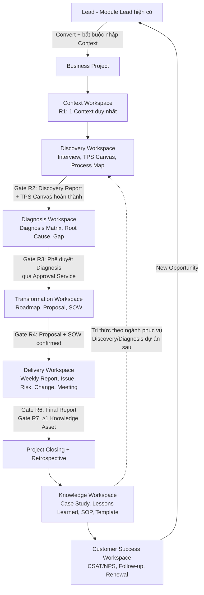

# BUSINESS CONSULTING OS — TÀI LIỆU TỔNG HỢP LUỒNG NGHIỆP VỤ & KIẾN TRÚC THỐNG NHẤT

> Tổng hợp từ: `spec/nghiencuu/handbook.docx` (THUCHOCVN Handbook v1.0), `spec/nghiencuu/thaotac.md`,
> `spec/nghiencuu/bcos_business_project_lifecycle.png` và kết quả khảo sát codebase hiện tại (2026-07-16).
>
> Mục đích: một tài liệu duy nhất mô tả **luồng nghiệp vụ liền mạch từ Lead đến Customer Success**,
> chỉ rõ **chức năng nào được dùng ở bước nào, do ai, dữ liệu sinh ra gì, service nào phục vụ** —
> đảm bảo mọi thành phần trong hệ thống đều có nơi sử dụng, không xây rời rạc.

---

## PHẦN 1 — NGUYÊN TẮC THIẾT KẾ XUYÊN SUỐT

Mọi quyết định thiết kế trong tài liệu này tuân theo 5 nguyên tắc của Handbook, được cụ thể hóa thành quy tắc kỹ thuật:

| # | Nguyên tắc | Quy tắc kỹ thuật bắt buộc |
|---|---|---|
| 1 | **Project Centric** | Mọi dữ liệu nghiệp vụ (deliverable, task, issue, risk, meeting, report, knowledge) đều có khóa ngoại `business_project_id`. Không tồn tại bản ghi "mồ côi" ngoài project. |
| 2 | **Workspace First** | Người dùng điều hướng theo `Business Project → Workspace → Deliverable`. Không có menu chức năng rời (không có trang "Danh sách Weekly Report" toàn hệ thống — report chỉ mở từ trong project). |
| 3 | **Single Source of Truth** | Mỗi loại thông tin chỉ có một nơi lưu. Hồ sơ doanh nghiệp lấy từ Organization/Lead, không nhập lại. Dữ liệu chảy một chiều theo lifecycle, không trùng lặp. |
| 4 | **Knowledge Driven** | Mọi giai đoạn đều sinh Deliverable có version; đóng dự án bắt buộc tạo Knowledge Asset (rào cản cứng, không phải nhắc nhở). Knowledge liên kết 2 chiều với Project sinh ra nó. |
| 5 | **Một Service — dùng mọi nơi** | Mỗi năng lực dùng chung (Approval, Version, Notification, Task, Document, Template, Audit) chỉ có **một** implementation, được mọi Workspace gọi qua cùng một interface. Cấm mỗi module tự chế cơ chế riêng (bài học: SOP hiện tự làm approval riêng trong khi vendor `process-approval` đã cài mà không nơi nào dùng). |

---

## PHẦN 2 — BỨC TRANH TỔNG THỂ: VÒNG ĐỜI KHÉP KÍN



**Ba vòng lặp cần nhìn thấy trong sơ đồ:**

1. **Vòng chính (Lead → Customer Success)**: hành trình một doanh nghiệp qua 8 giai đoạn, mỗi bước qua một Gate có điều kiện cứng.
2. **Vòng thương mại (Customer Success → Lead)**: New Opportunity sau dự án quay lại thành Lead mới trong module Lead hiện có — module Lead vừa là điểm vào vừa là điểm nhận đầu ra, không phải module đứng riêng.
3. **Vòng tri thức (Knowledge → Discovery dự án sau)**: Case Study/SOP/Best Practice được index theo Industry; Consultant dự án mới search trước khi Discovery — đây là lý do Knowledge Workspace phải nối vào Knowledge Center (KcItem) hiện có chứ không tạo kho riêng.

---

## PHẦN 3 — QUY TRÌNH NGHIỆP VỤ CHI TIẾT TỪNG GIAI ĐOẠN

Mỗi giai đoạn mô tả theo cùng một khung: **Ai thao tác → Thao tác gì trong hệ thống → Dữ liệu sinh ra → Service nào phục vụ → Điều kiện chuyển tiếp (Gate)**. Đây là phần bảo đảm "có sự móc nối, đúng nghiệp vụ".

### Giai đoạn 0 — Lead (module Lead hiện có, KHÔNG xây mới)

- **Ai**: Sales / Founder.
- **Thao tác**: quản lý Lead qua pipeline hiện có (lead_pipeline_stages, activities, notes). Khi Lead đủ điều kiện, bấm **"Convert to Business Project"** — chức năng mới duy nhất cần thêm vào module Lead.
- **Hệ thống phản ứng**: form convert bắt buộc chọn/tạo Organization và **bắt buộc nhập Business Context ngay tại bước tạo** (Company Profile, Stakeholder, mục tiêu chiến lược). Không cho tạo Business Project "rỗng".
- **Dữ liệu sinh ra**: 1 bản ghi `business_projects` (stage = `context`), 1 bản ghi `business_contexts`, liên kết `lead_id` để truy vết nguồn gốc.
- **Service phục vụ**: Lead module (nguồn), Organization/Tenancy (định danh doanh nghiệp), Notification (báo Lead Consultant được phân công).

### Giai đoạn 1 — Business Context Workspace

- **Ai**: Consultant (nhập), Lead Consultant (review).
- **Thao tác**: hoàn thiện Business Context Canvas (canvas cấp chiến lược — khác TPS Canvas), Stakeholder Map, Strategic Goals. Đầu ra là **Business Context Report** — tạo qua **Deliverable Engine** từ Template chuẩn.
- **Rule R1 — enforce 2 tầng**:
  - UI: form Context chỉ hiện một lần, không có nút "thêm Context".
  - Service: `BusinessContextService::create()` ném exception nếu project đã có Context — chặn cả trường hợp nhân viên "sửa" bằng cách tạo bản ghi mới thay vì update (unique index `business_contexts.business_project_id`).
- **Service phục vụ**: Deliverable Engine (version 1, draft), Template Service (Context Canvas template), Media (đính kèm hồ sơ), ActivityLog (audit).
- **Gate sang Discovery**: Business Context Report ở trạng thái `approved` (Lead Consultant duyệt qua Approval Service).

### Giai đoạn 2 — Discovery Workspace (nơi nhập liệu thủ công nhiều nhất)

- **Ai**: Consultant thực hiện, doanh nghiệp phối hợp.
- **Thao tác**: ghi **Interview, Observation, Document Review, Data Review, Process Map trực tiếp trong Workspace** (không dùng file Word rời). Sau khi đủ bối cảnh mới chạy **TPS Canvas Workshop** (Handbook nhấn mạnh TPS Canvas là công cụ tổng hợp – đồng thuận, không phải bước đầu tiên). Cuối cùng tổng hợp **Business Discovery Report**.
- **Hệ thống phản ứng**: mỗi bản ghi Interview/Observation/Document Review **tự động trở thành 1 Deliverable con** (version 1, status draft) — đây là điểm móc nối quan trọng: nhập liệu Discovery và Deliverable Engine là MỘT luồng, không phải hai chức năng tách rời.
- **Service phục vụ**: Deliverable Engine (mọi bản ghi), Template Service (mẫu Interview, TPS Canvas, Data Inventory), Media (file đính kèm), Task Service (giao việc khảo sát cho Consultant), Calendar/Meeting (lịch phỏng vấn), **Knowledge Search** (tra cứu Case Study cùng ngành trước khi bắt đầu — vòng tri thức).
- **Gate R2 — sang Diagnosis**: hệ thống kiểm tra checklist: (a) có Business Discovery Report, (b) TPS Canvas đã điền đủ. Thiếu → nút chuyển giai đoạn **disable kèm tooltip liệt kê còn thiếu gì** (chặn trước, không cho qua rồi báo lỗi sau).

### Giai đoạn 3 — Diagnosis Workspace (điểm nghẽn có chủ đích)

- **Ai**: Consultant phân tích, **Founder hoặc Lead Consultant phê duyệt**.
- **Thao tác**: lập Diagnosis Matrix (tài liệu trung tâm), Root Cause (theo RCF), Gap Analysis, xếp ưu tiên bằng Impact–Effort Matrix, đính kèm Evidence (trích từ Deliverable Discovery — liên kết, không copy).
- **Rule R3 — luồng phê duyệt chuẩn (dùng Approval Service dùng chung, KHÔNG tự chế)**:
  1. Consultant bấm **"Gửi phê duyệt"** → Approval Service tạo approval request trên Diagnosis Report.
  2. Notification Service bắn thông báo (in-app + web push) cho người có quyền duyệt.
  3. Người duyệt Approve/Reject kèm nhận xét; ActivityLog ghi lại toàn bộ.
  4. Duyệt xong → nút "Chuyển sang Transformation" mới xuất hiện.
- **Tách "xem trước" và "kích hoạt"**: khi chưa duyệt, Consultant **vẫn soạn được nháp Roadmap** trong Transformation Workspace (deliverable status draft) nhưng **không thể publish** hay gắn Proposal chính thức — quyền publish bị khóa theo trạng thái gate, không khóa quyền soạn thảo.
- **Gate sang Transformation**: Diagnosis Report `approved`.

### Giai đoạn 4 — Transformation Workspace (cổng thương mại)

- **Ai**: Lead Consultant thiết kế, khách hàng xác nhận (ngoài hệ thống), Consultant/PM ghi nhận.
- **Thao tác**: lập **Transformation Design Canvas** để thống nhất với doanh nghiệp trước, sau đó Roadmap theo 4 lớp thời gian (Quick Wins / 30 / 90 / 365 ngày), rồi **Proposal** và **SOW**.
- **Rule R4 — xác nhận thương mại**: khách ký duyệt ngoài hệ thống (email/chữ ký tay) → Consultant/PM tick **"Confirmed"** trên từng deliverable, hệ thống lưu `confirmed_at` + `confirmed_by` làm bằng chứng audit. **MVP không làm chữ ký số** (Digital Signature để Phase 3 đúng roadmap).
- **Service phục vụ**: Deliverable Engine (Canvas/Roadmap/Proposal/SOW đều là deliverable có version — khách yêu cầu sửa Proposal → version mới, giữ lịch sử đàm phán), Template Service (mẫu Proposal/SOW chuẩn), Approval Service (xác nhận nội bộ trước khi gửi khách), Notification (báo Founder khi Proposal được confirm).
- **Gate sang Delivery**: **cả Proposal VÀ SOW cùng `confirmed`** — thiếu một trong hai thì nút mở Delivery disable kèm tooltip.

### Giai đoạn 5 — Delivery Workspace (nhịp vận hành hằng tuần — dùng thường xuyên nhất)

- **Ai**: PM/Consultant vận hành, Lead Consultant giám sát.
- **Nhịp tuần chuẩn** (mỗi phần tử đều móc vào service sẵn có):
  1. **Task**: kế hoạch tuần giao việc qua **module Task hiện có** — task gắn `business_project_id`, hiển thị ngay trong Delivery Workspace (kanban/list tái dụng UI Task). Không xây task tracker thứ hai.
  2. **Meeting**: Weekly Review meeting tạo trong Calendar/Meeting service; minutes là deliverable con; action items từ meeting **sinh Task** — meeting và task nối nhau, không rời.
  3. **Weekly Report**: form report **luôn nằm trong context project** (Rule R5 — không có trang report độc lập, không tạo được report "mồ côi"). Report tổng hợp từ dữ liệu đã có: task done/pending, issue mới, risk thay đổi — hệ thống prefill, Consultant bổ sung nhận định.
  4. **Issue / Risk**: ghi nhận trong workspace; Issue/Risk nghiêm trọng **escalate thành Change Request** → Change Request được duyệt qua Approval Service → nếu ảnh hưởng scope thì sinh version mới cho SOW/Roadmap. Vòng này lặp cho tới khi dự án sẵn sàng đóng.
  5. **Acceptance**: nghiệm thu từng hạng mục, lưu bằng chứng qua Media.
- **Notification** phục vụ toàn giai đoạn: task quá hạn (command TaskOverdue hiện có), report đến hạn, issue mới, approval chờ duyệt.

### Giai đoạn 6 — Project Closing (kỷ luật tri thức được thực thi)

- **Ai**: Lead Consultant/PM đóng dự án; Founder chứng kiến qua dashboard.
- **Rule R6 + R7 — rào cản cứng**: nút **"Đóng dự án"** chỉ enable khi:
  - (R6) có **Final Project Report** (deliverable approved), VÀ
  - (R7) có **≥ 1 Knowledge Asset** (Case Study / Lessons Learned / Best Practice) gắn với project.
  - Thiếu → disable kèm tooltip. Đây là thiết kế có chủ đích: biến việc viết tri thức thành điều kiện đóng dự án, không phải lời nhắc.
- **Hệ thống phản ứng khi đóng thành công**: bắn event `BusinessProjectClosed` → tự động tạo **Project Retrospective** (gợi ý) → khởi động vòng lặp CLS (Consulting Learning System); đồng thời kích hoạt Customer Success Workspace.

### Giai đoạn 7 — Knowledge Workspace (tri thức quay vòng)

- **Ai**: Consultant ghi Lessons Learned, Lead Consultant chuẩn hóa, Founder duyệt Framework/SOP, BA cập nhật Template, Dev nhận Product Backlog.
- **Thao tác & móc nối vào hệ sinh thái tri thức HIỆN CÓ** (không tạo kho mới):
  - Case Study / Lessons Learned / Best Practice / Industry Knowledge → lưu vào **Knowledge Center (KcItem)** với type mới + trường `industry` + khóa ngoại `business_project_id` (liên kết 2 chiều).
  - SOP mới/cải tiến từ dự án → **module SOP hiện có** (đã có versioning + RACI).
  - Template cải tiến → **Template Service** (chính là template mà Deliverable Engine dùng — tri thức cải tiến quay lại chính công cụ tạo deliverable).
  - Yêu cầu cải tiến hệ thống → **Product Backlog** (có thể dùng Task/label riêng hoặc bảng backlog).
  - Luồng chuẩn hóa: `Lessons Learned → Knowledge Review → Knowledge Approval (Approval Service) → Publish vào Knowledge Base` — tái dùng đúng Approval Service của R3/R4.
- **Search theo Industry**: index KcItem theo ngành (bảo hiểm, nông nghiệp, sản xuất, logistics…) để Consultant dự án sau tra cứu ở Discovery — khép vòng tri thức.

### Giai đoạn 8 — Customer Success Workspace (vòng đời không kết thúc ở Closed)

- **Ai**: Customer Success.
- **Thao tác**:
  1. **CSAT/NPS**: tạo khảo sát bằng **Survey engine hiện có** (builder + scoring + webhook), kết quả gắn về `business_project_id` qua bảng `success_reviews` — không xây form khảo sát mới.
  2. **Follow-up định kỳ**: lịch follow-up qua Calendar + Notification nhắc hẹn.
  3. **Renewal / Long-term Roadmap**: ghi nhận cơ hội gia hạn.
  4. **New Opportunity** → bấm "Tạo Lead" → sinh Lead mới trong **module Lead** (kèm nguồn = dự án cũ) — **khép vòng lặp toàn hệ thống**.

---

## PHẦN 4 — MA TRẬN MÓC NỐI: SHARED SERVICE × WORKSPACE

Bảng này là công cụ chống rời rạc: mỗi service dùng chung phải được dùng **nhất quán ở mọi nơi có nghiệp vụ tương ứng**. Ô ✅ = bắt buộc dùng service dùng chung, cấm tự chế.

| Shared Service | Nguồn gốc | Context | Discovery | Diagnosis | Transform. | Delivery | Closing | Knowledge | Cust. Success |
|---|---|:-:|:-:|:-:|:-:|:-:|:-:|:-:|:-:|
| **Deliverable Engine** (version, status, history) | XÂY MỚI (nhân bản pattern versioning của SOP) | ✅ Context Report | ✅ mọi bản ghi | ✅ Diagnosis Report | ✅ Canvas/Roadmap/Proposal/SOW | ✅ Weekly Report, Minutes | ✅ Final Report | ✅ Case Study | ✅ Success Review |
| **Approval Service** | Đấu nối `ringlesoft/laravel-process-approval` (đã migrate, chưa dùng) | ✅ duyệt Context Report | — | ✅ **Gate R3** | ✅ duyệt nội bộ + Change Request | ✅ Change Request | ✅ duyệt Final Report | ✅ Knowledge Approval | — |
| **Template Service** | XÂY MỚI (Phase 1 tối thiểu: template theo type) | ✅ | ✅ TPS Canvas, Interview | ✅ Diagnosis Matrix | ✅ Proposal, SOW | ✅ Weekly Report | ✅ Final Report | ✅ Case Study template | ✅ CSAT form |
| **Task Service** | Module Task HIỆN CÓ (thêm `business_project_id`) | — | ✅ việc khảo sát | ✅ việc phân tích | — | ✅ **trung tâm** | — | ✅ Product Backlog | ✅ follow-up task |
| **Notification** | HIỆN CÓ (DB + web push) | ✅ phân công | ✅ nhắc deadline | ✅ **thông báo phê duyệt R3** | ✅ confirm events | ✅ task/report/issue | ✅ event đóng dự án | ✅ knowledge được duyệt | ✅ nhắc follow-up |
| **Calendar / Meeting** | XÂY MỚI (nhẹ) | — | ✅ lịch interview | ✅ workshop | ✅ họp thống nhất | ✅ Weekly Review | ✅ Retrospective | — | ✅ lịch follow-up |
| **Document/Media** | HIỆN CÓ (MediaLibrary) | ✅ | ✅ | ✅ evidence | ✅ | ✅ acceptance | ✅ | ✅ | ✅ |
| **ActivityLog (Audit)** | HIỆN CÓ (spatie) | ✅ | ✅ | ✅ | ✅ `confirmed_at/by` | ✅ | ✅ | ✅ | ✅ |
| **Knowledge Center (KcItem)** | HIỆN CÓ (mở rộng type + industry + project link) | — | ✅ **tra cứu** ngành | ✅ tra cứu | ✅ tái dụng Proposal cũ | — | — | ✅ **lưu trữ** | — |
| **Survey Engine** | HIỆN CÓ | — | (có thể dùng khảo sát nội bộ) | — | — | — | — | — | ✅ **CSAT/NPS** |
| **Lead Module** | HIỆN CÓ (thêm Convert) | ⬅ điểm vào (convert) | — | — | — | — | — | — | ➡ điểm nhận New Opportunity |
| **SOP Module** | HIỆN CÓ | — | tham chiếu SOP khảo sát | — | — | tham chiếu SOP triển khai | — | ✅ SOP mới từ dự án | tham chiếu SOP CS |
| **Stage Gate Engine** | XÂY MỚI (state machine trên `business_projects.current_stage`) | R1 | R2 | R3 | R4 | R5 | R6+R7 | — | — |

**Quy tắc đọc bảng**: nếu khi implement một workspace mà thấy mình đang viết cơ chế version/approval/notification/task riêng → dừng lại, sai kiến trúc. Ngược lại, nếu một service không có ô ✅ nào ở workspace đang làm → không ép dùng.

---

## PHẦN 5 — BUSINESS RULES R1–R7: NƠI ENFORCE THỐNG NHẤT

Nguyên tắc: **mỗi rule enforce ở 3 tầng** — Database (constraint), Service (exception), UI (disable + tooltip). UI chỉ là lớp trải nghiệm; Service là lớp quyết định; DB là lưới an toàn cuối.

| Rule | Nội dung | DB constraint | Service (quyết định) | UI |
|---|---|---|---|---|
| R1 | 1 Project = 1 Business Context | unique index `business_contexts.business_project_id` | `ContextService::create()` chặn nếu đã tồn tại | Form chỉ hiện 1 lần, không có nút thêm |
| R2 | Discovery xong mới Diagnosis | — | `StageGateService::advance()` kiểm tra Discovery Report + TPS Canvas | Nút chuyển disable + tooltip liệt kê thiếu gì |
| R3 | Diagnosis phê duyệt mới lập Roadmap chính thức | — | Approval Service; `DeliverableService::publish()` chặn publish Roadmap/Proposal khi Diagnosis chưa approved (nháp vẫn soạn được) | Nút "Gửi phê duyệt" → notification → sau duyệt mới hiện nút chuyển |
| R4 | Proposal + SOW confirmed mới Delivery | — | `StageGateService` yêu cầu cả 2 deliverable `confirmed` (lưu `confirmed_at`, `confirmed_by`) | Tick Confirmed thủ công + disable gate khi thiếu |
| R5 | Weekly Report luôn gắn Project | `weekly_reports.business_project_id NOT NULL` | Report chỉ tạo qua `DeliverableService` trong context project | Không có route/trang report độc lập |
| R6 | Final Report trước khi đóng | — | `StageGateService::close()` kiểm tra Final Report approved | Nút "Đóng dự án" disable + tooltip |
| R7 | ≥1 Knowledge Asset khi đóng | — | `StageGateService::close()` đếm KcItem gắn project | Cùng nút R6; sau khi đóng bắn event tạo Retrospective |

**Stage Gate Engine** là MỘT service duy nhất (`StageGateService`) chứa toàn bộ điều kiện chuyển giai đoạn — không rải điều kiện vào từng controller. API gợi ý: `canAdvance(project): GateResult` (trả về danh sách điều kiện đạt/thiếu để UI render tooltip) và `advance(project)` (ném `GateViolationException` nếu thiếu).

---

## PHẦN 5B — UX/NAVIGATION PATTERN (để FE align ngay, không tự suy diễn)

"Workspace First" (Phần 1, nguyên tắc 2) chỉ có giá trị nếu mọi Workspace **dùng chung một layout** — nếu mỗi workspace tự bày khác nhau, Consultant lại phải học lại cách dùng mỗi khi chuyển giai đoạn, phản tác dụng với mục tiêu chuẩn hóa. Pattern layout chuẩn, áp dụng cho **cả 8 workspace không ngoại lệ**:

```text
┌─────────────────────────────────────────────────────────────────┐
│ PROJECT HEADER                                                  │
│ [Tên Business Project] [Organization] [Current Stage badge]     │
│ [Overall Progress bar]  [Project Switcher ▾]     [Actions ▾]    │
├───────────────────────────────────────────────────────────────┤
│ Overview │ Context │ Discovery │ Diagnosis │ Transform. │ ... │ ← Vertical Tabs = 8 Workspace
├─────────────────────────────────────────────┬───────────────────┤
│                                              │ RIGHT SIDEBAR      │
│  WORKSPACE BODY                             │ - Deliverables     │
│  (nội dung riêng của từng workspace:         │   (list + status   │
│   form nhập liệu, canvas, matrix, bảng...)   │    badge + version)│
│                                              │ - Gate checklist   │
│                                              │   (điều kiện R#    │
│                                              │    đạt/thiếu)      │
│                                              │ - Related Tasks    │
│                                              │ - Activity feed    │
└─────────────────────────────────────────────┴───────────────────┘
```

Quy tắc bắt buộc:

- **Project Header** cố định trên mọi màn hình trong project — luôn biết đang ở project nào, đang ở stage nào, không cần đoán từ URL hay breadcrumb rời rạc.
- **Tab ngang theo Workspace** là điều hướng chính (đúng "điều hướng theo Business Project → Workspace", Phần 1) — **không dùng sidebar menu module bên trái** như các module hiện có (Task, SOP…) để tránh Consultant vừa quen 2 kiểu điều hướng khác nhau trong cùng hệ thống.
- **Right Sidebar Deliverables** xuất hiện ở mọi workspace, luôn hiển thị: danh sách deliverable của workspace hiện tại kèm version + status badge, và **Gate checklist** — chính là kết quả `StageGateService::canAdvance()` render trực tiếp (điều kiện đạt/thiếu, tooltip Phần 5 lấy dữ liệu từ đây, không phải text tĩnh).
- Tab bị khóa (chưa qua gate trước) hiển thị icon khóa nhưng **vẫn cho xem** (đúng nguyên tắc "được xem trước, chưa được kích hoạt chính thức" ở Giai đoạn 3) — chỉ khóa hành động ghi/publish, không khóa hành động đọc.

---

## PHẦN 6 — MÔ HÌNH DỮ LIỆU THỐNG NHẤT

### 6.1. Thực thể xây mới (module `BusinessProject`)

```text
organizations (CÓ SẴN)
└── business_projects            ← trung tâm; current_stage; lead_id (truy vết); code; status
    ├── business_project_members ← user_id + project_role (sponsor/owner/lead_consultant/consultant/ba/pm/cs)
    ├── business_contexts        ← UNIQUE(business_project_id) — R1; canvas JSON + stakeholders
    ├── deliverables             ← ĐA HÌNH cho MỌI workspace: type, workspace, version, status
    │   │                          (draft→review→approved→confirmed), parent_id (bản ghi con),
    │   │                          confirmed_at/by, template_id, media, activity log
    │   └── deliverable_versions ← snapshot nội dung từng version (pattern sop_versions)
    ├── milestones               ← mốc theo Roadmap (quick_win/30/90/365)
    ├── issues                   ← tổng quát (thay thế phạm vi hẹp deployment_issues cho consulting)
    ├── risks                    ← likelihood/impact; issue & risk có thể escalate → change_requests
    ├── change_requests          ← liên kết issue/risk nguồn; duyệt qua Approval Service
    ├── meetings                 ← type (interview/workshop/weekly_review/retrospective); minutes → deliverable
    └── success_reviews          ← CSAT/NPS score (nguồn: Survey engine), follow_up_at, renewal, new_lead_id
```

### 6.2. Evidence Linking — pattern cụ thể (bắt buộc dùng, không tự nghĩ cách khác)

Đây là cơ chế cho phát biểu "Diagnosis link evidence về Discovery, không copy" ở Phần 3 — cần một bảng pivot riêng, **không** dùng `parent_id` tự tham chiếu trên `deliverables` (vì `parent_id` đã dùng cho quan hệ deliverable con/cha trong cùng workspace, ví dụ Interview con thuộc Discovery Report cha — hai quan hệ khác nhau về ngữ nghĩa và không được trộn).

```text
deliverable_evidence_links
├── id
├── deliverable_id      ← deliverable ĐANG cần evidence (ví dụ: Diagnosis Matrix)
├── evidence_id         ← deliverable ĐƯỢC trích dẫn làm bằng chứng (ví dụ: Interview #4)
├── evidence_type       ← enum: interview | observation | document_review | data_review | task | metric
├── note                ← Consultant ghi chú tại sao evidence này liên quan (nullable)
└── created_by, created_at
```

Quy tắc dùng:

- Quan hệ **many-to-many**: một Diagnosis Matrix có thể trích nhiều evidence; một Interview có thể được nhiều Diagnosis/Proposal khác nhau trích dẫn lại (ví dụ Transformation trích lại Proposal cũ ở KcItem — Phần 4 dòng "tái dụng Proposal cũ").
- `evidence_id` luôn là `deliverables.id` — evidence luôn là một Deliverable đã tồn tại (Interview/Observation cũng là deliverable, theo Giai đoạn 2). Không tạo bảng evidence riêng ngoài deliverable.
- UI: khi Consultant thêm evidence vào Diagnosis Matrix, chọn từ danh sách deliverable đã có trong project (không nhập tay/copy nội dung) — ép đúng nguyên tắc Single Source of Truth.
- API gợi ý: `DeliverableService::attachEvidence(deliverable, evidenceDeliverable, type, note)` và `DeliverableService::evidenceFor(deliverable): Collection`.

### 6.3. Thực thể mở rộng (không tạo bảng song song)

| Bảng hiện có | Mở rộng |
|---|---|
| `tasks` | thêm `business_project_id` (nullable — task ngoài project vẫn hợp lệ cho nghiệp vụ khác) |
| `kc_items` | thêm types: `case_study`, `lessons_learned`, `best_practice`, `industry_knowledge`; cột `industry`; cột `business_project_id` (liên kết 2 chiều) |
| `leads` | thêm `converted_business_project_id`; thêm `source_project_id` cho Lead sinh từ New Opportunity |
| `process_approvals` (vendor) | dùng cho Deliverable (approvable morph) — kích hoạt package đang "chết" |

### 6.4. Dòng chảy dữ liệu một chiều (Single Source of Truth)

`Lead → business_projects → business_contexts → deliverables(Discovery) → deliverables(Diagnosis, evidence LINK về Discovery) → deliverables(Proposal/SOW) → weekly reports/issues/risks (prefill từ tasks) → final report → kc_items → success_reviews → leads(mới)`

Không nhập lại thông tin ở bước sau nếu bước trước đã có — Diagnosis **link** evidence về Deliverable Discovery chứ không copy; Weekly Report **prefill** từ Task/Issue chứ không gõ lại.

---

## PHẦN 7 — VAI TRÒ & PHÂN QUYỀN THEO ĐÚNG NGHIỆP VỤ

### 7.1. Hai lớp phân quyền (bắt buộc cả hai)

1. **Permission toàn cục** (Spatie, hiện có): thêm nhóm permission mới theo workspace — `business_project.view/create/close`, `context.manage`, `discovery.manage`, `diagnosis.manage`, `diagnosis.approve`, `transformation.manage`, `proposal.confirm`, `delivery.manage`, `knowledge.manage`, `knowledge.approve`, `customer_success.manage`.
2. **Project membership** (mới): Policy kiểm tra `business_project_members` — Consultant chỉ thao tác trên project được phân công; vai trò trong project quyết định quyền trên từng workspace (đúng BPOM 3.10).

### 7.2. Ma trận vai trò × hành động then chốt

| Hành động | Founder | Lead Consultant | Consultant | BA | PM | Customer Success |
|---|:-:|:-:|:-:|:-:|:-:|:-:|
| Convert Lead → Project | ✅ | ✅ | — | — | — | — |
| Nhập Context/Discovery | ✅ | ✅ | ✅ (project của mình) | ✅ tài liệu | — | — |
| Gửi phê duyệt Diagnosis | ✅ | ✅ | ✅ | — | — | — |
| **Duyệt Diagnosis (R3)** | ✅ | ✅ | ❌ | ❌ | ❌ | ❌ |
| Tick Confirm Proposal/SOW (R4) | ✅ | ✅ | ✅ | — | ✅ | — |
| Weekly Report / Issue / Risk | ✅ | ✅ | ✅ | — | ✅ | — |
| Đóng dự án (R6/R7) | ✅ | ✅ | — | — | ✅ | — |
| Duyệt Knowledge / SOP / Framework | ✅ | ✅ (chuẩn hóa) | ghi nhận | template | — | — |
| CSAT/NPS, Renewal, tạo Lead mới | ✅ | — | — | — | — | ✅ |

Mapping với 8 role hiện có: `ceo → Founder`, `system_admin → Admin` giữ nguyên; thêm mới `lead_consultant`, `consultant`, `ba`, `pm`, `customer_success` (role `sales` hiện có tiếp tục phụ trách Lead).

### 7.3. Multi-project context switching (bắt buộc — Consultant/PM thực tế làm 3–5 project song song)

Ma trận vai trò ở 7.2 giả định đang "trong 1 project", nhưng thực tế Consultant/PM không làm một project tại một thời điểm. Hai điểm bắt buộc để tránh nhầm ngữ cảnh (gõ Weekly Report của project A vào project B là lỗi nghiệp vụ nghiêm trọng, không phải lỗi UI nhỏ):

- **Project Switcher** trên Project Header (xem Phần 5B) phải luôn hiển thị, cho đổi project mà **giữ nguyên workspace đang xem** (đang ở tab Delivery của project A, chuyển sang project B → vào thẳng tab Delivery của B, không rơi về Overview) — giảm thao tác lặp cho người làm nhiều project.
- **Dashboard cá nhân** (không phải Dashboard của 1 project) là màn hình tổng hợp **cross-project** riêng: liệt kê tất cả project được phân công, Gate đang chờ hành động của mình ("Diagnosis dự án X đang chờ bạn duyệt"), Task quá hạn, Weekly Report đến hạn — gộp theo người dùng, không theo project. Đây là màn hình vào đầu tiên sau khi login, khác với Business Project Dashboard (Handbook 3.5) là dashboard của một project cụ thể.

Mockup text tối thiểu cho FE:

```text
┌─────────────────────────────────────────────────────────────────┐
│ Xin chào, [Tên user]              [Chọn project để mở ▾]        │
├─────────────────────────────────────────────────────────────────┤
│ MY PROJECTS (3)                                                  │
│  🟢 Project A — Delivery (65%)   🟡 Project B — Diagnosis (chờ) │
│  🔵 Project C — Transformation (30%)                             │
├─────────────────────────────────────────────────────────────────┤
│ CẦN HÀNH ĐỘNG CỦA BẠN                                            │
│  ⏳ Diagnosis "Project B" đang chờ bạn duyệt (R3)                │
│  ⚠️ Weekly Report "Project A" quá hạn 2 ngày                    │
│  ✅ Proposal "Project C" cần tick Confirmed                     │
├─────────────────────────────────────────────────────────────────┤
│ TASK QUÁ HẠN (5)          │  SẮP ĐẾN HẠN (7 ngày tới)            │
└─────────────────────────────────────────────────────────────────┘
```

Mỗi dòng trong khối "Cần hành động của bạn" click thẳng vào đúng workspace/deliverable đang chờ — không qua trang trung gian.

---

## PHẦN 8 — MAPPING MODULE HIỆN CÓ → VỊ TRÍ TRONG BCOS

Mục tiêu: mọi module liên quan đều có vai trò rõ trong luồng; module không liên quan được khoanh vùng rõ để không gây nhiễu.

### 8.1. Tham gia trực tiếp luồng BCOS

| Module hiện có | Vai trò trong luồng | Việc cần làm |
|---|---|---|
| **Lead** | Điểm vào (Giai đoạn 0) + điểm nhận New Opportunity (Giai đoạn 8) | Thêm action Convert; thêm 2 cột liên kết |
| **Task** | Xương sống Delivery; action items từ Meeting | Thêm `business_project_id`; embed UI vào workspace |
| **KcItem (Knowledge Center)** | Kho tri thức của Knowledge Workspace + nguồn tra cứu ở Discovery/Diagnosis | Thêm types + industry + project link; nâng search |
| **SOP** | Thư viện SOP (1 trong 8 nhóm tri thức); SOP mới sinh từ dự án | Giữ nguyên; về dài hạn chuyển approval riêng sang Approval Service chung |
| **Survey** | Engine CSAT/NPS cho Customer Success | Tạo flow khảo sát gắn `success_reviews` |
| **Notification** | Mọi event: phân công, phê duyệt, gate, quá hạn, follow-up | Thêm notification types mới |
| **Organization/Tenancy, RBAC, Media, ActivityLog** | Hạ tầng mọi workspace | Thêm permissions; dùng nguyên |
| **process-approval (vendor)** | Approval Service dùng chung (R3, R4, Change Request, Knowledge, Final Report) | Đấu nối lần đầu — implement `ApprovableModel` cho Deliverable |
| **Customer** | Hồ sơ khách hàng sau khi Lead convert | Liên kết Organization ↔ Customer thống nhất |

### 8.2. Không thuộc luồng BCOS (khoanh vùng, không đụng)

Assessment, Recruitment/JobPosting/Marketplace, Employee/Department/Branch/Leave/PerformanceReview/KpiGoal (khối HR), OcopRubric, Subscription, Deployment/BusinessSolution/Blueprint (engine triển khai vertical — nghiệp vụ khác với consulting delivery), WorkflowAutomation (có thể dùng sau cho Phase 3 Workflow Engine). **Các route stub 503 legacy** (products/orders/categories/settings/reports trong `routes/web.php` gốc) → gỡ bỏ.

---

## PHẦN 9 — LỘ TRÌNH TRIỂN KHAI (bám roadmap Handbook 5.9)

### Phase 1 — MVP: "triển khai được một dự án tư vấn từ đầu đến cuối"

Thứ tự build có chủ đích — nền trước, workspace sau, mỗi bước dùng ngay được:

1. **Nền**: module `BusinessProject` (bảng lõi + members) + **Deliverable Engine** + **Stage Gate Engine** + permissions/policies 2 lớp.
2. **Đầu vào**: Lead Convert + Context Workspace (R1).
3. **Discovery Workspace** (R2) — nhập liệu + TPS Canvas + Discovery Report.
4. **Transformation Workspace** (R4) — Roadmap/Proposal/SOW + confirm thủ công.
5. **Delivery Workspace** (R5) — Weekly Report + Issue/Risk + đấu Task + Meeting tối thiểu.
6. **Đóng dự án** với R6/R7 ở mức tối thiểu (Final Report + 1 Lessons Learned vào KcItem).

> ⚠️ **Ghi chú bắt buộc đọc — Bypass Diagnosis ở Phase 1**: Handbook cho phép MVP đi tắt Discovery → Transformation (chưa cần Diagnosis Workspace đầy đủ với Approval R3). Đây là **quyết định phạm vi có kiểm soát, không phải lỗ hổng thiết kế**. Điều kiện bắt buộc: `StageGateService` **phải implement đủ 8 stage và rule R1–R7 từ đầu**, trong đó Gate R3 (Diagnosis approval) được cấu hình qua **feature flag** (ví dụ `stage_gates.diagnosis.enforced = false` ở Phase 1). Khi Phase 2 bật Diagnosis Workspace, chỉ cần đổi flag thành `true` — **không refactor lại StageGateService, không migrate lại dữ liệu**. Nếu Phase 1 code cứng luồng "Discovery → Transformation" mà không đi qua state `diagnosis` (dù skip), Phase 2 sẽ phải sửa state machine và toàn bộ dữ liệu project đang chạy — đây là rủi ro kỹ thuật lớn nhất của cách "đi tắt", nên phải chặn từ thiết kế, không chặn bằng review sau.

**Tiêu chí hoàn thành Phase 1**: 1 dự án thật chạy trọn Lead → Closed trong hệ thống; 100% deliverable có version; không bản ghi mồ côi; `StageGateService` đã có đủ 8 stage (dù stage `diagnosis` đang tắt flag).

### Phase 2 — Chuẩn hóa

Diagnosis Workspace đầy đủ + **Approval Service (R3)**; Knowledge Workspace hoàn chỉnh (types, industry, liên kết 2 chiều, Retrospective event, luồng Knowledge Approval); Customer Success (Survey CSAT/NPS, follow-up, New Opportunity → Lead); BCOS Dashboard + KPI (tận dụng Report module); Template Library chuẩn.

### Phase 3 — Tự động hóa

Workflow Engine (cân nhắc tái dụng WorkflowAutomation state-machine hiện có), Template Engine nâng cao, Digital Signature, Import/Export, full-text search (Scout + Meilisearch) cho Knowledge.

### Phase 4 — AI Ready

AI Discovery Assistant, AI Diagnosis Assistant, AI Proposal Draft, AI Weekly Summary, AI Knowledge Search — nền tảng AiCopilot + OpenAI/Anthropic SDK đã sẵn; điều kiện là dữ liệu chuẩn hóa từ Phase 1–3. AI chỉ hỗ trợ, không thay thế Consultant.

---

## PHẦN 10 — METRICS & OS HEALTH (BCOS tự đo chính nó)

Đây là phần phân biệt "hệ điều hành" (Operating System — Handbook Chương 5, Volume 04) với "một cái tool quản lý dự án": BCOS phải tự đo được mức độ chính nó đang được tuân thủ và tạo ra giá trị, không chỉ đo dự án của khách. Các KPI này lấy thẳng từ dữ liệu đã có trong Phần 6 (không cần bảng mới), hiển thị trên **Founder/BCOS Dashboard** (khác Dashboard cá nhân ở 7.3 và Dashboard 1 project ở Handbook 3.5):

- **Gate Compliance Rate** — % Business Project đi đúng tuần tự gate (không bị bypass ngoài chủ đích Phase 1 ở Phần 9), % gate bị "trễ" quá X ngày kể từ khi đủ điều kiện nhưng chưa ai bấm chuyển — đo trực tiếp mục tiêu BRD "100% Business Project theo TCF" (Handbook 1.11).
- **Knowledge Reuse Rate** — % KcItem (Case Study/SOP/Template) được `deliverable_evidence_links` hoặc Discovery Workspace tra cứu lại ở ≥1 project khác sau khi publish; đo đúng triết lý "tri thức quay vòng" (Phần 2, vòng lặp thứ 3) — nếu tỷ lệ này thấp, Knowledge Workspace đang chỉ là nơi lưu trữ, không phải nơi tái sử dụng.
- **Average Cycle Time theo giai đoạn** — thời gian trung bình mỗi project ở mỗi stage (Context, Discovery, Diagnosis…) tính từ `business_projects.current_stage` history — phát hiện giai đoạn nào đang "tắc" thật (so với thaotac.md mục 3 mô tả Diagnosis là "điểm nghẽn có chủ đích" — cần số liệu để phân biệt tắc có chủ đích với tắc do vận hành kém).
- **Deliverable Version Discipline** — % deliverable có ≥2 version khi confirmed (chứng minh có review/sửa thật, không phải tạo 1 lần rồi confirm ngay) và % deliverable dùng đúng Template chuẩn — đo mục tiêu "100% Deliverables sử dụng Template chuẩn" (Handbook 1.11).
- **CSAT/NPS trung bình + Renewal Rate** — từ `success_reviews` (Phần 6.3), đo đầu ra cuối của toàn vòng đời, không chỉ đo nội bộ.
- **R7 Fulfillment Rate** — % project đóng có Knowledge Asset (không chỉ đạt điều kiện tối thiểu 1, mà theo dõi trung bình bao nhiêu Knowledge Asset/project) — nếu số này giảm dần theo thời gian, dấu hiệu R7 đang bị làm hình thức (viết 1 Lessons Learned sơ sài để mở khóa nút Đóng) và cần Founder/Lead Consultant siết lại chất lượng review trước khi Knowledge Approval, không phải siết thêm rule.

Nguyên tắc áp dụng: **các KPI này không phải báo cáo làm thêm** — mỗi con số đều tính được từ dữ liệu bắt buộc phải có do R1–R7 và Deliverable Engine (Phần 5–6), nếu một KPI cần thêm bảng riêng để tính, nghĩa là mô hình dữ liệu ở Phần 6 đang thiếu, cần bổ sung ở nguồn chứ không phải thêm bảng thống kê song song (vi phạm Single Source of Truth).

Toàn bộ KPI trên hiển thị tập trung tại **BCOS Admin Dashboard** (màn hình mới, phân biệt với Dashboard cá nhân ở 7.3 và Business Project Dashboard ở Handbook 3.5 — đây là dashboard cấp toàn hệ thống, chỉ Founder/Admin truy cập) và **hỗ trợ export CSV** cho từng bảng/KPI để Founder dùng ngoài hệ thống khi cần (báo cáo nhà đầu tư, review nội bộ) — tái dụng cơ chế export đã có ở Report module, không xây engine export riêng.

---

## PHẦN 11 — CHECKLIST CHỐNG RỜI RẠC (dùng khi review mỗi PR)

- [ ] Bản ghi mới có `business_project_id` chưa? (trừ shared service thuần)
- [ ] Tài liệu đầu ra có đi qua Deliverable Engine không, hay đang tạo bảng document riêng?
- [ ] Luồng duyệt có dùng Approval Service chung không, hay đang tự chế cột status?
- [ ] Thông báo có qua Notification Service không?
- [ ] Điều kiện chuyển giai đoạn có nằm trong `StageGateService` không, hay đang if/else trong controller?
- [ ] UI có nằm trong Workspace của project không, hay đang tạo menu/trang độc lập?
- [ ] Dữ liệu bước sau có link về bước trước không, hay đang copy/nhập lại? Nếu cần trích dẫn evidence, có dùng `deliverable_evidence_links` (Phần 6.2) không, hay đang tự chế cột tham chiếu mới?
- [ ] Tri thức sinh ra có vào KcItem (kèm industry + project link) không, hay đang lưu chỗ khác?
- [ ] Workspace mới có theo đúng layout chuẩn (Project Header + Vertical Tabs + Right Sidebar Deliverables, Phần 5B) không, hay đang tự vẽ layout riêng?
- [ ] Nếu thêm rule/gate mới, đã đi qua feature flag của `StageGateService` (Phần 9 note bypass) hay đang code cứng luồng bỏ qua stage?
