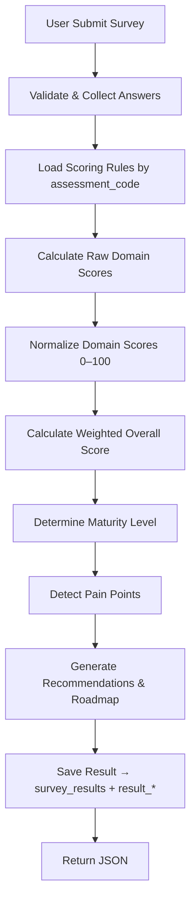

# SCORING ENGINE SPECIFICATION
**Module**: Survey
**Assessment**: AI Readiness & Workflow Assessment
**Version**: 3.1
**Target reader**: Backend Developer

> **Changelog v3.1**: Bổ sung Section 13 (Bảo mật), Section 14 (Mở rộng & Linh hoạt), Section 15 (Task Breakdown). Đây là tài liệu thiết kế đầy đủ trước khi bắt đầu implement.
> **Changelog v3.0**: Phân tích mapping với Module Survey hiện có, loại bỏ bảng trùng lặp, điều chỉnh schema để tái sử dụng infrastructure đã có, giải quyết các open questions từ v2.1.

---

## 1. Giới thiệu & Mục tiêu

Scoring Engine là **bộ não trung tâm** của Module Survey — không phải hàm cộng điểm đơn giản mà là một **Rule Engine + Business Intelligence Engine** có khả năng:

- Đánh giá mức độ trưởng thành vận hành doanh nghiệp
- Xác định AI Readiness
- Phát hiện pain points / bottleneck
- Tính điểm domain, overall score, maturity level
- Generate recommendation, roadmap, gói dịch vụ phù hợp
- Hỗ trợ **nhiều assessment khác nhau** trong tương lai

**Nguyên tắc cốt lõi**:
- **Config-driven & Dynamic 100%** — không hardcode bất kỳ score, domain, weight, maturity, recommendation nào
- **Relational-first** — toàn bộ config lưu thành bảng quan hệ, tránh JSON columns
- **Tái sử dụng infrastructure hiện có** — không tạo bảng mới khi bảng đã có phục vụ đúng mục đích
- Dễ mở rộng: thêm assessment mới, thay đổi scoring model, thêm ngành nghề **không cần rewrite code**

---

## 2. Mapping với Module Survey hiện có

> **Quan trọng**: Module Survey đã có sẵn một số bảng cốt lõi. Spec v2.1 đề xuất 17 bảng mới — phân tích dưới đây cho thấy một số bảng đó bị trùng lặp hoặc có thể mở rộng thay vì tạo mới.

### 2.1 Bảng ánh xạ

| Spec v2.1 (đề xuất) | Bảng thực tế | Quyết định | Lý do |
|---|---|---|---|
| `assessments` | `surveys` | **EXTEND** — thêm cột `assessment_code` | `surveys` đã lưu title, slug, status, version — chỉ cần thêm mã định danh cho scoring engine |
| `assessment_domains` | _(chưa có)_ | **CREATE NEW** | Không có tương đương |
| `maturity_levels` | _(chưa có)_ | **CREATE NEW** | Không có tương đương |
| `score_rules` | _(chưa có)_ | **CREATE NEW** | Thay `question_code` bằng `field_key` để khớp với `survey_fields.field_key` |
| `score_rule_options` | `survey_field_options` | **CREATE NEW** (tách biệt) | `survey_field_options` là tầng presentation (label, sort, is_other). Scoring là concern khác — tách riêng cho phép nhiều assessment score cùng option khác nhau |
| `pain_point_rules` | _(chưa có)_ | **CREATE NEW** | Không có tương đương |
| `recommendation_rules` | _(chưa có)_ | **CREATE NEW** | Không có tương đương |
| `roadmap_phases` | _(chưa có)_ | **CREATE NEW** | Không có tương đương |
| `roadmap_milestones` | _(chưa có)_ | **CREATE NEW** | Không có tương đương |
| `survey_submissions` | `survey_responses` | **REUSE** — không tạo bảng mới | Cấu trúc tương đương: survey_id, respondent_ref, status, submitted_at |
| `submission_answers` | `survey_answers` | **REUSE** — không tạo bảng mới | Typed columns (value_string, value_number, value_bool, option_id) **tốt hơn** VARCHAR blob đề xuất |
| `survey_results` | _(chưa có)_ | **CREATE NEW** | FK về `survey_responses.id` thay vì `survey_submissions.id` |
| `result_domain_scores` | _(chưa có)_ | **CREATE NEW** | Không có tương đương |
| `result_signal_flags` | _(chưa có)_ | **CREATE NEW** | Không có tương đương |
| `result_pain_points` | _(chưa có)_ | **CREATE NEW** | Không có tương đương |
| `result_recommendations` | _(chưa có)_ | **CREATE NEW** | Không có tương đương |
| `result_roadmap_phases` | _(chưa có)_ | **CREATE NEW** | Không có tương đương |

**Tổng kết**: 17 bảng đề xuất → EXTEND 1 bảng hiện có + CREATE 13 bảng mới + REUSE 2 bảng hiện có (không đổi schema).

### 2.2 Ánh xạ tên field/khái niệm

| Spec v2.1 | Module Survey hiện có | Ghi chú |
|---|---|---|
| `question_code` | `survey_fields.field_key` | Cùng khái niệm, dùng `field_key` trong code |
| `assessment_code` | Cần thêm vào `surveys.assessment_code` | Slug không đủ vì slug có thể đổi |
| `answer_value VARCHAR` | `survey_answers.value_bool / value_number / option_id` | Typed columns tốt hơn: index được, type-safe, query từng option không cần parse |
| `condition_type = 'boolean'` | `FieldType::Boolean` (value_kind = Bool) | Đọc `survey_answers.value_bool` |
| `condition_type = 'single_choice'` | `FieldType::Select / Radio` (value_kind = Option) | Đọc `survey_answers.option_id` → join `survey_field_options.option_value` |
| `condition_type = 'multi_choice'` | `FieldType::Checkbox` (value_kind = Option) | Nhiều rows trong `survey_answers` cùng `response_id + field_id`, mỗi row một `option_id` |

### 2.3 Cách Scoring Engine đọc câu trả lời từ `survey_answers`

```
-- Boolean field
SELECT value_bool FROM survey_answers
WHERE response_id = :rid AND field_id = (
    SELECT id FROM survey_fields WHERE survey_id = :sid AND field_key = :field_key
)

-- Single-choice / Multi-choice
SELECT sfo.option_value
FROM survey_answers sa
JOIN survey_field_options sfo ON sa.option_id = sfo.id
WHERE sa.response_id = :rid AND sa.field_id = (
    SELECT id FROM survey_fields WHERE survey_id = :sid AND field_key = :field_key
)
-- Multi-choice trả về nhiều rows, service collect thành array
```

---

## 3. Flow Scoring Engine



**Bảng tham chiếu theo bước:**

| Bước | Đọc từ | Ghi vào |
|---|---|---|
| Load rules | `surveys` (assessment_code), `assessment_domains`, `score_rules`, `score_rule_options`, `pain_point_rules`, `recommendation_rules` | — |
| Collect answers | `survey_responses`, `survey_answers`, `survey_fields`, `survey_field_options` | — |
| Calculate scores | (tính toán in-memory) | — |
| Save result | — | `survey_results`, `result_domain_scores`, `result_signal_flags`, `result_pain_points`, `result_recommendations`, `result_roadmap_phases` |

---

## 4. Domain & Weight (Configurable)

Mỗi assessment có domain & trọng số riêng, lưu trong bảng `assessment_domains`.

**Mặc định cho AI Readiness & Workflow Assessment:**

| Domain | Ý nghĩa | Weight |
|---|---|---|
| `workflow` | Quy trình & Vận hành | 25% |
| `sales` | Bán hàng & Khách hàng | 20% |
| `hr` | Nhân sự & Đào tạo | 15% |
| `data` | Dữ liệu & Hệ thống | 20% |
| `ai` | AI Readiness | 20% |

> **Constraint**: Tổng weight của tất cả domain trong một assessment **phải bằng 100%**. Backend validate khi load config.

---

## 5. Scoring Rules (Positive + Negative Signals)

Toàn bộ rules lưu trong bảng `score_rules` và `score_rule_options`. Mỗi rule gắn với `field_key` + `assessment_code`.

> **Lưu ý tên field**: Spec v2.1 dùng `question_code` — trong implementation thực tế dùng `field_key` (khớp với `survey_fields.field_key`).

### 5.1 Workflow Domain

| Signal | field_key tương ứng | Loại | Score |
|---|---|---|---|
| Có SOP | `existing_systems` (option: `sop`) | Positive | +15 |
| Có workflow rõ ràng | `workflow_mode` (option: `partial_digital`, `full_digital`) | Positive | +15 |
| Có dashboard theo dõi | `existing_systems` (option: `dashboard`) | Positive | +10 |
| Có task management / phân quyền | `existing_systems` (option: `workflow`) | Positive | +10 |
| Có quy trình phê duyệt | `existing_systems` (option: `approval`) | Positive | +8 |
| CEO khó kiểm soát hoạt động | `current_problems` (option: `hard_to_control`) | Negative | -15 |
| Vận hành thủ công | `workflow_mode` (option: `manual`) | Negative | -10 |
| Không có SOP | `existing_systems` không chứa `sop` | Negative | -15 |
| Sai sót lặp lại / chồng chéo công việc | `current_problems` (option: `work_overlap`) | Negative | -12 |
| Phụ thuộc nhân sự chủ chốt | `current_problems` (option: `key_person_dependency`) | Negative | -15 |

**Max lý thuyết**: +58 | **Min lý thuyết**: -67

### 5.2 Sales Domain

| Signal | field_key tương ứng | Loại | Score |
|---|---|---|---|
| Có CRM | `using_crm` (true) hoặc `existing_systems` (option: `crm`) | Positive | +20 |
| Có KPI / đo conversion rate | `lead_management_tool` (option: `kpi_tracking`) | Positive | +15 |
| Có dashboard sales | `existing_systems` (option: `sales_dashboard`) | Positive | +10 |
| Có hệ thống follow-up tự động | `lead_management_tool` (option: `auto_followup`) | Positive | +15 |
| Lead bị bỏ quên | `current_problems` (option: `lead_loss`) | Negative | -18 |
| Sale nghỉ → mất data khách hàng | `current_problems` (option: `data_loss_on_resign`) | Negative | -15 |
| Không follow-up | `lead_management_tool` (option: `no_followup`) | Negative | -12 |
| Không đo KPI | `lead_management_tool` (option: `no_kpi`) | Negative | -10 |

**Max lý thuyết**: +60 | **Min lý thuyết**: -55

### 5.3 HR Domain

| Signal | field_key tương ứng | Loại | Score |
|---|---|---|---|
| Có quy trình onboarding | `existing_systems` (option: `onboarding`) | Positive | +15 |
| Có KPI nhân sự | `existing_systems` (option: `hr_kpi`) | Positive | +15 |
| Có SOP đào tạo | `existing_systems` (option: `training_sop`) | Positive | +15 |
| Có task management | `existing_systems` (option: `workflow`) | Positive | +10 |
| Nhân sự mới khó bắt nhịp công việc | `current_problems` (option: `new_staff_slow`) | Negative | -15 |
| Phụ thuộc nhân sự cũ | `current_problems` (option: `key_person_dependency`) | Negative | -18 |
| Đào tạo hoàn toàn thủ công | `existing_systems` không chứa `training_sop` | Negative | -10 |

**Max lý thuyết**: +55 | **Min lý thuyết**: -43

### 5.4 Data Domain

| Signal | field_key tương ứng | Loại | Score |
|---|---|---|---|
| Dữ liệu tập trung một nơi | `current_problems` không chứa `data_scattered` | Positive | +20 |
| Có hạ tầng cloud | `existing_systems` (option: `cloud_infra`) | Positive | +15 |
| Có cơ chế backup định kỳ | `existing_systems` (option: `backup`) | Positive | +10 |
| Có realtime dashboard + phân quyền | `existing_systems` (option: `dashboard`) + `existing_systems` (option: `access_control`) | Positive | +15 |
| Dữ liệu phân tán nhiều nơi | `current_problems` (option: `data_scattered`) | Negative | -20 |
| Không có backup | `existing_systems` không chứa `backup` | Negative | -15 |
| Dữ liệu sai / trùng lặp | `current_problems` (option: `data_duplicate`) | Negative | -15 |

**Max lý thuyết**: +60 | **Min lý thuyết**: -50

### 5.5 AI Domain

| Signal | field_key tương ứng | Loại | Score |
|---|---|---|---|
| Đã sử dụng AI tool | `ai_tools_used` (không rỗng) | Positive | +10 |
| Có AI use case cụ thể | `ai_use_cases` (có option cụ thể) | Positive | +15 |
| Lãnh đạo sẵn sàng đầu tư AI | `ai_investment_readiness` (option: `ready`) | Positive | +20 |
| Có workflow + dữ liệu đủ để áp dụng AI | `workflow_mode` không phải `manual` + không có `data_scattered` | Positive | +15 |
| Nhân sự chưa biết AI | `current_problems` (option: `staff_no_ai_knowledge`) | Negative | -10 |
| Dữ liệu chưa sẵn sàng cho AI | `current_problems` (option: `data_not_ai_ready`) | Negative | -20 |
| Không biết bắt đầu từ đâu | `ai_investment_readiness` (option: `dont_know_where_to_start`) | Negative | -12 |
| Không có use case rõ ràng | `ai_use_cases` (rỗng / option: `none`) | Negative | -15 |

**Max lý thuyết**: +60 | **Min lý thuyết**: -57

---

## 6. Tính toán điểm

### 6.1 Raw Domain Score

```
RawScore(domain) = Σ score của tất cả rules được trigger thuộc domain đó
```

Một rule được trigger khi câu trả lời của user match điều kiện của rule (`score_rules.condition_type`).

### 6.2 Normalized Domain Score

```
NormalizedScore(domain) = ((RawScore - MinScore) / (MaxScore - MinScore)) × 100
```

- `MinScore` và `MaxScore` lưu tường minh trong `assessment_domains.min_score` / `max_score` — không tính động tại runtime.
- Kết quả clamp về `[0, 100]` để tránh vượt biên khi rules conflict.

**Ví dụ — Workflow domain:**
```
MinScore = -67, MaxScore = +58
RawScore  = +20
Normalized = ((20 - (-67)) / (58 - (-67))) × 100 = (87 / 125) × 100 = 69.6
```

### 6.3 Overall Score

```
OverallScore = Σ (NormalizedScore(domain) × Weight(domain))
```

**Ví dụ:**
```
workflow: 69.6 × 0.25 = 17.4
sales:    55.0 × 0.20 = 11.0
hr:       60.0 × 0.15 =  9.0
data:     72.0 × 0.20 = 14.4
ai:       40.0 × 0.20 =  8.0
─────────────────────────────
OverallScore = 59.8
```

---

## 7. Maturity Level

Lưu trong bảng `maturity_levels` — mỗi ngưỡng là một row.

| Overall Score | Level | Ý nghĩa |
|---|---|---|
| 0 – 30 | `MANUAL_OPERATION` | Vận hành thủ công |
| 31 – 60 | `DIGITAL_FOUNDATION` | Nền tảng số cơ bản |
| 61 – 80 | `AI_READY` | Sẵn sàng triển khai AI |
| 81 – 100 | `AI_TRANSFORMATION` | Chuyển đổi AI toàn diện |

> **Edge case**: Score = 30 → `MANUAL_OPERATION`; score = 31 → `DIGITAL_FOUNDATION`. Backend dùng `score >= min_score AND score <= max_score`.

---

## 8. Pain Point Detection

Pain points detect dựa trên **tổ hợp signal flags** — không phải domain score.
Mỗi điều kiện là một row trong bảng `pain_point_rules`.

| Condition | Pain Point Code | Label |
|---|---|---|
| `!HAS_CRM && LEAD_LOSS` | `sales_leakage` | Rò rỉ lead bán hàng |
| `DATA_FRAGMENTED` | `fragmented_data` | Dữ liệu phân tán |
| `!HAS_SOP` | `manual_workflow` | Thiếu quy trình chuẩn |
| `CEO_HARD_TO_CONTROL` | `lack_of_visibility` | CEO thiếu tầm nhìn vận hành |
| `TRAINING_DEPENDENCY` | `training_dependency` | Phụ thuộc nhân sự đào tạo |

Signal flags được emit từ `score_rule_options.signal_flag` (và `score_rules.signal_flag` cho boolean rules), sau đó lưu vào `result_signal_flags` khi calculate.

---

## 9. Recommendation & Roadmap

### 9.1 Recommendation Rules

Lưu trong bảng `recommendation_rules` — mỗi rule là một row.

| Condition | Recommendation Code | Priority |
|---|---|---|
| `workflow_score < 40` | `workflow_foundation` | 1 |
| `sales_score < 50` | `crm_setup` | 1 |
| `hr_score < 40` | `hr_process_setup` | 2 |
| `ai_score < 30` | `ai_training` | 2 |
| `data_score < 40` | `data_cleanup` | 2 |

> **Lưu ý**: Domain `hr` đã có recommendation rule (`hr_score < 40 → hr_process_setup`). Đây là rule còn thiếu trong spec v2.1, đã bổ sung vào seed data.

### 9.2 Roadmap

Lưu trong bảng `roadmap_phases` và `roadmap_milestones` — mỗi maturity level có nhiều phases, mỗi phase có nhiều milestones.

---

## 10. Database Schema

> **Nguyên tắc**: Toàn bộ config lưu dạng bảng quan hệ. Không dùng JSON columns cho config.
> JSON chỉ được dùng tại **1 chỗ duy nhất** (`pain_point_rules.required_flags` — xem lý do tại mục đó).

> **Ký hiệu**: `[EXISTING]` = bảng đã có, chỉ cần migrate thêm cột. `[NEW]` = bảng mới cần tạo.

---

### 10.1 `surveys` [EXISTING — EXTEND]

Thêm cột `assessment_code` vào bảng `surveys` hiện có:

```sql
ALTER TABLE surveys
    ADD COLUMN assessment_code VARCHAR(50) NULL UNIQUE AFTER slug,
    ADD INDEX idx_assessment_code (assessment_code);
```

> **Lý do**: Dùng `assessment_code` để Scoring Engine load config mà không phụ thuộc vào `slug` (slug có thể thay đổi). Nullable vì không phải survey nào cũng có scoring.

---

### 10.2 `assessment_domains` [NEW]
Thay thế JSON config `domain_weights` và `domain_min_max`.

```sql
CREATE TABLE assessment_domains (
    id              BIGINT PRIMARY KEY AUTO_INCREMENT,
    assessment_code VARCHAR(50)    NOT NULL,          -- FK logic tới surveys.assessment_code
    domain_code     VARCHAR(50)    NOT NULL,          -- e.g. "workflow", "sales"
    label           VARCHAR(100)   NOT NULL,          -- e.g. "Quy trình & Vận hành"
    weight          DECIMAL(5,4)   NOT NULL,          -- e.g. 0.2500
    min_score       INT            NOT NULL,          -- raw score thấp nhất lý thuyết
    max_score       INT            NOT NULL,          -- raw score cao nhất lý thuyết
    sort_order      TINYINT        DEFAULT 0,
    is_active       BOOLEAN        DEFAULT TRUE,

    UNIQUE KEY uq_domain (assessment_code, domain_code)
);
```

**Seed data cho AI Readiness assessment:**

| assessment_code | domain_code | weight | min_score | max_score |
|---|---|---|---|---|
| `ai_workflow_v1` | `workflow` | 0.2500 | -67 | +58 |
| `ai_workflow_v1` | `sales` | 0.2000 | -55 | +60 |
| `ai_workflow_v1` | `hr` | 0.1500 | -43 | +55 |
| `ai_workflow_v1` | `data` | 0.2000 | -50 | +60 |
| `ai_workflow_v1` | `ai` | 0.2000 | -57 | +60 |

> **Constraint**: Backend validate `SUM(weight) = 1.0000` khi load config. Nếu sai → log error, không calculate.

---

### 10.3 `maturity_levels` [NEW]
Thay thế JSON `maturity_thresholds`.

```sql
CREATE TABLE maturity_levels (
    id              BIGINT PRIMARY KEY AUTO_INCREMENT,
    assessment_code VARCHAR(50)  NOT NULL,
    level_code      VARCHAR(50)  NOT NULL,   -- e.g. "DIGITAL_FOUNDATION"
    label           VARCHAR(100) NOT NULL,   -- e.g. "Nền tảng số cơ bản"
    description     TEXT         NULL,       -- mô tả chi tiết cho UI
    min_score       DECIMAL(5,2) NOT NULL,   -- e.g. 31.00
    max_score       DECIMAL(5,2) NOT NULL,   -- e.g. 60.00
    sort_order      TINYINT      DEFAULT 0,

    UNIQUE KEY uq_level (assessment_code, level_code)
);
```

---

### 10.4 `score_rules` [NEW]

```sql
CREATE TABLE score_rules (
    id              BIGINT PRIMARY KEY AUTO_INCREMENT,
    assessment_code VARCHAR(50)  NOT NULL,
    field_key       VARCHAR(100) NOT NULL,   -- khớp với survey_fields.field_key
    domain_code     VARCHAR(50)  NOT NULL,   -- khớp với assessment_domains.domain_code
    signal_flag     VARCHAR(100) NULL,       -- e.g. "HAS_CRM" — nullable nếu không emit flag
    score_if_true   INT          NOT NULL DEFAULT 0,  -- dùng khi condition_type = 'boolean'
    score_if_false  INT          NOT NULL DEFAULT 0,  -- dùng khi condition_type = 'boolean'
    condition_type  ENUM('boolean', 'single_choice', 'multi_choice') NOT NULL DEFAULT 'boolean',
    is_active       BOOLEAN      DEFAULT TRUE,

    UNIQUE KEY uq_rule (assessment_code, field_key, domain_code)
    -- Bỏ UNIQUE trên (assessment_code, field_key) để 1 field_key có thể thuộc nhiều domain
);
```

> **Mapping với `FieldType` enum hiện có:**
> - `condition_type = 'boolean'` → `FieldType::Boolean` — đọc `survey_answers.value_bool`
> - `condition_type = 'single_choice'` → `FieldType::Select / Radio` — đọc `survey_answers.option_id`
> - `condition_type = 'multi_choice'` → `FieldType::Checkbox` — nhiều rows cùng `response_id + field_id`

> **Lý do dùng `field_key` (VARCHAR) thay vì FK `field_id`**: `field_key` là định danh ngữ nghĩa bền vững — nếu field bị xóa và tạo lại với cùng key, rule vẫn hoạt động. FK tới `survey_fields.id` sẽ bị null khi field bị recreate.

> **Lưu ý về một field thuộc nhiều domain**: UNIQUE KEY chỉ enforce trên `(assessment_code, field_key, domain_code)` — cho phép `field_key = 'existing_systems'` thuộc cả `workflow` lẫn `hr` domain với các `score_rules` riêng biệt.

---

### 10.5 `score_rule_options` [NEW]
Dùng cho câu hỏi dạng choice (`single_choice` và `multi_choice`).

```sql
CREATE TABLE score_rule_options (
    id            BIGINT PRIMARY KEY AUTO_INCREMENT,
    rule_id       BIGINT       NOT NULL REFERENCES score_rules(id),
    option_value  VARCHAR(100) NOT NULL,   -- khớp với survey_field_options.option_value
    score         INT          NOT NULL DEFAULT 0,
    signal_flag   VARCHAR(100) NULL,       -- flag emit khi option này được chọn
    sort_order    TINYINT      DEFAULT 0,

    UNIQUE KEY uq_option (rule_id, option_value)
);
```

> **Tại sao không extend `survey_field_options`?** Ba lý do:
> 1. `survey_field_options` là tầng presentation (label, sort, is_other) — scoring là concern riêng
> 2. Nhiều assessment trong tương lai có thể score cùng một option khác nhau
> 3. Không phải option nào cũng có scoring rule → cột nullable trên `survey_field_options` sẽ sparse

> **Liên kết với `survey_field_options`**: Match theo `option_value` (VARCHAR), không phải FK. Đây là intentional: scoring config độc lập với presentation config.

---

### 10.6 `pain_point_rules` [NEW]
Thay thế logic detect pain point hardcode trong code.

```sql
CREATE TABLE pain_point_rules (
    id                BIGINT PRIMARY KEY AUTO_INCREMENT,
    assessment_code   VARCHAR(50)  NOT NULL,
    pain_point_code   VARCHAR(100) NOT NULL,   -- e.g. "sales_leakage"
    label             VARCHAR(255) NOT NULL,   -- e.g. "Rò rỉ lead bán hàng"
    required_flags    VARCHAR(500) NOT NULL,   -- e.g. "LEAD_LOSS,!HAS_CRM"
    -- Phân tách bằng dấu phẩy, prefix "!" = NOT, mặc định tất cả AND
    is_active         BOOLEAN DEFAULT TRUE,

    UNIQUE KEY uq_pain_rule (assessment_code, pain_point_code)
);
```

> **Lý do dùng VARCHAR cho `required_flags`**: Số flags mỗi rule nhỏ (1–3), ít thay đổi, service đọc và parse một lần khi load config. Xem Section 12 nếu cần mở rộng sang OR / nested logic.

---

### 10.7 `recommendation_rules` [NEW]
Thay thế JSON `recommendation_rules`.

```sql
CREATE TABLE recommendation_rules (
    id                    BIGINT PRIMARY KEY AUTO_INCREMENT,
    assessment_code       VARCHAR(50)  NOT NULL,
    recommendation_code   VARCHAR(100) NOT NULL,   -- e.g. "crm_setup"
    label                 VARCHAR(255) NOT NULL,   -- e.g. "Thiết lập CRM"
    description           TEXT         NULL,       -- nội dung chi tiết cho UI
    trigger_domain        VARCHAR(50)  NOT NULL,   -- e.g. "sales"
    threshold_score       DECIMAL(5,2) NOT NULL,   -- e.g. 50.00
    -- Rule trigger khi: normalized_domain_score < threshold_score
    priority              TINYINT      DEFAULT 1,
    is_active             BOOLEAN      DEFAULT TRUE,

    UNIQUE KEY uq_rec (assessment_code, recommendation_code)
);
```

---

### 10.8 `roadmap_phases` [NEW]
Thay thế JSON `roadmap_templates`.

```sql
CREATE TABLE roadmap_phases (
    id              BIGINT PRIMARY KEY AUTO_INCREMENT,
    assessment_code VARCHAR(50)  NOT NULL,
    maturity_level  VARCHAR(50)  NOT NULL,   -- khớp với maturity_levels.level_code
    phase_code      VARCHAR(100) NOT NULL,
    title           VARCHAR(255) NOT NULL,
    description     TEXT         NULL,
    duration_weeks  TINYINT      NULL,       -- thời gian dự kiến (tuần)
    sort_order      TINYINT      DEFAULT 0,

    UNIQUE KEY uq_phase (assessment_code, maturity_level, phase_code)
);
```

---

### 10.9 `roadmap_milestones` [NEW]

```sql
CREATE TABLE roadmap_milestones (
    id              BIGINT PRIMARY KEY AUTO_INCREMENT,
    phase_id        BIGINT       NOT NULL REFERENCES roadmap_phases(id),
    title           VARCHAR(255) NOT NULL,
    description     TEXT         NULL,
    sort_order      TINYINT      DEFAULT 0
);
```

---

### 10.10 `survey_responses` [EXISTING — REUSE, không thay đổi schema]

Bảng này là **`survey_submissions`** trong thuật ngữ của spec. Sử dụng nguyên vẹn.

```
survey_responses (đã có)
  ├── id
  ├── survey_id          -- FK -> surveys (thay cho assessment_code)
  ├── respondent_ref     -- email/phone match CRM (tương đương respondent_id)
  ├── respondent_ip      -- binary 16 bytes
  ├── status             -- 0=partial, 1=complete
  └── submitted_at
```

> **Lưu ý**: `survey_results` sẽ FK về `survey_responses.id`, không phải một bảng `survey_submissions` riêng.

---

### 10.11 `survey_answers` [EXISTING — REUSE, không thay đổi schema]

Bảng này là **`submission_answers`** trong thuật ngữ của spec. Typed columns tốt hơn VARCHAR blob:

```
survey_answers (đã có)
  ├── response_id    -- FK -> survey_responses
  ├── field_id       -- FK -> survey_fields (dùng field_key để join score_rules)
  ├── option_id      -- FK -> survey_field_options (nullable, dùng cho choice)
  ├── value_string   -- Text ngắn (indexable)
  ├── value_text     -- Textarea dài
  ├── value_number   -- Number / Rating
  ├── value_date     -- Date
  └── value_bool     -- Boolean
```

> **Ưu điểm so với `submission_answers.answer_value VARCHAR`:**
> - Index được trên từng type → query phân tích nhanh hơn
> - Type-safe: không cần parse string khi scoring
> - Multi-choice: mỗi option là một row riêng với `option_id` rõ ràng → không cần parse "opt_a,opt_b"

---

### 10.12 `survey_results` [NEW]

```sql
CREATE TABLE survey_results (
    id              BIGINT PRIMARY KEY AUTO_INCREMENT,
    response_id     BIGINT       UNIQUE NOT NULL REFERENCES survey_responses(id),
    -- Dùng response_id (không phải submission_id) để khớp với bảng hiện có
    overall_score   DECIMAL(5,2) NOT NULL,
    maturity_level  VARCHAR(50)  NOT NULL,   -- khớp với maturity_levels.level_code
    calculated_at   TIMESTAMP    DEFAULT CURRENT_TIMESTAMP
);
```

---

### 10.13 `result_domain_scores` [NEW]
Thay thế JSON `domain_scores` trong result.

```sql
CREATE TABLE result_domain_scores (
    id               BIGINT PRIMARY KEY AUTO_INCREMENT,
    result_id        BIGINT         NOT NULL REFERENCES survey_results(id),
    domain_code      VARCHAR(50)    NOT NULL,
    raw_score        INT            NOT NULL,
    normalized_score DECIMAL(5,2)   NOT NULL,

    UNIQUE KEY uq_domain_score (result_id, domain_code)
);
```

---

### 10.14 `result_signal_flags` [NEW]
Thay thế JSON `signal_flags` trong result.

```sql
CREATE TABLE result_signal_flags (
    id          BIGINT PRIMARY KEY AUTO_INCREMENT,
    result_id   BIGINT       NOT NULL REFERENCES survey_results(id),
    flag_code   VARCHAR(100) NOT NULL,   -- e.g. "HAS_CRM"
    flag_value  BOOLEAN      NOT NULL,   -- TRUE / FALSE

    UNIQUE KEY uq_flag (result_id, flag_code)
);
```

---

### 10.15 `result_pain_points` [NEW]
Thay thế JSON `pain_points` trong result.

```sql
CREATE TABLE result_pain_points (
    id                BIGINT PRIMARY KEY AUTO_INCREMENT,
    result_id         BIGINT       NOT NULL REFERENCES survey_results(id),
    pain_point_code   VARCHAR(100) NOT NULL,

    UNIQUE KEY uq_pain (result_id, pain_point_code)
);
```

---

### 10.16 `result_recommendations` [NEW]
Thay thế JSON `recommendations` trong result.

```sql
CREATE TABLE result_recommendations (
    id                    BIGINT PRIMARY KEY AUTO_INCREMENT,
    result_id             BIGINT       NOT NULL REFERENCES survey_results(id),
    recommendation_code   VARCHAR(100) NOT NULL,
    priority              TINYINT      DEFAULT 1,

    UNIQUE KEY uq_rec (result_id, recommendation_code)
);
```

---

### 10.17 `result_roadmap_phases` [NEW]
Thay thế JSON `roadmap` trong result.

```sql
CREATE TABLE result_roadmap_phases (
    id          BIGINT PRIMARY KEY AUTO_INCREMENT,
    result_id   BIGINT  NOT NULL REFERENCES survey_results(id),
    phase_id    BIGINT  NOT NULL REFERENCES roadmap_phases(id),
    sort_order  TINYINT DEFAULT 0,

    UNIQUE KEY uq_result_phase (result_id, phase_id)
);
```

---

### Tổng quan quan hệ bảng (sau khi tích hợp với Module Survey)

```
surveys  [EXISTING + assessment_code]
  ├── assessment_domains          (weight, min/max score per domain)         [NEW]
  ├── maturity_levels             (score threshold → level)                  [NEW]
  ├── score_rules                 (field_key + domain → scoring logic)       [NEW]
  │     └── score_rule_options    (choice option → score + signal_flag)      [NEW]
  ├── pain_point_rules            (signal flags → pain point detection)      [NEW]
  ├── recommendation_rules        (domain score → recommendation)            [NEW]
  ├── roadmap_phases              (maturity level → phases)                  [NEW]
  │     └── roadmap_milestones                                               [NEW]
  └── survey_responses            [EXISTING — reuse as survey_submissions]
        ├── survey_answers        [EXISTING — reuse as submission_answers]
        └── survey_results        [NEW — FK về response_id]
              ├── result_domain_scores                                        [NEW]
              ├── result_signal_flags                                         [NEW]
              ├── result_pain_points                                          [NEW]
              ├── result_recommendations                                      [NEW]
              └── result_roadmap_phases                                       [NEW]
```

---

## 11. Implementation Notes

### Service interface

```php
// ScoringEngineService.php
public function calculate(string $assessmentCode, int $responseId): ScoringResult
```

> **Thay đổi so với v2.1**: Nhận `$responseId` thay vì `array $answers` — service tự load answers từ `survey_answers` để đảm bảo tính nhất quán và tận dụng typed columns.

**Thứ tự xử lý bên trong:**
1. Load survey từ `surveys` theo `assessment_code` → lấy `survey_id`
2. Load config từ DB: `assessment_domains`, `score_rules` + `score_rule_options`, `pain_point_rules`, `recommendation_rules` (query trực tiếp — xem lý do tại mục "Không cache scoring config")
3. Load answers: join `survey_answers` → `survey_fields` (theo `field_key`) → `survey_field_options` (theo `option_id`) cho response đã cho
4. Iterate `score_rules` → match với answers → cộng dồn `raw_score` per domain + collect `signal_flags`
5. Normalize từng domain score theo `min_score`/`max_score` trong `assessment_domains`
6. Clamp kết quả về `[0, 100]`
7. Tính `overall_score` từ weighted sum
8. Lookup `maturity_level` từ `maturity_levels` (`score >= min_score AND score <= max_score`)
9. Detect pain points từ `signal_flags` theo `pain_point_rules.required_flags`
10. Evaluate `recommendation_rules` theo normalized domain scores
11. Load roadmap phases theo `maturity_level` từ `roadmap_phases` + `roadmap_milestones`
12. Persist kết quả vào `survey_results` + các bảng `result_*`
13. Return `ScoringResult` DTO

### Response JSON (API output — không phải DB storage)

```json
{
  "overall_score": 59.8,
  "maturity_level": "DIGITAL_FOUNDATION",
  "domain_scores": {
    "workflow": { "raw": 20, "normalized": 69.6 },
    "sales":    { "raw": -5, "normalized": 55.0 },
    "hr":       { "raw": 12, "normalized": 60.0 },
    "data":     { "raw": 24, "normalized": 72.0 },
    "ai":       { "raw": -8, "normalized": 40.0 }
  },
  "signal_flags": {
    "HAS_CRM": false,
    "LEAD_LOSS": true,
    "DATA_FRAGMENTED": false
  },
  "pain_points": ["sales_leakage"],
  "recommendations": [
    { "code": "crm_setup",    "label": "Thiết lập CRM",     "priority": 1 },
    { "code": "hr_process_setup", "label": "Chuẩn hóa quy trình HR", "priority": 2 }
  ],
  "roadmap": [
    {
      "phase_code": "phase_1",
      "title": "Thiết lập nền tảng",
      "duration_weeks": 4,
      "milestones": ["Triển khai CRM", "Chuẩn hóa quy trình sales"]
    }
  ]
}
```

### Không cache scoring config

**Quyết định**: Scoring Engine **không dùng application-level cache** cho config. Query DB trực tiếp mỗi lần calculate.

**Lý do**:
1. **Tần suất thấp** — Survey submission là hành động B2B, không phải high-throughput API. Một tổ chức hiếm khi nộp đồng thời hàng chục form.
2. **Config nhỏ** — Tổng số rows của 5 bảng config (assessment_domains, score_rules, score_rule_options, pain_point_rules, recommendation_rules) cho một assessment thường < 100 rows. Query với index là sub-millisecond.
3. **Tránh stale config** — Cache đồng nghĩa với invalidation. Mỗi lần admin chỉnh sửa weight, rule, hay threshold → phải purge đúng key. Nếu miss purge → kết quả sai trong thời gian cache còn sống. Với data nhạy cảm như điểm số thì không chấp nhận được.
4. **Tránh phức tạp hóa không cần thiết** — Observer, purge hook, cache key versioning là overhead thực sự. Loại bỏ cache = loại bỏ cả lớp bug tiềm ẩn.
5. **Survey schema cache đã tách biệt** — `BuildSurveySchemaAction` đã cache schema (`survey:v2:schema:{slug}`) phục vụ render form. Scoring config là concern khác, không nên trộn lẫn.

**Đảm bảo performance không dùng cache**:
- Index `(assessment_code)` trên tất cả config tables — query filter đầu tiên chỉ trên cột này.
- `score_rules` eager load `score_rule_options` trong một query (JOIN hoặc whereIn).
- Toàn bộ config load trong **một lượt** (`ScoringConfigLoader`) trước khi bắt đầu iterate rules.

**Khi nào xem xét thêm cache**: Nếu sau này có nhu cầu recalculate hàng loạt (batch job cho nhiều responses) hoặc scoring được gọi qua public API high-volume → thêm cache lúc đó, không phải bây giờ.

### Mở rộng trong tương lai

Thêm assessment mới: UPDATE `surveys` SET `assessment_code = 'new_code'` + INSERT vào các bảng config liên quan — **không sửa code**.

---

## 12. Resolved Open Questions (từ spec v2.1)

| # | Vấn đề | Quyết định | Lý do |
|---|---|---|---|
| 1 | `min_score`/`max_score` per domain chưa verified | **Đã verify** — xem Section 5 (min/max đã liệt kê từng domain) | BA + Dev đã rà lại toàn bộ rules; lưu tường minh vào `assessment_domains.min_score/max_score` |
| 2 | Một question có thể thuộc nhiều domain không? | **Có** — UNIQUE KEY trên `(assessment_code, field_key, domain_code)`, không phải chỉ `(assessment_code, field_key)` | `existing_systems` thuộc cả workflow lẫn hr domain |
| 3 | `multi_choice` answer lưu dạng `"opt_a,opt_b"` — nếu cần query từng option | **Không cần bảng thêm** — `survey_answers` đã lưu mỗi option là một row riêng với `option_id` | Typed design tốt hơn VARCHAR blob; query theo option là simple `WHERE option_id = ?` |
| 4 | `pain_point_rules.required_flags` dùng VARCHAR — nếu logic phức tạp hơn (OR, nested) | **Giữ VARCHAR với AND-only trong giai đoạn đầu**. Nếu cần OR/nested: tách thành `pain_point_conditions(rule_id, flag_code, operator ENUM('AND','OR','NOT'))` | Hiện tại 5 pain points đều là AND logic; YAGNI cho phần còn lại |
| 5 | Chưa có recommendation rule cho domain `hr` | **Đã bổ sung**: `hr_score < 40 → hr_process_setup` (priority 2) — xem Section 9.1 | Tất cả 5 domain đều cần có recommendation rule tương ứng |

---

## 13. Nguyên tắc Bảo mật

> Mỗi nguyên tắc dưới đây có **rủi ro cụ thể**, **biện pháp xử lý**, và **vị trí trong code** để developer biết chính xác phải làm ở đâu.

---

### 13.1 Tenant Isolation — Cô lập dữ liệu tổ chức

**Rủi ro**: Một tổ chức đọc được kết quả khảo sát của tổ chức khác nếu query không scoped.

**Biện pháp**:
- `survey_results` phải extend `TenantAwareModel` hoặc luôn join qua `survey_responses` → `surveys` → `organization_id`.
- Không bao giờ query `survey_results` trực tiếp bằng `id` mà không verify `organization_id` qua chain.
- Tất cả model scoring result (`ResultDomainScore`, `ResultSignalFlag`, …) chỉ truy cập qua relationship `SurveyResult`, không query trực tiếp.

**Vị trí**: `SurveyResultController::show()` phải dùng `->whereHas('response.survey', fn ($q) => $q->where('organization_id', TenantContext::id()))`.

---

### 13.2 Score Integrity — Chống gian lận điểm

**Rủi ro**: Client gửi payload giả mạo để tác động vào điểm số (ví dụ override `value_bool = true` cho câu hỏi chưa trả lời).

**Biện pháp**:
- `ScoringEngineService::calculate()` nhận `$responseId` (int) — **không nhận answers từ request body**.
- Engine tự load `survey_answers` từ DB. Dữ liệu đã validated và persisted từ bước submit trước đó.
- Nếu một `field_key` không có answer trong DB → engine coi là "không trả lời" → score = 0 cho rule đó (không phải error).
- Scoring trigger sau khi `survey_responses.status` chuyển thành `complete` — sau thời điểm đó không cho phép update `survey_answers`.

**Vị trí**: `SubmitSurveyAction` → sau khi lock response, emit event → `ScoringEngineService::calculate()`.

---

### 13.3 Config Integrity — Tính toàn vẹn cấu hình

**Rủi ro**: Admin nhập sai config (weight không bằng 100%, min_score > max_score) → kết quả điểm sai hoặc division-by-zero.

**Biện pháp bắt buộc**:

| Validation | Điều kiện | Hành động khi sai |
|---|---|---|
| Weight sum | `SUM(weight) = 1.0000` per assessment | Log error + throw `InvalidScoringConfigException`, không calculate |
| Score range | `min_score < max_score` per domain | Log error + throw |
| Normalized range | `NormalizedScore` clamp `[0, 100]` | Clamp silently, log warning nếu ra ngoài biên |
| Maturity coverage | `MAX(maturity_levels.max_score) = 100` AND gaps = 0 | Log warning, fallback về level gần nhất |
| Rule active check | Chỉ load `score_rules.is_active = true` | Bỏ qua rule inactive |

**Vị trí**: `ScoringConfigLoader::validate()` chạy mỗi lần load config từ DB — không có cache trung gian nên validate luôn trên data mới nhất.

---

### 13.4 Authorization — Phân quyền xem kết quả

**Rủi ro**: Respondent vô danh xem được kết quả của người khác; nhân viên không có quyền xem báo cáo tổng hợp.

**Hai luồng truy cập kết quả:**

```
Luồng A — Respondent (anonymous / external):
  survey_tokens.token (UUID, 1-time hoặc persistent)
  → verify token chưa expired + gắn với response_id
  → cho phép xem survey_results của response_id đó

Luồng B — Admin / Staff (CRM):
  Middleware auth + permission "survey.view_stats"
  → có thể xem tất cả results trong organization
  → không thể xem results của organization khác
```

**Vị trí**:
- `SurveyTokenMiddleware` (đã có `survey_tokens` table) — cho Luồng A.
- `$this->authorize('survey.view_stats')` trong `SurveyResultController` — cho Luồng B.
- Token phải single-use nếu chứa kết quả nhạy cảm (thêm cột `used_at` vào `survey_tokens`).

---

### 13.5 Respondent Privacy — Bảo vệ thông tin người dùng

**Rủi ro**: `respondent_ref` (email/phone) và `respondent_ip` bị lộ qua API, log, hoặc error messages.

**Biện pháp**:
- `respondent_ref` **không được expose** trong API response. Chỉ dùng internal để match CRM.
- `respondent_ip` đã lưu dạng binary 16 bytes (INET6_ATON) — không readable trực tiếp. Không bao giờ convert sang string trong log.
- `SurveyResult` API response không trả về `respondent_ref` hay `respondent_ip`.
- Khi export data: mask email thành `k***@example.com` trước khi trả về.
- GDPR / Right to erasure: cần có `AnonymizeRespondentAction` — xóa `respondent_ref`, zero-out `respondent_ip`, giữ nguyên answers (dữ liệu thống kê) và results (không thể link về cá nhân nữa).

---

### 13.6 Rate Limiting — Giới hạn nộp bài

**Rủi ro**: Bot spam submissions → làm nhiễu thống kê, chiếm tài nguyên server, tạo fake results.

**Biện pháp**:
- Route submit survey: `throttle:5,10` (5 lần/10 phút per IP).
- External form (không auth): thêm honeypot field hoặc CAPTCHA nếu cần.
- Một `respondent_ref` (email) chỉ có một `survey_response.status = complete` per survey (UNIQUE index hoặc check trong `SubmitSurveyAction`).
- `ScoringEngineService::calculate()` phải idempotent: nếu `survey_results` đã tồn tại cho `response_id` → trả về kết quả cũ, không recalculate (trừ khi có flag `force_recalculate`).

---

### 13.7 Giới hạn phạm vi Cache — Chỉ Survey Schema, không phải Scoring Config

**Quyết định**: Scoring Engine không dùng cache. Điều này loại bỏ toàn bộ lớp rủi ro bảo mật liên quan đến cache poisoning, stale data, và key enumeration cho scoring config.

**Cache duy nhất còn lại trong hệ thống**: `survey:v2:schema:{slug}` (từ `BuildSurveySchemaAction`) — phục vụ render form cho respondent, không liên quan đến scoring.

**Các rủi ro đã được loại bỏ hoàn toàn do không cache**:
- Cache key enumeration (`scoring:config:*`) → không tồn tại
- Cache poisoning qua expired/corrupted Redis entry → không thể xảy ra
- Stale scoring config sau khi admin chỉnh sửa weight/rule → không thể xảy ra
- Thiếu purge hook khi đổi config → không cần purge

**Không cache `survey_results`**: Kết quả scoring mỗi respondent là dữ liệu riêng tư, không có lợi ích gì khi cache (mỗi request đọc result của chính mình, không có shared cache benefit).

---

### 13.8 XSS & Output Encoding

**Rủi ro**: Admin nhập label chứa `<script>` → XSS khi render recommendation label hoặc roadmap title trong UI.

**Biện pháp**:
- Blade template dùng `{{ $label }}` (double-brace, escaped) — không bao giờ dùng `{!! !!}` cho dữ liệu từ config table.
- API JSON response: encode characters đặc biệt (`json_encode` với `JSON_HEX_TAG | JSON_HEX_AMP`).
- Validation khi save config: strip HTML tags khỏi `label` và `description` fields.

---

### 13.9 SQL Injection

**Rủi ro**: Raw query với user input → SQL injection.

**Biện pháp**:
- Toàn bộ query dùng Eloquent / Query Builder với parameter binding.
- `field_key` và `assessment_code` là giá trị từ DB (đã validated khi seed/admin save), không phải từ request trực tiếp.
- Nếu cần raw expression: dùng `DB::raw()` chỉ cho literals, không cho user-supplied values.
- Rule: không bao giờ string-concat SQL với bất kỳ biến nào đến từ HTTP request.

---

## 14. Nguyên tắc Mở rộng & Linh hoạt

> Mỗi điểm dưới đây mô tả **tình huống thực tế**, **cơ chế xử lý**, và **những gì KHÔNG cần sửa** khi mở rộng.

---

### 14.1 Multi-Assessment — Nhiều loại khảo sát chấm điểm

**Tình huống**: Ngoài `ai_workflow_v1`, team muốn thêm `sales_maturity_v1` cho sales team, `hr_audit_v1` cho HR.

**Cơ chế**:
```
surveys.assessment_code = 'sales_maturity_v1'
↓
assessment_domains: (sales_maturity_v1, pipeline, weight=0.40, ...)
                    (sales_maturity_v1, customer_retention, weight=0.30, ...)
                    (sales_maturity_v1, revenue_ops, weight=0.30, ...)
↓
score_rules: (sales_maturity_v1, field_key='deal_cycle_time', domain='pipeline', ...)
↓
maturity_levels: (sales_maturity_v1, 'EMERGING', 0-40)
                 (sales_maturity_v1, 'SCALING',  41-70)
                 (sales_maturity_v1, 'OPTIMIZED', 71-100)
```

**KHÔNG cần sửa code**: `ScoringEngineService` đọc config theo `assessment_code` — hoàn toàn agnostic với nội dung config.

**Chỉ cần**: INSERT data vào các bảng config + tạo/link survey mới.

---

### 14.2 Domain Mở rộng — Thêm domain mới vào assessment

**Tình huống**: Sau 6 tháng, muốn thêm domain `customer_service` vào `ai_workflow_v1`.

**Cơ chế**:
1. INSERT vào `assessment_domains`: `(ai_workflow_v1, customer_service, weight=0.15)`
2. Giảm weight của các domain khác sao cho tổng = 1.00
3. INSERT `score_rules` mới cho domain này
4. INSERT `recommendation_rules` cho `customer_service`

**Constraint quan trọng**: Sau khi thêm domain, kết quả cũ (`result_domain_scores`) không có `customer_service` — là expected behavior. Khi hiển thị result cũ, UI check `domain_code NOT IN result_domain_scores` → hiển thị "N/A" hoặc ẩn.

**Không ảnh hưởng**: Code scoring engine, không cần migrate lại kết quả cũ.

---

### 14.3 Rule Type Mở rộng — Loại điều kiện mới

**Tình huống**: Cần thêm rule cho rating field ("nếu rating >= 4 → +10 điểm") hoặc number field ("nếu revenue > 5 tỷ → +15 điểm").

**Cơ chế hiện tại** (`score_rules.condition_type`):
- `boolean` → `score_if_true / score_if_false`
- `single_choice / multi_choice` → `score_rule_options`

**Cách mở rộng — không breaking**:
```sql
ALTER TABLE score_rules
    ADD COLUMN condition_threshold  DECIMAL(10,2) NULL,
    ADD COLUMN condition_operator   ENUM('gte','lte','eq','between') NULL,
    ADD COLUMN condition_threshold2 DECIMAL(10,2) NULL;  -- cho 'between'

ALTER TABLE score_rules
    MODIFY COLUMN condition_type ENUM('boolean','single_choice','multi_choice','number_threshold','rating_threshold');
```

`ScoringEngineService` thêm branch mới trong rule matching — các rule cũ (`boolean`, `single_choice`) không bị ảnh hưởng.

---

### 14.4 Assessment Versioning — Nâng cấp scoring model

**Tình huống**: Team muốn thay đổi trọng số domain và scoring rules cho `ai_workflow` nhưng không muốn ảnh hưởng đến kết quả cũ.

**Cơ chế**:
```
surveys.assessment_code = 'ai_workflow_v2'  ← survey mới hoặc updated
assessment_domains: (ai_workflow_v2, ...)   ← config mới hoàn toàn
```

- Kết quả cũ (`result_domain_scores` linked với `ai_workflow_v1`) giữ nguyên.
- Kết quả mới calculate theo config `v2`.
- Khi hiển thị: UI đọc `assessment_code` từ survey → biết version → render đúng label/weight.

**Không nên**: Update trực tiếp config `v1` khi đã có results — làm mất tính nhất quán lịch sử.

---

### 14.5 Scoring Per Segment — Điểm theo ngành nghề

**Tình huống**: Doanh nghiệp sản xuất và doanh nghiệp dịch vụ có ngưỡng maturity khác nhau.

**Cơ chế (future extension)**:
```sql
ALTER TABLE score_rules
    ADD COLUMN industry_filter VARCHAR(100) NULL;
    -- NULL = áp dụng cho tất cả ngành
    -- "manufacturing" = chỉ áp dụng cho ngành sản xuất

ALTER TABLE maturity_levels
    ADD COLUMN industry_filter VARCHAR(100) NULL;
```

`ScoringConfigLoader` khi load rules: filter theo `industry_filter IS NULL OR industry_filter = :industry` (industry lấy từ `survey_answers` của field_key `industry`).

---

### 14.6 Multi-language — Đa ngôn ngữ nhãn kết quả

**Tình huống**: Hiển thị maturity level label và recommendation bằng English cho user quốc tế.

**Cơ chế (future)**:
```sql
-- Thêm bảng translation thay vì cột locale trực tiếp
CREATE TABLE scoring_translations (
    id              BIGINT PRIMARY KEY AUTO_INCREMENT,
    translatable_type VARCHAR(100) NOT NULL,  -- 'maturity_levels', 'recommendation_rules'
    translatable_id   BIGINT       NOT NULL,
    locale            VARCHAR(10)  NOT NULL,  -- 'vi', 'en'
    field             VARCHAR(50)  NOT NULL,  -- 'label', 'description'
    value             TEXT         NOT NULL,

    UNIQUE KEY uq_trans (translatable_type, translatable_id, locale, field)
);
```

Hoặc dùng Spatie Laravel Translatable package (đã phổ biến trong ecosystem).

Không sửa bảng config hiện có, thêm translation layer bên trên.

---

### 14.7 Tenant-specific Config — Config riêng theo tổ chức

**Tình huống**: Một tổ chức muốn điều chỉnh ngưỡng scoring hoặc thêm recommendation riêng.

**Cơ chế (future)**:
```sql
ALTER TABLE assessment_domains
    ADD COLUMN organization_id BIGINT NULL;  -- NULL = global config
    -- Khi load: ưu tiên org-specific config, fallback global

ALTER TABLE score_rules
    ADD COLUMN organization_id BIGINT NULL;
```

`ScoringConfigLoader` logic: load config theo `assessment_code AND (organization_id = :org_id OR organization_id IS NULL)`, merge với org-specific override.

**Hiện tại**: Không implement ngay. Khi cần: migration addColumn là đủ, không rebuild.

---

### 14.8 ML Integration — Tích hợp AI/ML scoring

**Tình huống**: Thay thế rule-based scoring bằng ML model cho một số domain.

**Cơ chế**:
- `ScoringEngineService` hiện tại là rule-based engine.
- Khi cần ML: thêm `ScoringStrategyInterface` với hai implementation: `RuleBasedStrategy` (hiện tại) và `MLApiStrategy` (gọi external API).
- `assessments` thêm cột `scoring_strategy ENUM('rule_based', 'ml_api') DEFAULT 'rule_based'`.
- ML API nhận raw answers → trả về domain_scores → engine tiếp tục flow bình thường từ bước normalize trở đi.

**Điều quan trọng**: ML chỉ thay thế bước "Calculate Raw Domain Scores" — toàn bộ flow normalize, maturity, pain point, recommendation vẫn giữ nguyên.

---

### 14.9 Idempotency & Recalculation

**Tình huống**: Admin thay đổi scoring rules → muốn recalculate kết quả cho các responses cũ.

**Cơ chế**:
- `ScoringEngineService::calculate($responseId, $force = false)`:
  - Nếu `force = false` và `survey_results` đã tồn tại → return existing result.
  - Nếu `force = true` → delete old result + result_* children → recalculate.
- Recalculation job: `RecalculateSurveyResultsJob($assessmentCode)` → queue với low priority.
- Lưu `assessment_code_version` vào `survey_results` để biết result được tính với config nào.

---

### 14.10 Audit Trail — Lịch sử thay đổi config

**Tình huống**: Ai đó thay đổi scoring weight và kết quả biến động — cần biết khi nào thay đổi và ai thay đổi.

**Cơ chế**: Tất cả model config (`AssessmentDomain`, `ScoreRule`, …) extend `TenantAwareModel` → **Spatie Activity Log tự động ghi nhận mọi thay đổi** (đã có trong kiến trúc hiện tại). Không cần implement thêm gì.

**Lưu ý**: Log cần có `causer_id` (admin đã thay đổi) và `before/after` JSON — Spatie Activity Log đã cung cấp sẵn.

---

## 15. Task Breakdown — Kế hoạch triển khai

> Chia thành 8 phase, mỗi phase độc lập và có thể review riêng. Thứ tự là thứ tự phụ thuộc kỹ thuật.

---

### Phase 1 — Database Migrations (13 bảng mới + 1 ALTER)

| Task | Mô tả | Phụ thuộc |
|---|---|---|
| **T1.1** | `ALTER TABLE surveys ADD COLUMN assessment_code VARCHAR(50) NULL UNIQUE` + index | — |
| **T1.2** | Migration: `assessment_domains` | T1.1 |
| **T1.3** | Migration: `maturity_levels` | T1.1 |
| **T1.4** | Migration: `score_rules` | T1.1 |
| **T1.5** | Migration: `score_rule_options` | T1.4 |
| **T1.6** | Migration: `pain_point_rules` | T1.1 |
| **T1.7** | Migration: `recommendation_rules` | T1.1 |
| **T1.8** | Migration: `roadmap_phases` | T1.3 |
| **T1.9** | Migration: `roadmap_milestones` | T1.8 |
| **T1.10** | Migration: `survey_results` | T1.3 |
| **T1.11** | Migration: `result_domain_scores` | T1.10 |
| **T1.12** | Migration: `result_signal_flags` | T1.10 |
| **T1.13** | Migration: `result_pain_points` | T1.10 |
| **T1.14** | Migration: `result_recommendations` | T1.10 |
| **T1.15** | Migration: `result_roadmap_phases` | T1.10 |

---

### Phase 2 — Models & Relationships

| Task | Model | Quan hệ chính | Phụ thuộc |
|---|---|---|---|
| **T2.1** | `AssessmentDomain` | belongsTo Survey (via assessment_code) | T1.2 |
| **T2.2** | `MaturityLevel` | belongsTo Survey (via assessment_code) | T1.3 |
| **T2.3** | `ScoreRule` | hasMany ScoreRuleOption | T1.4 |
| **T2.4** | `ScoreRuleOption` | belongsTo ScoreRule | T1.5 |
| **T2.5** | `PainPointRule` | belongsTo Survey (via assessment_code) | T1.6 |
| **T2.6** | `RecommendationRule` | belongsTo Survey (via assessment_code) | T1.7 |
| **T2.7** | `RoadmapPhase` | hasMany RoadmapMilestone | T1.8 |
| **T2.8** | `RoadmapMilestone` | belongsTo RoadmapPhase | T1.9 |
| **T2.9** | `SurveyResult` | belongsTo SurveyResponse; hasMany result_* | T1.10 |
| **T2.10** | `ResultDomainScore`, `ResultSignalFlag`, `ResultPainPoint`, `ResultRecommendation`, `ResultRoadmapPhase` | belongsTo SurveyResult | T1.11–T1.15 |
| **T2.11** | Update `Survey` model | scopeByAssessmentCode(), hasMany ScoreRules | T1.1 |
| **T2.12** | Update `SurveyResponse` model | hasOne SurveyResult | T2.9 |

---

### Phase 3 — Seed Data (Config cho `ai_workflow_v1`)

| Task | Mô tả | Phụ thuộc |
|---|---|---|
| **T3.1** | Update `AiReadinessSurveySeeder`: set `assessment_code = 'ai_workflow_v1'` trên survey | T1.1 |
| **T3.2** | `AssessmentDomainSeeder`: 5 domains với weight + min/max score (Section 10.2) | T2.1 |
| **T3.3** | `MaturityLevelSeeder`: 4 levels (MANUAL → AI_TRANSFORMATION) với description | T2.2 |
| **T3.4** | `ScoreRuleSeeder` — Workflow domain: 10 rules | T2.3, T3.1 |
| **T3.5** | `ScoreRuleSeeder` — Sales domain: 8 rules | T2.3, T3.1 |
| **T3.6** | `ScoreRuleSeeder` — HR domain: 7 rules | T2.3, T3.1 |
| **T3.7** | `ScoreRuleSeeder` — Data domain: 7 rules | T2.3, T3.1 |
| **T3.8** | `ScoreRuleSeeder` — AI domain: 8 rules | T2.3, T3.1 |
| **T3.9** | `ScoreRuleOptionSeeder`: options với score + signal_flag cho tất cả choice rules | T2.4, T3.4–T3.8 |
| **T3.10** | `PainPointRuleSeeder`: 5 pain points với required_flags | T2.5 |
| **T3.11** | `RecommendationRuleSeeder`: 5 rules (bao gồm `hr_process_setup`) với label + description | T2.6 |
| **T3.12** | `RoadmapSeeder`: phases + milestones cho 4 maturity levels | T2.7, T2.8 |

---

### Phase 4 — Core Scoring Engine

| Task | Class | Mô tả | Phụ thuộc |
|---|---|---|---|
| **T4.1** | `ScoringResult` DTO | overall_score, maturity_level, domain_scores[], signal_flags[], pain_points[], recommendations[], roadmap[] | — |
| **T4.2** | Sub-DTOs | `DomainScoreResult`, `RecommendationResult`, `RoadmapPhaseResult` | T4.1 |
| **T4.3** | `ScoringConfigLoader` | Query DB trực tiếp: load `assessment_domains`, `score_rules` (eager load `score_rule_options`), `pain_point_rules`, `recommendation_rules` trong một lượt. Validate: weight sum = 1.0, min < max. Throw `InvalidScoringConfigException` nếu sai. Không cache. | T2.1–T2.8 |
| **T4.4** | `AnswerReader` | Load answers từ `survey_answers`, map về `[field_key => answer_payload]`. Handle boolean / single_choice / multi_choice | T2.12 |
| **T4.5** | `RuleEngine` | Match answers với `score_rules` + `score_rule_options` → tính raw_score per domain + emit signal_flags | T4.3, T4.4 |
| **T4.6** | `ScoreNormalizer` | Raw → Normalized (formula Section 6.2) + clamp [0, 100] + weighted overall | T4.5 |
| **T4.7** | `MaturityDetector` | Lookup `maturity_levels` theo overall_score | T4.6 |
| **T4.8** | `PainPointDetector` | Parse `required_flags` (comma-separated + `!` prefix) → match signal_flags | T4.5 |
| **T4.9** | `RecommendationEngine` | Evaluate `recommendation_rules` theo normalized domain scores | T4.6 |
| **T4.10** | `RoadmapLoader` | Load roadmap_phases + milestones theo maturity_level | T4.7 |
| **T4.11** | `ResultPersister` | Upsert vào `survey_results` + xóa + re-insert `result_*` children khi recalculate | T2.9, T2.10 |
| **T4.12** | `ScoringEngineService` | Orchestrate T4.3→T4.11. Public API: `calculate(string $assessmentCode, int $responseId, bool $force = false): ScoringResult` | T4.3–T4.11 |

---

### Phase 5 — Integration với Survey Submit Flow

| Task | Mô tả | Phụ thuộc |
|---|---|---|
| **T5.1** | `CalculateSurveyScoreAction` | Wrap `ScoringEngineService::calculate()` với error handling. Kiểm tra survey có `assessment_code` không trước khi gọi | T4.12 |
| **T5.2** | Hook vào `SubmitSurveyAction` | Sau khi `survey_responses.status = complete` → dispatch `CalculateSurveyScoreJob` (queue, low priority) | T5.1 |
| **T5.3** | `CalculateSurveyScoreJob` | Queued job: gọi `CalculateSurveyScoreAction`, retry 3 lần, log failure | T5.1 |
| **T5.4** | Idempotency guard | Nếu `survey_results` đã tồn tại cho `response_id` → skip (không recalculate trừ khi `force = true`) | T4.12 |

---

### Phase 6 — API & Controllers

| Task | Route | Mô tả | Phụ thuộc |
|---|---|---|---|
| **T6.1** | `GET /survey/{slug}/result/{token}` | External: respondent xem kết quả của mình qua token | T5.2 |
| **T6.2** | `GET /dashboard/surveys/{id}/responses/{responseId}/result` | Admin: xem kết quả chi tiết một response | T5.2 |
| **T6.3** | `GET /dashboard/surveys/{id}/results/summary` | Admin: tổng hợp kết quả toàn bộ responses (phân bố maturity, avg domain score) | T5.2 |
| **T6.4** | `POST /dashboard/surveys/{id}/responses/{responseId}/recalculate` | Admin: force recalculate một result | T4.12 |
| **T6.5** | `SurveyResultController` | Authorization: Luồng A (token) + Luồng B (permission `survey.view_stats`) | T6.1–T6.4 |

---

### Phase 7 — UI / Views

| Task | View | Mô tả | Phụ thuộc |
|---|---|---|---|
| **T7.1** | `result/show.blade.php` | Respondent view: overall score lớn, maturity badge, domain chart, recommendations list, roadmap timeline | T6.1 |
| **T7.2** | Component: Radar chart | ECharts radar cho 5 domain scores. Center = overall score | T7.1 |
| **T7.3** | Component: Maturity badge | Badge màu theo level (MANUAL=red, DIGITAL=yellow, READY=blue, TRANSFORMATION=green) | T7.1 |
| **T7.4** | Component: Pain point cards | Card highlight pain points với icon cảnh báo | T7.1 |
| **T7.5** | Component: Recommendation list | Priority 1 (đỏ), Priority 2 (cam), có description và action button | T7.1 |
| **T7.6** | Component: Roadmap timeline | Horizontal hoặc vertical timeline theo phases, mỗi phase có milestones | T7.1 |
| **T7.7** | `result/admin-show.blade.php` | Admin view: bổ sung raw scores, signal flags table, recalculate button | T6.2 |
| **T7.8** | Update `stats/index.blade.php` | Thêm tab "Kết quả chấm điểm": phân bố maturity level, avg domain scores (bar chart) | T6.3 |

---

### Phase 8 — Testing

| Task | Loại | Mô tả | Phụ thuộc |
|---|---|---|---|
| **T8.1** | Unit | `RuleEngine`: test boolean (true/false), single_choice (match/miss), multi_choice (partial match) | T4.5 |
| **T8.2** | Unit | `ScoreNormalizer`: formula đúng, clamp boundary (raw = max, raw = min, raw > max) | T4.6 |
| **T8.3** | Unit | `PainPointDetector`: AND logic, NOT logic, flag missing = false | T4.8 |
| **T8.4** | Unit | `ScoringConfigLoader::validate()`: weight sum ≠ 1.0, min ≥ max | T4.3 |
| **T8.5** | Feature | Full flow: submit survey → scoring triggered → result persisted → API trả đúng JSON | T5.3 |
| **T8.6** | Feature | Idempotency: submit 2 lần → chỉ có 1 `survey_results` row | T5.4 |
| **T8.7** | Feature | Force recalculate: thay đổi rule → force → result thay đổi | T4.12 |
| **T8.8** | Feature | Tenant isolation: org A không xem được result của org B | T6.5 |
| **T8.9** | Feature | Token authorization: expired token / wrong token → 403 | T6.1 |
| **T8.10** | Feature | Config change reflection: thay đổi `assessment_domains.weight` → submit mới → kết quả tính theo weight mới ngay lập tức (không cần purge cache) | T4.3 |

---

### Tổng quan tiến độ

```
Phase 1 — Migrations          15 tasks  ██████████████░  ~2 ngày
Phase 2 — Models              12 tasks  ████████████░░░  ~1.5 ngày
Phase 3 — Seed Data           12 tasks  ████████████░░░  ~2 ngày
Phase 4 — Scoring Engine      12 tasks  ████████████░░░  ~4 ngày (phức tạp nhất)
Phase 5 — Submit Integration   4 tasks  ████░░░░░░░░░░░  ~1 ngày
Phase 6 — API & Controllers    5 tasks  █████░░░░░░░░░░  ~1.5 ngày
Phase 7 — UI / Views           8 tasks  ████████░░░░░░░  ~3 ngày
Phase 8 — Testing             10 tasks  ██████████░░░░░  ~2 ngày
──────────────────────────────────────────────────────
Tổng:                         78 tasks                   ~17 ngày
```

**Thứ tự ưu tiên khi resource hạn chế**:
1. Phase 1–4: Core engine (không có UI nhưng hoạt động được, testable)
2. Phase 5: Kết nối với submit flow
3. Phase 7.1–7.3: Result page cơ bản cho respondent
4. Phase 6.1, 6.2: API endpoints
5. Phase 8: Tests song song với Phase 4–5
6. Phase 7.4–7.8, Phase 6.3–6.5: Enhancement
