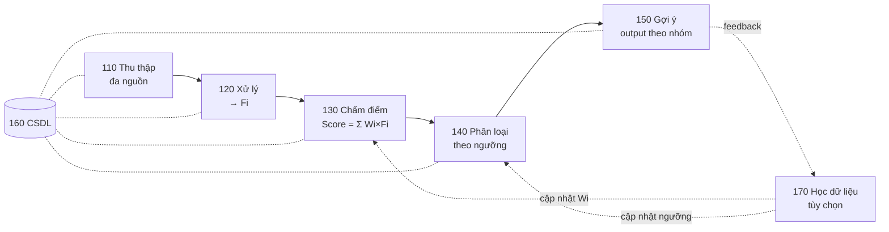
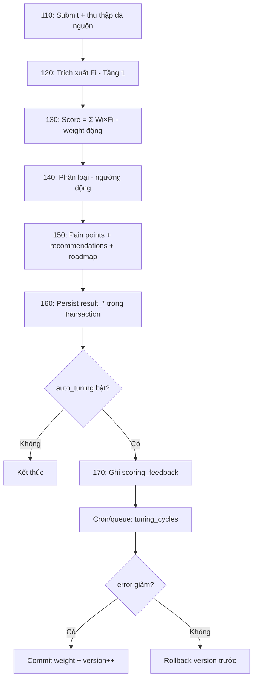

# SCORING ENGINE — ĐẶC TẢ HỆ THỐNG HOÀN CHỈNH
**Hệ thống**: Xử lý dữ liệu & Đánh giá năng lực người dùng (Module Survey)
**Version**: FINAL 1.0
**Target reader**: Backend Developer + BA
**Nguồn hợp nhất**: Mô tả sáng chế 6 module + Kiến trúc scoring 3 tầng linh hoạt + Các quyết định kỹ thuật đã chốt

---

# PHẦN A — TỔNG QUAN

## A.1. Mục tiêu hệ thống

Scoring Engine là **bộ não trung tâm** của Module Survey — một **Rule Engine + Business Intelligence Engine** thực hiện:

- Thu thập & chuẩn hóa dữ liệu đa nguồn
- Tính điểm năng lực theo tiêu chí + trọng số
- Phân loại người dùng theo mức độ năng lực
- Sinh gợi ý / roadmap tương ứng từng nhóm
- Tự cải thiện độ chính xác theo thời gian (tùy chọn)

## A.2. Nguyên tắc cốt lõi

| Nguyên tắc | Ý nghĩa |
|---|---|
| **Config-driven 100%** | Không hardcode score, domain, weight, ngưỡng, recommendation |
| **Relational-first** | Toàn bộ config là bảng quan hệ, hạn chế JSON columns |
| **3 tầng độc lập** | Cách chấm câu / cách gộp điểm / cách phân loại — cấu hình riêng, kết hợp tự do |
| **Tĩnh trước, động sau** | Chạy tốt với weight tĩnh trước khi bật tuning động |
| **An toàn mặc định** | Mọi cơ chế động mặc định TẮT; mọi thay đổi đều cap + rollback được |

## A.3. Ánh xạ kiến trúc — 6 Module ↔ Thiết kế

| Module | Vai trò | Thành phần |
|---|---|---|
| **110** Thu thập | Input đa nguồn | `survey_submissions`, `submission_answers`, `submission_behavior_log` |
| **120** Xử lý | Chuẩn hóa → đặc trưng Fᵢ | **Tầng 1** — Question Scoring |
| **130** Chấm điểm | `Score = Σ(Wᵢ × Fᵢ)` | **Tầng 2** — Aggregation + trọng số động |
| **140** Phân loại | Score → nhóm năng lực | **Tầng 3** — Classification |
| **150** Gợi ý | Output theo nhóm | Recommendations + Roadmap + Pain points |
| **160** CSDL | Lưu trữ, toàn vẹn | Toàn bộ bảng + transaction + versioning |
| **170** Học dữ liệu | Cập nhật Wᵢ, ngưỡng | Feedback & Tuning *(tùy chọn, mặc định tắt)* |



---

# PHẦN B — KIẾN TRÚC 3 TẦNG

Mỗi survey cấu hình **3 chiều độc lập**, khai báo trên bảng `assessments`:

```sql
CREATE TABLE assessments (
    id              BIGINT       PRIMARY KEY AUTO_INCREMENT,
    assessment_code VARCHAR(50)  UNIQUE NOT NULL,
    name            VARCHAR(255) NOT NULL,
    version         VARCHAR(20)  NOT NULL,
    is_active       BOOLEAN      DEFAULT TRUE,

    has_scoring     BOOLEAN      NOT NULL DEFAULT FALSE,
    -- FALSE → bỏ qua toàn bộ engine, chỉ lưu câu trả lời

    aggregation_model
        ENUM('flat_sum','weighted_domain','sectioned')
        NOT NULL DEFAULT 'flat_sum',

    classification_type
        ENUM('none','score_band','pass_fail','persona_match')
        NOT NULL DEFAULT 'none',

    created_at      TIMESTAMP    DEFAULT CURRENT_TIMESTAMP
);
```

```
┌──────────────────────────────────────────────────────────────┐
│ TẦNG 1 — QUESTION SCORING (cách chấm từng câu)               │
│ none / boolean / single_choice / multi_choice / numeric_range │
├──────────────────────────────────────────────────────────────┤
│ TẦNG 2 — AGGREGATION (cách gộp điểm)                         │
│ flat_sum / weighted_domain / sectioned                        │
├──────────────────────────────────────────────────────────────┤
│ TẦNG 3 — CLASSIFICATION (cách phân loại)                     │
│ none / score_band / pass_fail / persona_match                 │
└──────────────────────────────────────────────────────────────┘
```

### Ma trận kết hợp thực tế

| Survey | Aggregation | Classification |
|---|---|---|
| AI Readiness & Workflow | `weighted_domain` | `score_band` |
| Sales Health Check | `weighted_domain` | `persona_match` |
| Onboarding Quiz | `flat_sum` | `pass_fail` |
| NPS Feedback | `flat_sum` | `score_band` |
| HR Competency | `sectioned` | `score_band` |
| Lead Qualification | `weighted_domain` | `persona_match` |
| Market Research | `flat_sum` | `none` |

---

# PHẦN C — TẦNG 1: QUESTION SCORING (Module 120)

Mỗi câu trả lời → một **feature value Fᵢ** đã chuẩn hóa.

## C.1. Bảng `score_rules`

```sql
CREATE TABLE score_rules (
    id                  BIGINT       PRIMARY KEY AUTO_INCREMENT,
    assessment_code     VARCHAR(50)  NOT NULL REFERENCES assessments(assessment_code),
    question_code       VARCHAR(100) NOT NULL,
    feature_code        VARCHAR(100) NOT NULL,   -- định danh đặc trưng Fi (khóa cho tuning)
    domain_code         VARCHAR(50),             -- NULL nếu flat_sum
    section_id          BIGINT       REFERENCES survey_sections(id),
    signal_flag         VARCHAR(100),

    question_scoring_type
        ENUM('none','boolean','single_choice','multi_choice','numeric_range')
        NOT NULL DEFAULT 'boolean',

    score_if_true       INT NOT NULL DEFAULT 0,   -- boolean
    score_if_false      INT NOT NULL DEFAULT 0,   -- boolean
    min_score_cap       INT,                      -- multi_choice: chặn dưới
    max_score_cap       INT,                      -- multi_choice: chặn trên
    is_active           BOOLEAN DEFAULT TRUE,

    UNIQUE KEY uq_rule (assessment_code, question_code)
);
```

> `feature_code` là cầu nối giữa câu hỏi và trọng số động — Module 170 cập nhật weight theo `feature_code`, bền vững khi đổi câu chữ.

## C.2. Bảng `score_rule_options` (single/multi choice)

```sql
CREATE TABLE score_rule_options (
    id              BIGINT       PRIMARY KEY AUTO_INCREMENT,
    rule_id         BIGINT       NOT NULL REFERENCES score_rules(id),
    option_value    VARCHAR(100) NOT NULL,
    option_label    VARCHAR(255) NOT NULL,
    score           INT          NOT NULL DEFAULT 0,   -- dương / âm / 0 đều được
    signal_flag     VARCHAR(100),
    sort_order      TINYINT      DEFAULT 0,

    UNIQUE KEY uq_option (rule_id, option_value)
);
```

## C.3. Bảng `score_rule_numeric_ranges` (numeric_range)

```sql
CREATE TABLE score_rule_numeric_ranges (
    id          BIGINT PRIMARY KEY AUTO_INCREMENT,
    rule_id     BIGINT         NOT NULL REFERENCES score_rules(id),
    min_value   DECIMAL(10,2),            -- NULL = không giới hạn dưới
    max_value   DECIMAL(10,2),            -- NULL = không giới hạn trên
    score       INT            NOT NULL,
    signal_flag VARCHAR(100),
    sort_order  TINYINT        DEFAULT 0
);
```

## C.4. Logic chấm điểm từng kiểu

| Kiểu | Công thức Fᵢ |
|---|---|
| `boolean` | `score_if_true` nếu đúng, ngược lại `score_if_false` |
| `single_choice` | `score` của option được chọn |
| `multi_choice` | `CLAMP(Σ score các option chọn, min_score_cap, max_score_cap)` |
| `numeric_range` | `score` của range chứa giá trị nhập |
| `none` | Không sinh feature |

### Ví dụ multi_choice: "Công cụ đang dùng?" (cap: -20 → +30)

| Option | score | flag |
|---|---|---|
| CRM | +15 | HAS_CRM |
| Excel/Sheets | +5 | — |
| Phần mềm kế toán | +10 | — |
| Quản lý thủ công | -10 | MANUAL_PROCESS |
| Không dùng gì | -15 | NO_TOOL |

- Chọn CRM + Kế toán → `+25` (clamp → +25), flags: `[HAS_CRM]`
- Chọn Excel + Thủ công → `-5`, flags: `[MANUAL_PROCESS]`
- Chọn tất cả → raw `+5` (clamp → +5), flags: `[HAS_CRM, MANUAL_PROCESS, NO_TOOL]`

## C.5. Validation bắt buộc (Backend enforce)

- `multi_choice` / `single_choice`: tối thiểu 2 options
- `multi_choice`: bắt buộc khai báo `min_score_cap` và `max_score_cap`
- `min_score_cap < max_score_cap`
- `single_choice`: chỉ cho phép 1 option khi submit
- `numeric_range`: các range không được overlap

---

# PHẦN D — TẦNG 2: AGGREGATION (Module 130)

Công thức tổng quát theo sáng chế:
```
Score = Σ (Wᵢ × Fᵢ),  với i = 1 → n
```

## D.1. `flat_sum`
```
TotalScore = Σ Fᵢ (tất cả câu)
```
Không cần bảng config thêm. Lưu thẳng `survey_results.overall_score`.

## D.2. `weighted_domain`

```sql
CREATE TABLE assessment_domains (
    id              BIGINT PRIMARY KEY AUTO_INCREMENT,
    assessment_code VARCHAR(50)  NOT NULL REFERENCES assessments(assessment_code),
    domain_code     VARCHAR(50)  NOT NULL,
    label           VARCHAR(100) NOT NULL,
    min_score       INT          NOT NULL,   -- raw score thấp nhất lý thuyết
    max_score       INT          NOT NULL,   -- raw score cao nhất lý thuyết
    sort_order      TINYINT      DEFAULT 0,
    is_active       BOOLEAN      DEFAULT TRUE,

    UNIQUE KEY uq_domain (assessment_code, domain_code)
);
```

```
RawDomain(d)        = Σ Fᵢ (feature thuộc domain d)
NormalizedDomain(d) = ((Raw - Min)/(Max - Min)) × 100   → CLAMP [0,100]
OverallScore        = Σ ( NormalizedDomain(d) × Weight(d) )
```

> `Weight(d)` lấy từ bảng `feature_weights` (PHẦN F) — KHÔNG hardcode.
> Ràng buộc: tổng weight các domain = 100% (validate khi load config).

### Ví dụ (AI Readiness)
```
workflow: 69.6 × 0.25 = 17.4
sales:    55.0 × 0.20 = 11.0
hr:       60.0 × 0.15 =  9.0
data:     72.0 × 0.20 = 14.4
ai:       40.0 × 0.20 =  8.0
─────────────────────────────
OverallScore = 59.8
```

## D.3. `sectioned`

```sql
CREATE TABLE survey_sections (
    id              BIGINT PRIMARY KEY AUTO_INCREMENT,
    assessment_code VARCHAR(50)  NOT NULL REFERENCES assessments(assessment_code),
    section_code    VARCHAR(50)  NOT NULL,
    label           VARCHAR(255) NOT NULL,
    min_score       INT          NOT NULL,
    max_score       INT          NOT NULL,
    sort_order      TINYINT      DEFAULT 0,

    UNIQUE KEY uq_section (assessment_code, section_code)
);
```
```
SectionScore(s) = Σ Fᵢ (feature thuộc section s)
```
Không có overall score (hoặc NULL). Mỗi section ra 1 điểm độc lập.

---

# PHẦN E — TẦNG 3: CLASSIFICATION (Module 140)

## E.1. `score_band` (ngưỡng có thể động)

```sql
CREATE TABLE score_bands (
    id              BIGINT       PRIMARY KEY AUTO_INCREMENT,
    assessment_code VARCHAR(50)  NOT NULL REFERENCES assessments(assessment_code),
    band_code       VARCHAR(50)  NOT NULL,
    label           VARCHAR(100) NOT NULL,
    description     TEXT,
    min_score       DECIMAL(5,2) NOT NULL,   -- ngưỡng hiện hành
    max_score       DECIMAL(5,2) NOT NULL,
    default_min     DECIMAL(5,2) NOT NULL,   -- ngưỡng gốc (reset)
    default_max     DECIMAL(5,2) NOT NULL,
    is_dynamic      BOOLEAN      DEFAULT FALSE,
    sort_order      TINYINT      DEFAULT 0,

    UNIQUE KEY uq_band (assessment_code, band_code)
);
```

Ví dụ (AI Readiness): `0–30 MANUAL_OPERATION` / `31–60 DIGITAL_FOUNDATION` / `61–80 AI_READY` / `81–100 AI_TRANSFORMATION`.

Logic (tổng quát N band, theo IF–THEN của sáng chế):
```
IF score >= band.min_score AND score <= band.max_score → classify = band.band_code
```

## E.2. `pass_fail`

```sql
CREATE TABLE pass_fail_configs (
    id              BIGINT       PRIMARY KEY AUTO_INCREMENT,
    assessment_code VARCHAR(50)  NOT NULL UNIQUE REFERENCES assessments(assessment_code),
    passing_score   DECIMAL(5,2) NOT NULL,
    label_pass      VARCHAR(100) NOT NULL DEFAULT 'Pass',
    label_fail      VARCHAR(100) NOT NULL DEFAULT 'Fail'
);
```

## E.3. `persona_match`

```sql
CREATE TABLE personas (
    id              BIGINT PRIMARY KEY AUTO_INCREMENT,
    assessment_code VARCHAR(50)  NOT NULL REFERENCES assessments(assessment_code),
    persona_code    VARCHAR(100) NOT NULL,
    label           VARCHAR(255) NOT NULL,
    description     TEXT,
    sort_order      TINYINT      DEFAULT 0,

    UNIQUE KEY uq_persona (assessment_code, persona_code)
);

CREATE TABLE persona_conditions (
    id              BIGINT PRIMARY KEY AUTO_INCREMENT,
    persona_id      BIGINT       NOT NULL REFERENCES personas(id),
    target_type     ENUM('domain','section','overall','signal_flag') NOT NULL,
    target_code     VARCHAR(100) NOT NULL,
    operator        ENUM('<','<=','=','>=','>') NOT NULL,
    threshold_value DECIMAL(5,2),
    flag_value      BOOLEAN,
    sort_order      TINYINT DEFAULT 0
    -- Điều kiện trong cùng persona = AND. OR → tạo persona riêng.
);
```

Logic matching:
```
match_score(persona) = số điều kiện thỏa / tổng điều kiện
→ chọn persona match_score cao nhất (tie → sort_order thấp hơn)
→ nếu không persona nào đạt ngưỡng tối thiểu → persona mặc định / NULL
```

---

# PHẦN F — TRỌNG SỐ ĐỘNG (Module 130 nâng cao)

> Đây là cơ chế then chốt của sáng chế: Wᵢ **không cố định** mà cập nhật được.

## F.1. `feature_weights`

```sql
CREATE TABLE feature_weights (
    id              BIGINT       PRIMARY KEY AUTO_INCREMENT,
    assessment_code VARCHAR(50)  NOT NULL REFERENCES assessments(assessment_code),
    feature_code    VARCHAR(100) NOT NULL,
    domain_code     VARCHAR(50),
    weight_level    ENUM('domain','feature') NOT NULL DEFAULT 'domain',
    -- QUYẾT ĐỊNH: mặc định cấp 'domain' (đủ dữ liệu, tránh overfit)

    weight          DECIMAL(8,4) NOT NULL,   -- Wi hiện hành
    default_weight  DECIMAL(8,4) NOT NULL,   -- gốc (reset)
    weight_min      DECIMAL(8,4) NOT NULL DEFAULT 0,
    weight_max      DECIMAL(8,4) NOT NULL DEFAULT 1,

    version         INT          NOT NULL DEFAULT 1,
    updated_by      ENUM('manual','rule_based','ml_model') NOT NULL DEFAULT 'manual',
    updated_at      TIMESTAMP    DEFAULT CURRENT_TIMESTAMP ON UPDATE CURRENT_TIMESTAMP,

    UNIQUE KEY uq_weight (assessment_code, feature_code)
);
```

## F.2. `feature_weight_history` (audit + rollback)

```sql
CREATE TABLE feature_weight_history (
    id                BIGINT       PRIMARY KEY AUTO_INCREMENT,
    feature_weight_id BIGINT       NOT NULL REFERENCES feature_weights(id),
    old_weight        DECIMAL(8,4) NOT NULL,
    new_weight        DECIMAL(8,4) NOT NULL,
    delta             DECIMAL(8,4) NOT NULL,
    reason            VARCHAR(255),
    cycle_id          BIGINT,
    created_at        TIMESTAMP    DEFAULT CURRENT_TIMESTAMP
);
```

---

# PHẦN G — FEEDBACK & HỌC DỮ LIỆU (Module 170, tùy chọn)

> **Mặc định TẮT.** Chỉ bật per assessment khi đã đủ dữ liệu + có người gác cổng.

## G.1. Nguồn ground-truth — phân tầng theo độ tin cậy

```sql
CREATE TABLE feedback_sources_config (
    id           BIGINT PRIMARY KEY AUTO_INCREMENT,
    source_type  ENUM('admin_review','observed_outcome','user_self_report') NOT NULL,
    trust_weight DECIMAL(4,2) NOT NULL,   -- hệ số tin cậy khi tuning
    is_enabled   BOOLEAN DEFAULT TRUE
);
```

| Nguồn | trust_weight | Dùng từ Phase |
|---|---|---|
| `admin_review` | 1.0 | Phase 1 (nguồn vàng) |
| `observed_outcome` | 0.7 | Phase 3 |
| `user_self_report` | 0.4 | Chỉ gợi ý cho admin, không auto-tune |

## G.2. `scoring_feedback`

```sql
CREATE TABLE scoring_feedback (
    id              BIGINT       PRIMARY KEY AUTO_INCREMENT,
    result_id       BIGINT       NOT NULL REFERENCES survey_results(id),
    assessment_code VARCHAR(50)  NOT NULL,
    predicted_band  VARCHAR(50),
    actual_band     VARCHAR(50),
    predicted_score DECIMAL(5,2),
    actual_score    DECIMAL(5,2),
    feedback_source ENUM('admin_review','observed_outcome','user_self_report') NOT NULL,
    is_processed    BOOLEAN      DEFAULT FALSE,
    created_at      TIMESTAMP    DEFAULT CURRENT_TIMESTAMP
);
```

## G.3. `tuning_schedule_config` + `tuning_cycles`

```sql
CREATE TABLE tuning_schedule_config (
    id                      BIGINT PRIMARY KEY AUTO_INCREMENT,
    assessment_code         VARCHAR(50) NOT NULL UNIQUE,
    is_auto_tuning_enabled  BOOLEAN     DEFAULT FALSE,   -- công tắc tổng (mặc định TẮT)
    min_feedback_to_trigger INT         NOT NULL DEFAULT 30,
    max_cooldown_days       INT         NOT NULL DEFAULT 30,
    learning_rate           DECIMAL(6,4) NOT NULL DEFAULT 0.05,   -- cố định, nhỏ
    max_weight_change_pct   DECIMAL(5,2) NOT NULL DEFAULT 10.00,  -- cap 10%/chu kỳ
    last_cycle_at           TIMESTAMP
);

CREATE TABLE tuning_cycles (
    id              BIGINT PRIMARY KEY AUTO_INCREMENT,
    assessment_code VARCHAR(50)  NOT NULL,
    cycle_number    INT          NOT NULL,
    method          ENUM('rule_based','ml_model') NOT NULL,
    feedback_count  INT          NOT NULL,
    error_before    DECIMAL(8,4),
    error_after     DECIMAL(8,4),
    status          ENUM('pending','running','completed','rolled_back') NOT NULL DEFAULT 'pending',
    started_at      TIMESTAMP,
    completed_at    TIMESTAMP,

    UNIQUE KEY uq_cycle (assessment_code, cycle_number)
);
```

## G.4. Công thức cập nhật (rule-based) + an toàn

```
error    = f(predicted_band, actual_band)        # sai lệch dự đoán vs thực tế
ΔWᵢ_raw  = learning_rate × error × Fᵢ × trust_weight
ΔWᵢ      = CLAMP(ΔWᵢ_raw, -Wᵢ×10%, +Wᵢ×10%)      # cap biên độ mỗi chu kỳ
Wᵢ(t+1)  = CLAMP(Wᵢ(t) - ΔWᵢ, weight_min, weight_max)

AN TOÀN: nếu error_after >= error_before → rollback về version trước
```

## G.5. Trigger (Hybrid)

```
Chạy cycle KHI auto_tuning_enabled = TRUE VÀ:
  unprocessed_feedback >= min_feedback_to_trigger
  VÀ (now - last_cycle_at) >= 24h (cooldown chống chạy dồn)
HOẶC cron fallback: feedback >= 10 VÀ (now - last_cycle_at) >= max_cooldown_days
```

> Module 170 chạy **bất đồng bộ** (cron/queue), tách khỏi luồng submit — user không bị chậm.

---

# PHẦN H — GỢI Ý & OUTPUT (Module 150)

## H.1. Pain Point Detection

```sql
CREATE TABLE pain_point_rules (
    id              BIGINT       PRIMARY KEY AUTO_INCREMENT,
    assessment_code VARCHAR(50)  NOT NULL REFERENCES assessments(assessment_code),
    pain_point_code VARCHAR(100) NOT NULL,
    label           VARCHAR(255) NOT NULL,
    required_flags  VARCHAR(500) NOT NULL,   -- "LEAD_LOSS,!HAS_CRM" (phẩy=AND, !=NOT)
    is_active       BOOLEAN DEFAULT TRUE
);
```

Ví dụ: `!HAS_CRM && LEAD_LOSS → sales_leakage`, `DATA_FRAGMENTED → fragmented_data`.

## H.2. Recommendation Rules

```sql
CREATE TABLE recommendation_rules (
    id                  BIGINT       PRIMARY KEY AUTO_INCREMENT,
    assessment_code     VARCHAR(50)  NOT NULL REFERENCES assessments(assessment_code),
    recommendation_code VARCHAR(100) NOT NULL,
    label               VARCHAR(255) NOT NULL,
    trigger_domain      VARCHAR(50)  NOT NULL,
    threshold_score     DECIMAL(5,2) NOT NULL,   -- trigger khi domain_score < threshold
    priority            TINYINT      DEFAULT 1,
    is_active           BOOLEAN      DEFAULT TRUE,

    UNIQUE KEY uq_rec (assessment_code, recommendation_code)
);
```

## H.3. Roadmap

```sql
CREATE TABLE roadmap_phases (
    id              BIGINT PRIMARY KEY AUTO_INCREMENT,
    assessment_code VARCHAR(50)  NOT NULL REFERENCES assessments(assessment_code),
    band_code       VARCHAR(50)  NOT NULL,   -- gắn theo nhóm phân loại
    phase_code      VARCHAR(100) NOT NULL,
    title           VARCHAR(255) NOT NULL,
    description     TEXT,
    duration_weeks  TINYINT,
    sort_order      TINYINT      DEFAULT 0,

    UNIQUE KEY uq_phase (assessment_code, band_code, phase_code)
);

CREATE TABLE roadmap_milestones (
    id          BIGINT PRIMARY KEY AUTO_INCREMENT,
    phase_id    BIGINT       NOT NULL REFERENCES roadmap_phases(id),
    title       VARCHAR(255) NOT NULL,
    description TEXT,
    sort_order  TINYINT      DEFAULT 0
);
```

---

# PHẦN I — THU THẬP DỮ LIỆU (Module 110) & KẾT QUẢ (160)

## I.1. Submission & Answers (đa nguồn)

```sql
CREATE TABLE survey_submissions (
    id              BIGINT PRIMARY KEY AUTO_INCREMENT,
    assessment_code VARCHAR(50) NOT NULL REFERENCES assessments(assessment_code),
    respondent_id   BIGINT,
    submitted_at    TIMESTAMP   DEFAULT CURRENT_TIMESTAMP
);

CREATE TABLE submission_answers (
    id              BIGINT       PRIMARY KEY AUTO_INCREMENT,
    submission_id   BIGINT       NOT NULL REFERENCES survey_submissions(id),
    question_code   VARCHAR(100) NOT NULL,
    answer_value    VARCHAR(500) NOT NULL,   -- bool/option/option,option/số
    source_type     ENUM('survey_answer','behavior','interaction','external')
                    NOT NULL DEFAULT 'survey_answer',
    collected_at    TIMESTAMP    DEFAULT CURRENT_TIMESTAMP,

    UNIQUE KEY uq_answer (submission_id, question_code, source_type)
);
```

## I.2. Behavior Log (thu thập từ Phase 1, dùng từ Phase 3)

```sql
CREATE TABLE submission_behavior_log (
    id            BIGINT PRIMARY KEY AUTO_INCREMENT,
    submission_id BIGINT       NOT NULL REFERENCES survey_submissions(id),
    question_code VARCHAR(100),
    event_type    ENUM('view','answer','change','skip','back','time_spent') NOT NULL,
    event_value   VARCHAR(255),
    sequence_no   INT          NOT NULL,
    occurred_at   TIMESTAMP    DEFAULT CURRENT_TIMESTAMP
);
```

## I.3. Bảng kết quả (Module 160)

```sql
CREATE TABLE survey_results (
    id              BIGINT       PRIMARY KEY AUTO_INCREMENT,
    submission_id   BIGINT       UNIQUE NOT NULL REFERENCES survey_submissions(id),
    overall_score   DECIMAL(5,2),            -- NULL nếu sectioned/none
    weight_version  INT          NOT NULL,   -- bộ weight nào đã dùng (truy vết)
    calculated_at   TIMESTAMP    DEFAULT CURRENT_TIMESTAMP
);

CREATE TABLE result_question_scores (
    id            BIGINT PRIMARY KEY AUTO_INCREMENT,
    result_id     BIGINT       NOT NULL REFERENCES survey_results(id),
    question_code VARCHAR(100) NOT NULL,
    feature_code  VARCHAR(100) NOT NULL,
    raw_score     INT          NOT NULL,   -- trước cap
    final_score   INT          NOT NULL,   -- sau cap = Fi
    selected_options VARCHAR(500),
    UNIQUE KEY uq_q (result_id, question_code)
);

CREATE TABLE result_domain_scores (
    id               BIGINT PRIMARY KEY AUTO_INCREMENT,
    result_id        BIGINT        NOT NULL REFERENCES survey_results(id),
    domain_code      VARCHAR(50)   NOT NULL,
    raw_score        INT           NOT NULL,
    normalized_score DECIMAL(5,2)  NOT NULL,
    UNIQUE KEY uq_ds (result_id, domain_code)
);

CREATE TABLE result_sections (
    id               BIGINT PRIMARY KEY AUTO_INCREMENT,
    result_id        BIGINT        NOT NULL REFERENCES survey_results(id),
    section_id       BIGINT        NOT NULL REFERENCES survey_sections(id),
    raw_score        INT           NOT NULL,
    normalized_score DECIMAL(5,2)  NOT NULL,
    UNIQUE KEY uq_rs (result_id, section_id)
);

CREATE TABLE result_signal_flags (
    id         BIGINT PRIMARY KEY AUTO_INCREMENT,
    result_id  BIGINT       NOT NULL REFERENCES survey_results(id),
    flag_code  VARCHAR(100) NOT NULL,
    flag_value BOOLEAN      NOT NULL,
    UNIQUE KEY uq_fl (result_id, flag_code)
);

CREATE TABLE result_classifications (
    id           BIGINT PRIMARY KEY AUTO_INCREMENT,
    result_id    BIGINT       NOT NULL UNIQUE REFERENCES survey_results(id),
    band_code    VARCHAR(50),
    passed       BOOLEAN,
    persona_code VARCHAR(100),
    match_score  DECIMAL(5,2)
);

CREATE TABLE result_pain_points (
    id              BIGINT PRIMARY KEY AUTO_INCREMENT,
    result_id       BIGINT       NOT NULL REFERENCES survey_results(id),
    pain_point_code VARCHAR(100) NOT NULL,
    UNIQUE KEY uq_pp (result_id, pain_point_code)
);

CREATE TABLE result_recommendations (
    id                  BIGINT PRIMARY KEY AUTO_INCREMENT,
    result_id           BIGINT       NOT NULL REFERENCES survey_results(id),
    recommendation_code VARCHAR(100) NOT NULL,
    priority            TINYINT      DEFAULT 1,
    UNIQUE KEY uq_rec (result_id, recommendation_code)
);

CREATE TABLE result_roadmap_phases (
    id         BIGINT PRIMARY KEY AUTO_INCREMENT,
    result_id  BIGINT  NOT NULL REFERENCES survey_results(id),
    phase_id   BIGINT  NOT NULL REFERENCES roadmap_phases(id),
    sort_order TINYINT DEFAULT 0,
    UNIQUE KEY uq_rp (result_id, phase_id)
);
```

> **Toàn vẹn dữ liệu**: persist toàn bộ bảng `result_*` trong **một transaction**. `weight_version` đảm bảo mỗi kết quả truy vết được tính bằng bộ trọng số nào.

---

# PHẦN J — PIPELINE & ORCHESTRATOR



```php
class CompetencyScoringOrchestrator
{
    public function process(Assessment $a, Submission $sub): ?ScoringResult
    {
        if (!$a->has_scoring) return null;                       // 110

        $features = $this->featureExtractor->extract($a, $sub);  // 120 (Tầng 1)
        $weights  = $this->weightRepo->loadActive($a->assessment_code);
        $scored   = $this->aggregationFactory                    // 130 (Tầng 2)
                        ->make($a->aggregation_model)
                        ->aggregate($a, $features, $weights);
        $class    = $this->classificationFactory                 // 140 (Tầng 3)
                        ->make($a->classification_type)
                        ->classify($a, $scored);
        $output   = $this->recommendationEngine                  // 150
                        ->generate($a, $scored, $class);

        return $this->resultRepo->persist(                       // 160 (transaction)
            $sub, $scored, $class, $output, $weights->version
        );
    }
}

// 170 — chạy riêng theo lịch, KHÔNG nằm trong luồng submit
class FeedbackTuningJob
{
    public function runCycle(string $code): void
    {
        if (!$this->config->isAutoTuningEnabled($code)) return;
        $fb = $this->feedbackRepo->unprocessed($code);
        if (count($fb) < $this->config->minFeedback($code)) return;

        $cycle = $this->tuningEngine->run($code, $fb);
        if ($cycle->error_after >= $cycle->error_before) {
            $this->weightRepo->rollback($code);                  // an toàn
        }
    }
}
```

**Mở rộng**: thêm aggregation model / classification type / tuning method mới = thêm class implement interface + đăng ký factory. Không sửa code cũ.

---

# PHẦN K — RESPONSE JSON (API output)

```json
{
  "overall_score": 59.8,
  "weight_version": 3,
  "classification": { "type": "score_band", "band_code": "DIGITAL_FOUNDATION", "label": "Nền tảng số cơ bản" },
  "domain_scores": {
    "workflow": { "raw": 20, "normalized": 69.6 },
    "sales":    { "raw": -5, "normalized": 55.0 },
    "ai":       { "raw": -8, "normalized": 40.0 }
  },
  "signal_flags": { "HAS_CRM": false, "LEAD_LOSS": true },
  "pain_points": ["sales_leakage"],
  "recommendations": [{ "code": "crm_setup", "label": "Thiết lập CRM", "priority": 1 }],
  "roadmap": [{ "phase_code": "phase_1", "title": "Thiết lập nền tảng", "duration_weeks": 4,
               "milestones": ["Triển khai CRM", "Chuẩn hóa quy trình sales"] }]
}
```

---

# PHẦN L — LỘ TRÌNH TRIỂN KHAI

| Phase | Nội dung | Module | Trạng thái tuning |
|---|---|---|---|
| **1 — Core** | Question scoring + aggregation + classification + output. Weight TĨNH. Thu thập behavior log (chưa dùng). | 110–160 | TẮT |
| **2 — Dynamic infra** | Tách `feature_weights`, ngưỡng động, ghi `scoring_feedback` (chưa tuning). | + hạ tầng 170 | TẮT |
| **3 — Rule-based tuning** | Bật `tuning_cycles` rule-based + rollback. Mở `observed_outcome`. Dùng behavior data. | 170 (rule) | BẬT có kiểm soát |
| **4 — ML tuning** | Thay rule bằng ML model khi đủ dữ liệu lịch sử. | 170 (ml) | BẬT (ML) |

---

# PHẦN M — ĐỐI CHIẾU PATENT CLAIMS

| Claim | Yêu cầu | Đáp ứng |
|---|---|---|
| 1 | 6 module liên kết qua CSDL, truyền tuần tự | Phần J pipeline + transaction |
| 2 | Trích xuất chỉ số hành vi từ chuỗi tương tác | `submission_behavior_log` |
| 3 | Trọng số động: rule-based / ml, tối ưu hàm sai số | `feature_weights` + `tuning_cycles.method` |
| 4 | Module phản hồi cập nhật theo sai lệch, lặp chu kỳ | `scoring_feedback` + `tuning_cycles` |
| 5 | Phương pháp 6 bước, tính/phân loại/cập nhật lặp lại | Orchestrator + FeedbackTuningJob |
| 6 | Cập nhật theo mô hình hành vi theo thời gian | Phase 4 ML + behavior log |

---

# PHẦN N — NGUYÊN TẮC AN TOÀN (TÓM TẮT)

1. **Tĩnh trước, động sau** — chạy tốt với weight tĩnh trước khi bật tuning.
2. **Có người gác cổng** — chỉ tuning trên nguồn đáng tin (`admin_review`); nguồn nhiễu chỉ gợi ý.
3. **Cap + rollback** — mỗi chu kỳ weight đổi tối đa 10%; sai số tăng thì rollback.
4. **Thu thập rộng, dùng hẹp** — log behavior từ đầu (không thu hồi được), dùng khi đã chứng minh giá trị.
5. **Công tắc động mặc định TẮT** — bật có chủ đích per assessment.
6. **Tuning bất đồng bộ** — tách khỏi luồng submit, không làm chậm người dùng.